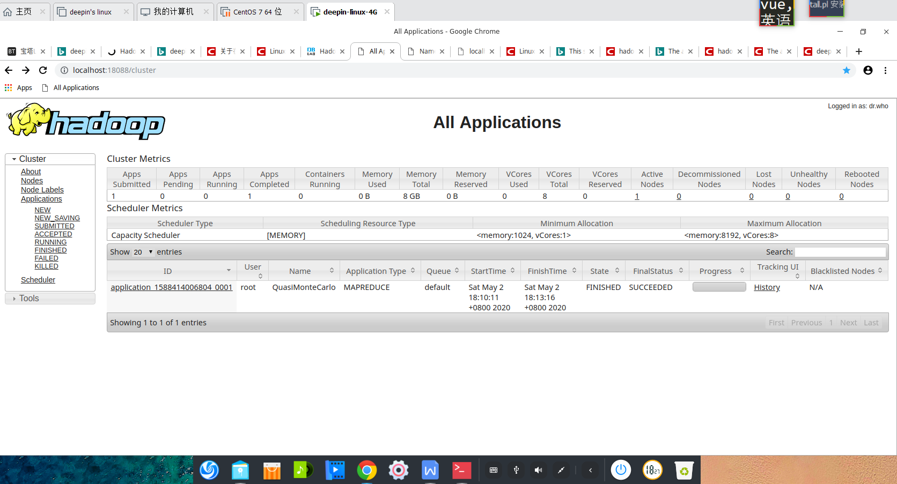

## 1. 准备

> 1. java
> 2. Hadoop,[镜像下载地址](http://mirror.bit.edu.cn/apache/hadoop/common/)
> 3. deepin linux操作系统(或其他Ubuntu)


## 2. 配置


### 2.1 安装SSH、配置SSH无密码登陆

Ubuntu 默认已安装了 SSH client，此外还需要安装 SSH server：

```shell
sudo apt-get install openssh-server
```

安装后，可以使用如下命令登陆本机：

```shell
ssh localhost
```

然后用输入yes登录


生成无密码登录：

```shell
exit                       # 退出刚才的 ssh localhost
cd ~/.ssh/      # 若没有该目录，请先执行一次ssh localhost
ssh-keygen -t rsa             # 会有提示，都按回车就可以
cat ./id_rsa.pub >> ./authorized_keys  # 加入授权
```


### 2.2 配置java环境

先执行

```shell
java -version
```

如果版本是openjdk，则删除并下载jdk

```shell
sudo apt-get remove openjdk*
```

删除并下载好jdk后配置java环境变量

```shell
sudo vi /etc/bash.bashrc #配置永久环境变量
```

然后插入

```shell
export JAVA_HOME=/usr/lib/jvm/jdk1.x.y
export JRE_HOME=${JAVA_HOME}/jre
export CLASSPATH=.:${JAVA_HOME}/lib:${JRE_HOME}/lib
export PATH=${JAVA_HOME}/bin:$PATH
```

再使其生效

```shell
source /etc/bash.bashrc
```


### 2.3 配置Hadoop

安装hadoop到/usr下

检验是否安装成功，进入hadoop-2.x.y/bin/hadoop下

```shell
cd /usr/local/hadoop-2.x.y/bin/hadoop
hadoop version
```

显示版本等信息即成功

更改环境变量，同上java配置，插入

```shell
export HADOOP_HOME=/usr/local/hadoop
export HADOOP_COMMON_LIB_NATIVE_DIR=$HADOOP_HOME/lib/native
```

配置伪分布式需要更改配置文件，首先进入

```shell
cd /usr/local/hadoop-2.x.y/etc/hadoop
```

更改==core-site.xml==

```xml
<configuration>
    <property>
        <name>hadoop.tmp.dir</name>
        <value>file:/usr/local/hadoop-2.x.y/tmp</value>
        <description>Abase for other temporary directories.</description>
    </property>
    <property>
        <name>fs.defaultFS</name>
        <value>hdfs://localhost:9000</value>
 </property>
</configuration>
```


更改==hdfs-site.xml==

```xml
<configuration>
    <property>
        <name>dfs.replication</name>
        <value>1</value>
    </property>
    <property>
        <name>dfs.namenode.name.dir</name>        <value>file:/usr/local/hadoop/tmp/dfs/name</value>
    </property>
    <property>
        <name>dfs.datanode.data.dir</name>     <value>file:/usr/local/hadoop/tmp/dfs/data</value>
    </property>
</configuration>
```


配置完成后，执行 NameNode 的格式化:

```shell
cd /usr/local/hadoop

./bin/hdfs namenode -format
```

如果出现**Error: JAVA_HOME is not set and could not be found**

java没配好，或者更改==hadoop-env.sh==

```shell
export JAVA_HOME=${JAVA_HOME}
更改为
export JAVA_HOME=/usr/java/jdk1.8 #java路径
```


接着开启 NameNode 和 DataNode 守护进程：

进入sbin文件夹下打开终端，输入

```shell
start-all.sh
```


## 3. 检验

输入==jps==查看进程状态，如下则说明成功


然后进入网址

1. http://localhost:50070

   

2. http://localhost:18088

   


运算实例：执行jar包计算圆周率

```shell
hadoop jar /usr/local/hadoop-2.7.7/share/hadoop/mapreduce/hadoop-mapreduce-examples-2.7.7.jar pi  10  10
```

第一个10是运行10次map任务，第二个10是每个map任务投掷次数，可以改变，可得到不同的近似pi值


## 4. 参考

[厦门大学大数据实验室Hadoop配置](http://dblab.xmu.edu.cn/blog/install-hadoop/)

