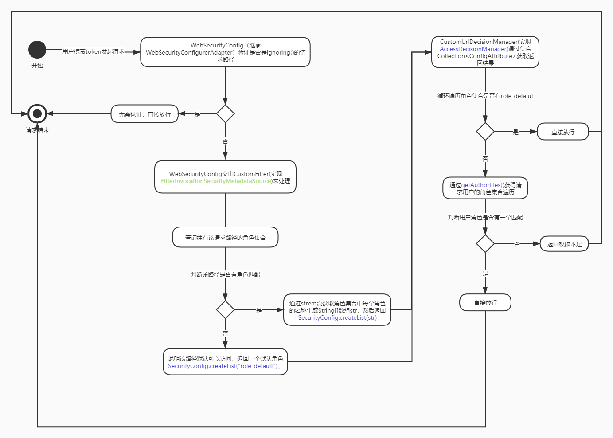
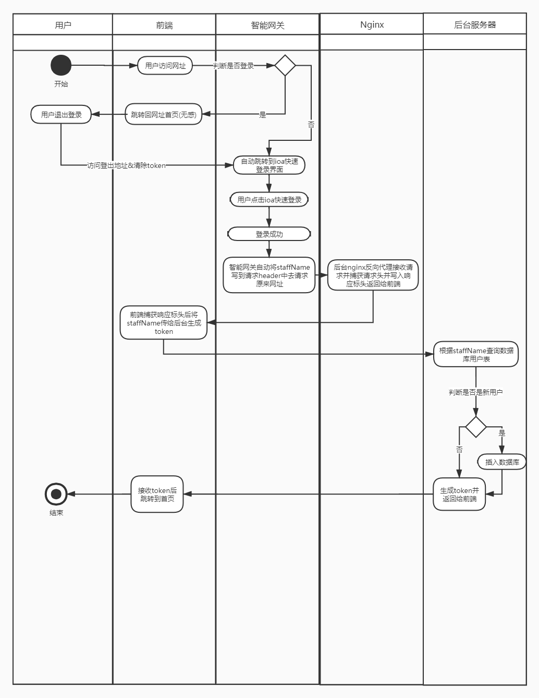
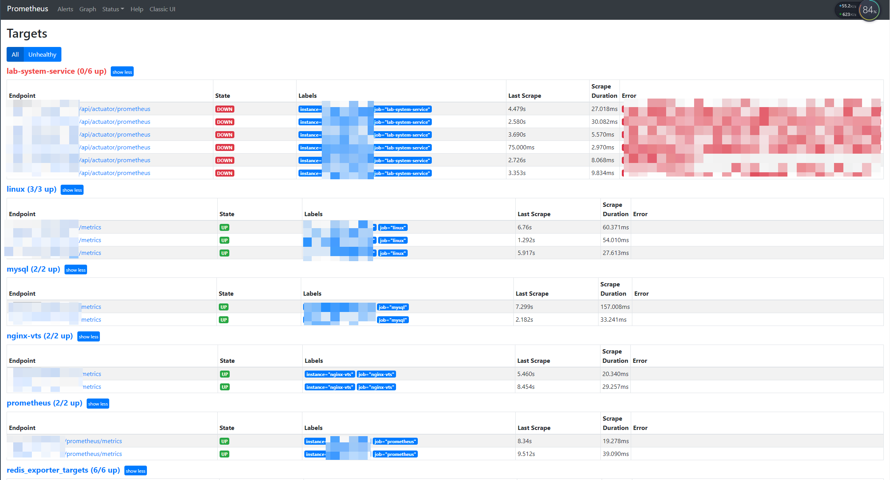
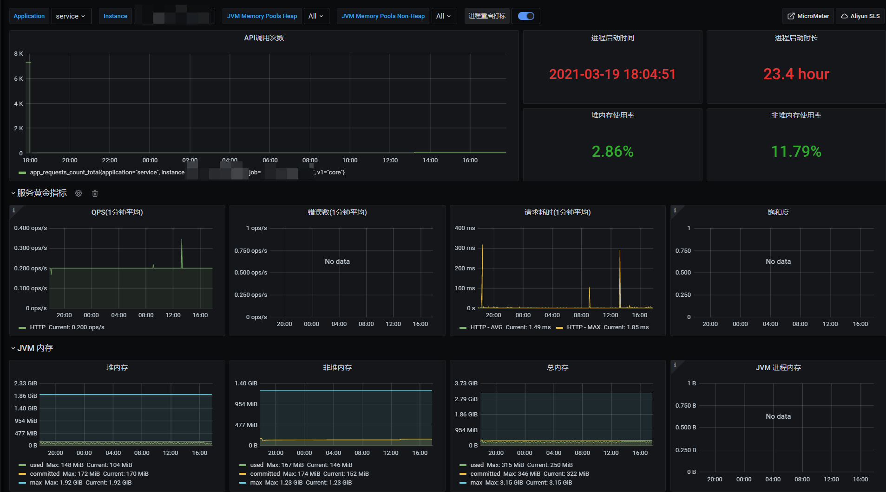

## 需求评审/拆分

入职后了解到招我是因为目前有许多其他部门需要批量调用我们的`识曲服务SDK`，有着采用脚本或者临时调用的方式繁琐，不可控，沟通成本高，无法持久化日志等等痛点，所以一直想做一个开放平台中台，通过中台去调用服务。对于需求方来说，可视化，方便，实时查看批量识曲结果，可增量；而对于我们服务提供者兼管理者而言，可以动态查看各个识曲任务调用的SDK的QPS可视化并做到随时动态控制和预警，还能根据需求方那边具体的业务分配QPS并提前扩容(申请机器)等等，最重要的是让我们和需求方的对接规范化，流程化，可监控是最重要的。甚至以后还有可能开放出去面向`toB`，将听歌识曲开放平台推广(可参考其他开放平台[ACRCloud](https://www.acrcloud.com/music-recognition/))


并要求拥有基础的用户角色体系，管理员能随时查看和控制每个用户的每个任务调用`识曲服务SDK`的QPS，并能可视化监控和预警。`识曲服务SDK`采用的是http协议，即调用接口API的方式，所以会考虑到并发等问题所以要从我们这边控制好调用的QPS。过了两个月开发功能快完成时，与大部分需求方开了个关于数据源的形式的需求讨论会，发现大部分部门还是希望能简化调用，于是我们提出可以从原来的识曲任务绑定资源库的方式改为识曲任务绑定数据库的形式，需求方提供数据库地址端口号密码等，每次增量数据库就通知识曲任务增量。但在讨论过后发现不同部门一般不会暴露数据库，要做隔离，最后敲定说我们开放API接口的方式供他们调用，进行推送任务，查询结果等，还供给我们回调接口，即每识别一批增量数据后将结果推送到他们的接口。


## 技术栈总览


::: info 技术栈总览

- 【前端】：Vue.js+ElementUi
- 【后端】：Springboot，SpringSecurity，Swagger，JWT(Java Web Token)，Mybatis Plus，Druid数据库连接池，EasyExcel
- 【数据库】：Mysql，Redis
- 【服务器】：Docker，Docker-compose，Nginx
- 【监控】：Grafana+Prometheus

:::


## 前端

::: tip 技术栈

Vue.js+组件ElementUi

:::


为了快速开发前端，使用Vue.js搭配组件ElementUi，后面将项目打包build后放到Docker部署的Nginx中，进行反向代理。开发难度基本不高。


## 后端


::: info 技术栈

- Springboot
- SpringSecurity
- Swagger
- JWT(Java Web Token)
- Mybatis Plus
- Druid数据库连接池
- EasyExcel

:::


后端为了快速搭建好整体业务框架采用了`Springboot+MybatisPlus`，在设计好初步的数据库后，利用`MybatisPlus`的逆向工程快速生成代码，包括entity，dao，service，controller层等，然后开始基本的业务开发。


### 使用SpringSecurity做登录验证和动态权限过滤

spring security 的核心功能主要包括：

::: info

- 认证 （你是谁）
- 授权 （你能干什么）
- 攻击防护 （防止伪造身份）

:::


一开始做登录验证和动态权限的时候，就想到使用SpringSecurity。对于密码加密和验证，使用里面自带的`Bcrypt`进行加密和验证，后面使用内网登录的时候就没使用。而关于权限验证过滤的问题，需要做到对用户的每个API请求都判断是否有权限，下面是SpringSecurity的整体流程活动图：





通过`getAuthorities`来获取该用户的角色集合需要用户实体类实现`SpringSecurity`自带的`UserDetails`，重写`Collection<? extends GrantedAuthority> getAuthorities()`方法，自己写根据用户获取角色的方法，然后将角色名提取出来生成集合。


而与之对应的是数据库设计，围绕着`RBAC`设计，设计了用户，角色，菜单以及中间表用户角色，角色菜单中间表。


而关于token采用的不是session等实现方式，由于http协议是无状态的，每一次请求都无状态。当一个用户通过用户名和密码登录了之后，他的下一个请求不会携带任何状态，应用程序无法知道他的身份，那就必须重新认证。因此我们希望用户登录成功之后的每一次http请求，都能够保存他的登录状态。所以使用了符合无状态stateless的JWT来做token，好处是在服务服务均衡的时候无需服务保存一份对应的token，一旦用户注销，令牌将在客户端被销毁，且在负载均衡应用程序分布式部署的情况下，session需要做多机数据共享，通常可以存在数据库或者redis里面。而jwt不需要。


### 使用Swagger做技术文档

在于前端对接时，一份动态的swagger接口API文档能帮助我们调试接口，接口说明等以此降低对接的沟通成本和准确率


### 使用MybatisPlus

通过MybatisPlus的逆向工程和自定义代码模板快速生成entity，dao，service，controller等，且自带封装好的方法已经能满足大部分的场景的CRUD需求


### 使用Druid做数据库连接池

使用Alibaba的Druid做连接池，并监控执行SQL语句次数，时间等


## 数据库


::: info 技术栈

- Mysql
- Redis

:::


### Mysql

Mysql主要难点还是表的设计，且了解到到时候将会吧数据在公司维护的Mysql数据库中，所以没有过于考虑其他。


### Redis

redis作为一个支持多种数据类型，读写性能高地key-value数据库，在项目许多地方使用的都很多，而且不用太过于考虑内存(公司服务器内存一般比较充足)。

具体在项目使用用途有


#### 将系统相关的配置改动较少但读比较多的放在redis中

::: info 

将系统相关的配置改动较少但读比较多的放在redis中，例如角色对应菜单，前端表单下拉框，返回体等放在redis中，每次获取时先从redis中获取，如果没有就从数据库获取，然后再写入redis中，同样改动这些的时候，改动数据库和redis即可。存入的都是序列化后的对象

:::


#### 单点登录

::: info 

用户在第一次登录后不仅返回token，还会将当时登录的时间戳存入到redis中，而前端则将时间戳放到请求头中，用户的每次请求都会比较请求头中的时间戳和redis的时间戳，此时就有三种情况

- 请求头中的时间戳`小于`redis中的时间戳：说明用户在其他地方登录了并更新了redis中的时间戳，那么当前用户便会被挤下去重新回到登录界面
- 请求头中的时间戳`等于`redis中的时间戳：说明时间戳没变，则允许访请求


得益于redis的高性能读写的特性，每次请求都去做验证的耗时很快，唯一阻碍的就是网络阻塞等

:::


#### 实时反馈任务状态和任务队列

项目功能中，用户在创建任务并开始识曲任务后，前端能实时反馈识曲进度，剩余时间等，于是在创建任务后便使用redis的`hash`数据结构来存储，field有总数total，已完成finish，状态state，调用频率qps，total一般不会变，而当每识曲完一条，finish字段就自增1，对于前端来说，定时调度查询这些字段的接口实时返回进度。如果将这些字段放在普通数据库中，去轮询调用，且不说操作的是磁盘IO速度相对较慢，频繁的修改finish这个字段也会产生事务一致性同步等问题。


另外，将redis的`list`改造成队列，每当任务下有新的小任务，我就会`RPUSH`到redis的`list`，然后后台的识曲任务则循环从里面`LPOP`去取，为了批量取一定的数据这里我用到了redis的`事务`，也叫管道操作，因为每次都去取受网络等因素影响最后累积也会造成性能下降，所以用`pipeline`去完成两个命令，即

```shell
pipe = r.pipeline()
pipe.lrange(my_key, 0, 3)
pipe.ltrim(my_key, 4, -1)
pipe.execute()
```


这样操作能保证一致性，当然新版本的redis中pop已经有参数count可以直接取多个。


这样子在redis list中一个生产者消费者队列，既可以避免了频繁从数据库磁盘IO获取引起阻塞性能下降，也避免了一次性取出大量数据堆积在JVM中当任务一多时造成`OOM(out of memory)`，且一边生产，一边消费，后期增量任务时也方便容易。做好redis的持久化后，也不用担心任务队列丢失，在后台做好异常捕捉，如果中途发生错误，就暂停任务，且将消费取出的任务重新塞回redis list队列中。


## 服务器


::: info 技术栈

- Docker
- Nginx

:::


### Docker

整个项目的所有使用到的都通过Docker容器部署在服务器上，好处是通过Dockerfile能随时做镜像版本的迭代，且将镜像打包push到hub上，也能随时做好项目服务的迁移。使用Docker，能很容易开启多个Springboot后台容器从而使用Nginx的负载均衡到各个服务上，且使用数据卷挂载，在持久化redis，mysql数据，随时修改Nginx配置等都非常方便。


### Nginx

Nginx主要是做反向代理，直接将域名指向打包好的Vue项目。在搭配负载均衡轮询多个Springboot后台，顺便解决了跨域的问题。除此之外，在对接内网登录的时候用到了链路，当用户访问域名时会转发到智能网关，用户在智能网关登录后，返回的用户信息是写在响应头中，但是在前端的响应头中看不到，需要在`Nginx`中奖响应头的中的内容写到返回给前端的响应头即`add_header`写到响应头中去，链路图如下





## 监控

::: info 技术栈

- Grafana
- Prometheus

:::


`Grafana`是一个开源的度量分析与可视化套件，他可以以`Prometheus`作为数据源，而`Prometheus`则是开源的服务监控系统和时间序列数据库。两者都通过Docker部署。


首先是数据源`Prometheus`，通过配置从而监听各个项目暴露在某个端口的时序数据，比如SpringBoot，Mysql，Redis，Linux等等


图来源自己服务器




然后使用Grafana选择prometheus为数据源后，再选择响应的模板就可以监控到以时间为横坐标的数据大表图，例如监控Springboot





还可以通过配置，当某个指标的值超过多少则预警，通过控制识曲QPS防止任务量多时堆积内存


## 其他难点&方案


### 识曲任务如何在后台运行和暂停

用户在后台开始任务请求接口时，异步调用开始任务方法，在开始后即返回开始成功消息，而后台则开启一个线程去调用真正的识曲方法，识曲方法会不断的循环消费redis中任务队列直到为空，线程结束。而想要获取实时进度等信息，我是放到redis中，适合频繁的修改，且由于redis是网络多线程，但是处理确实单线程，所以基本不会发生同步问题在高并发不高的情况下。这样子，前端轮询调用查看进度接口，对用户而言，就相当于后台有个正在进行中的任务。


而对于暂停任务，由于没有使用获取那个线程的操作，所以识曲任务在每次循环识曲都会去判断redis中的任务状态，当发现任务状态不是`进行中`就退出循环结束识曲，所以我们只需要修改redis中任务状态即可。


### 如何在Springboot后台控制调用识曲接口的QPS

如果真正要做到QPS，每秒调用多少次，就需要用到多线程异步调用，Springboot有一个注解`@Async`，使用该注解可以异步调用该方法，无需等待该方法返回再去执行下一步。而该方法难以获取到返回值，需要用到`Future`去获取返回值，但在本项目没用到。接下来就是根据QPS一次性调用多少个该异步方法，然后让线程sleep后，再去异步调用。这样就不用等待每个识曲小任务返回结果后再去调用下一个。


### 全局异常处理

新建全局异常处理类，通过`@ExceptionHandler`注解去捕获异常，让系统返回我们自定义的返回体。首先捕获最大的异常类`Exception.class`，然后其余的根据业务需求去获取即可。


