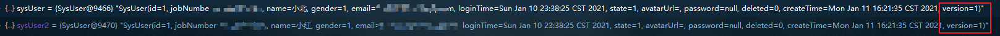

## 参考

::: tip 参考

- [Mybatis-Plus官网](https://mybatis.plus/)
- [视频：【最新版】4小时学会MyBatis Plus通俗易懂，从入门到部署上线](https://www.bilibili.com/video/BV1yA411t782)

:::


## 1. 快速上手


### 1.1 创建表

```sql
DROP TABLE IF EXISTS user;

CREATE TABLE user
(
	id BIGINT(20) NOT NULL COMMENT '主键ID',
	name VARCHAR(30) NULL DEFAULT NULL COMMENT '姓名',
	age INT(11) NULL DEFAULT NULL COMMENT '年龄',
	email VARCHAR(50) NULL DEFAULT NULL COMMENT '邮箱',
	PRIMARY KEY (id)
);

DELETE FROM user;

INSERT INTO user (id, name, age, email) VALUES
(1, 'Jone', 18, 'test1@baomidou.com'),
(2, 'Jack', 20, 'test2@baomidou.com'),
(3, 'Tom', 28, 'test3@baomidou.com'),
(4, 'Sandy', 21, 'test4@baomidou.com'),
(5, 'Billie', 24, 'test5@baomidou.com');
```


| id   | name   | age  | email              |
| ---- | ------ | ---- | ------------------ |
| 1    | Jone   | 18   | test1@baomidou.com |
| 2    | Jack   | 20   | test2@baomidou.com |
| 3    | Tom    | 28   | test3@baomidou.com |
| 4    | Sandy  | 21   | test4@baomidou.com |
| 5    | Billie | 24   | test5@baomidou.com |


### 1.2 创建Springboot项目


### 1.3 引入依赖

```xml
<!-- https://mvnrepository.com/artifact/com.baomidou/mybatis-plus-boot-starter -->
<dependency>
  <groupId>com.baomidou</groupId>
  <artifactId>mybatis-plus-boot-starter</artifactId>
  <version>3.4.1</version>
</dependency>

<!-- 其他基本的springboot依赖 -->
```


::: warning 小坑注意

配合分页插件`page helper`时比较老的版本会导致无法注入等问题，可以使用最新的

```xml
<!-- page helper -->
<dependency>
  <groupId>com.github.pagehelper</groupId>
  <artifactId>pagehelper-spring-boot-starter</artifactId>
  <version>1.3.0</version>
</dependency>
```

:::


### 1.4 配置数据源dataSource

```yaml
spring:
  application:
    name: dao
  datasource:
     # 特别注意：java 9以后需要将com.mysql.jdbc.Driver  改为  com.mysql.cj.jdbc.Driver即可
     # 否则报错：Loading class `com.mysql.jdbc.Driver'. This is deprecated.
     driver-class-name: com.mysql.cj.jdbc.Driver
     #基本属性
     url: jdbc:mysql://localhost:3306/music_recognition?
     username: root
     password: root
```


### 1.5 创建实体

```java
@Data
public class UserDemo {
    private Integer id;
    private String username;
    private String password;
}
```


### 1.6 创建mapper

```java
//继承BaseMapper，User作为泛型参数类
public interface UserMapper extends BaseMapper<User> {
}
```


### 1.7 启动器加扫描mapper的注解

`@MapperScan("com.tme.musicrecognition.dao")`

```java {2}
@SpringBootApplication
@MapperScan("com.tme.musicrecognition.dao")
public class WebApplication {
    public static void main(String[] args) {
        SpringApplication.run(WebApplication.class, args);
    }
}
```


### 1.8 在测试类中运行

```java
@SpringBootTest
class WebApplicationTests {

    @Autowired
    private UserMapper userMapper;

    @Test
    public void testSelect() {
        System.out.println(("----- selectAll method test ------"));
        userMapper.selectList(null).forEach(System.out::println);
    }
}
```


::: info 结果

> ----- selectAll method test ------
> Creating a new SqlSession
> SqlSession [org.apache.ibatis.session.defaults.DefaultSqlSession@47cf65f1] was not registered for synchronization because synchronization is not active
> JDBC Connection [com.mysql.cj.jdbc.ConnectionImpl@2ad80cf6] will not be managed by Spring
> ==>  Preparing: SELECT id,name,age,email FROM user
> ==> Parameters: 
> <==    Columns: id, name, age, email
> <==        Row: 1, Jone, 18, test1@baomidou.com
> <==        Row: 2, Jack, 20, test2@baomidou.com
> <==        Row: 3, Tom, 28, test3@baomidou.com
> <==        Row: 4, Sandy, 21, test4@baomidou.com
> <==        Row: 5, Billie, 24, test5@baomidou.com
> <==      Total: 5
> Closing non transactional SqlSession [org.apache.ibatis.session.defaults.DefaultSqlSession@47cf65f1]
> User(id=1, name=Jone, age=18, email=test1@baomidou.com)
> User(id=2, name=Jack, age=20, email=test2@baomidou.com)
> User(id=3, name=Tom, age=28, email=test3@baomidou.com)
> User(id=4, name=Sandy, age=21, email=test4@baomidou.com)
> User(id=5, name=Billie, age=24, email=test5@baomidou.com)

:::


### 1.9 application.yml配置

::: tip 参考

[mybatis-plus 3.X yml配置](https://blog.csdn.net/u012153904/article/details/106134902)

:::


`application.yml`

```yml
#mybatis-plus
mybatis-plus:
  mapper-locations: classpath:mapper/*
  type-aliases-package: com.tme.musicrecognition.entity
  # MyBatis 原生支持的配置
  configuration:
    # 是否开启自动驼峰命名规则（camel case）映射
    mapUnderscoreToCamelCase: true
    # 在控制台打印SQL命令并打印执行结果
    log-impl: org.apache.ibatis.logging.stdout.StdOutImpl
  # 全局策略配置
  global-config:
    db-config:
      logic-delete-field: deleted  # 全局逻辑删除的实体字段名(since 3.3.0,配置后可以忽略不配置步骤2)
      logic-delete-value: 1 # 逻辑已删除值(默认为 1)
      logic-not-delete-value: 0 # 逻辑未删除值(默认为 0)
```


## 2. 常用注解

::: tip 参考

- [https://mybatis.plus/guide/annotation.html](https://mybatis.plus/guide/annotation.html)

  

  介绍 `MybatisPlus` 注解包相关类详解(更多详细描述可点击查看源码注释)

  注解类包：

  👉 [mybatis-plus-annotation(opens new window)](https://gitee.com/baomidou/mybatis-plus/tree/3.0/mybatis-plus-annotation/src/main/java/com/baomidou/mybatisplus/annotation)

:::


### 2.1 @TableName

> 描述：表名注解

|       属性       |   类型   | 必须指定 | 默认值 | 描述                                                         |
| :--------------: | :------: | :------: | :----: | ------------------------------------------------------------ |
|      value       |  String  |    否    |   ""   | 表名                                                         |
|      schema      |  String  |    否    |   ""   | schema                                                       |
| keepGlobalPrefix | boolean  |    否    | false  | 是否保持使用全局的 tablePrefix 的值(如果设置了全局 tablePrefix 且自行设置了 value 的值) |
|    resultMap     |  String  |    否    |   ""   | xml 中 resultMap 的 id                                       |
|  autoResultMap   | boolean  |    否    | false  | 是否自动构建 resultMap 并使用(如果设置 resultMap 则不会进行 resultMap 的自动构建并注入) |
| excludeProperty  | String[] |    否    |   {}   | 需要排除的属性名(@since 3.3.1)                               |


### 2.2 @TableId

> 描述：主键注解

| 属性  |  类型  | 必须指定 |   默认值    |    描述    |
| :---: | :----: | :------: | :---------: | :--------: |
| value | String |    否    |     ""      | 主键字段名 |
| type  |  Enum  |    否    | IdType.NONE |  主键类型  |


IdType

|         值          | 描述                                                         |
| :-----------------: | :----------------------------------------------------------- |
|        AUTO         | 数据库ID自增。即使手动指定了Id，存入数据库还是按数据库字段最大值来自增 |
|        NONE         | 无状态,该类型为未设置主键类型(注解里等于跟随全局,全局里约等于 INPUT)。MP set主键，使用雪花算法自动生成随机数 |
|        INPUT        | insert前自行set主键值。                                      |
|      ASSIGN_ID      | 分配ID(主键类型为Number(Long和Integer)或String)(since 3.3.0),使用接口`IdentifierGenerator`的方法`nextId`(默认实现类为`DefaultIdentifierGenerator`雪花算法) |
|     ASSIGN_UUID     | 分配UUID,主键类型为String(since 3.3.0),使用接口`IdentifierGenerator`的方法`nextUUID`(默认default方法) |
|   ID_WORKER(弃用)   | 分布式全局唯一ID 长整型类型(please use `ASSIGN_ID`)          |
|     UUID(弃用)      | 32位UUID字符串(please use `ASSIGN_UUID`)                     |
| ID_WORKER_STR(弃用) | 分布式全局唯一ID 字符串类型(please use `ASSIGN_ID`)          |


### 2.3 @TableField

> 描述：字段注解(非主键),value映射字段名
>
> exist表示是否为数据库字段false

|       属性       |             类型             | 必须指定 |          默认值          |                             描述                             |
| :--------------: | :--------------------------: | :------: | :----------------------: | :----------------------------------------------------------: |
|      value       |            String            |    否    |            ""            |                         数据库字段名                         |
|        el        |            String            |    否    |            ""            | 映射为原生 `#{ ... }` 逻辑,相当于写在 xml 里的 `#{ ... }` 部分 |
|      exist       |           boolean            |    否    |           true           |                      是否为数据库表字段                      |
|    condition     |            String            |    否    |            ""            | 字段 `where` 实体查询比较条件,有值设置则按设置的值为准,没有则为默认全局的 `%s=#{%s}`,[参考(opens new window)](https://github.com/baomidou/mybatis-plus/blob/3.0/mybatis-plus-annotation/src/main/java/com/baomidou/mybatisplus/annotation/SqlCondition.java) |
|      update      |            String            |    否    |            ""            | 字段 `update set` 部分注入, 例如：update="%s+1"：表示更新时会set version=version+1(该属性优先级高于 `el` 属性) |
|  insertStrategy  |             Enum             |    N     |         DEFAULT          | 举例：NOT_NULL: `insert into table_a(<if test="columnProperty != null">column</if>) values (<if test="columnProperty != null">#{columnProperty}</if>)` |
|  updateStrategy  |             Enum             |    N     |         DEFAULT          | 举例：IGNORED: `update table_a set column=#{columnProperty}` |
|  whereStrategy   |             Enum             |    N     |         DEFAULT          | 举例：NOT_EMPTY: `where <if test="columnProperty != null and columnProperty!=''">column=#{columnProperty}</if>` |
|       fill       |             Enum             |    否    |    FieldFill.DEFAULT     |                       字段自动填充策略                       |
|      select      |           boolean            |    否    |           true           |                     是否进行 select 查询                     |
| keepGlobalFormat |           boolean            |    否    |          false           |              是否保持使用全局的 format 进行处理              |
|     jdbcType     |           JdbcType           |    否    |    JdbcType.UNDEFINED    |           JDBC类型 (该默认值不代表会按照该值生效)            |
|   typeHandler    | Class<? extends TypeHandler> |    否    | UnknownTypeHandler.class |          类型处理器 (该默认值不代表会按照该值生效)           |
|   numericScale   |            String            |    否    |            ""            |                    指定小数点后保留的位数                    |


#### 关于fill自动填充

|      值       |         描述         |
| :-----------: | :------------------: |
|    DEFAULT    |      默认不处理      |
|    INSERT     |    插入时填充字段    |
|    UPDATE     |    更新时填充字段    |
| INSERT_UPDATE | 插入和更新时填充字段 |


例子(在实体类中)

```java
@TableField(fill = FieldFill.INSERT)
private Date createTime;

@TableField(fill = FieldFill.UPDATE)
private Date updateTime;

@TableField(fill = FieldFill.INSERT_UPDATE)
private Date updateTime;
```


然后创建Handle方法

`MyMetaObjectHandler.java`

> 要加上注解`@Component`

```java
@Component
public class MyMetaObjectHandler implements MetaObjectHandler {
    @Override
    public void insertFill(MetaObject metaObject) {
        this.setFieldValByName("createTime", new Date(), metaObject);
    }

    @Override
    public void updateFill(MetaObject metaObject) {

    }

}
```


这样插入的时候就能自动填充当前时间


### 2.4 @Version

标记乐观锁,通过 `version`字段来保证数据的安全性,当修改数据的时候,会以`version`作为更新时的条件,当条件成立的时候才会修改成功。

例如

::: info 例如

线程1: update… set version=2 where version=1

线程2: update…, set version=2 where version=1

:::


#### 2.4.1 数据库添加version字段

设置默认为1


#### 2.4.2 在实体类的属性上添加@Version注解

```java
@Version
private Integer version;
```


#### 2.4.3 并发测试

```java
SysUser sysUser = sysUserMapper.selectById(1);
sysUser = sysUser.toBuilder().name("小北").build();

SysUser sysUser2 = sysUserMapper.selectById(1);
sysUser2 = sysUser2.toBuilder().name("小南").build();

sysUserMapper.updateById(sysUser);
sysUserMapper.updateById(sysUser2);
```


这里先查询两次分别赋值给`sysSuser`和`sysUser2`，此时调用`debug`模式可以看到两个查询出来的`version`都为1




此时这里按顺序更新，由于第一次带着的version与数据库中的匹配，更新后version会变为2，而接着sysUser2也带着version=1去更新，由于更新是带着version=1为条件更新，但是数据库的version已经变成2了所以找不到，所以也就无法更新。

最后的更新结果是sysUser的更新。


### 2.5 @EnumValue

枚举类型，根据数据库的字段映射替换成自定义枚举类型的实体


#### 2.5.1 在数据库创建state字段

1表示正常

2表示禁用


#### 2.5.2 在实体类加上对应属性state

> 类型为创建的枚举型

```java
private SysUserState state;
```


#### 2.5.3 创建enum类型

在字段`code`上加注解`@EnumValue`表示用code去对应映射数据库中字段`state`的值

::: info

- 如果`state`的值为1那么实体类中的`state`会自动填充为`NORMAL(1,"正常")`
- 如果`state`的值为2那么实体类中的`state`会自动填充为`DISABLED(2, "禁用")`

:::

```java
public enum SysUserState {
    NORMAL(1,"正常"),
    DISABLED(2, "禁用");

    @EnumValue
    private Integer code;
    private String msg;

    SysUserState(Integer code, String msg) {
        this.code = code;
        this.msg = msg;
    }
}
```


#### 2.5.4 在application.yml中配置扫描枚举的包

```yaml {5}
#mybatis-plus
mybatis-plus:
  mapper-locations: classpath:mapper/*
  type-aliases-package: com.tme.musicrecognition.entity
  type-enums-package: com.tme.musicrecognition.enums
```


#### 2.5.5 测试结果


#### 2.5.6 第二种方式：实现接口

```java
public enum SysUserStateEnum2 implements IEnum<Integer> {

    NORMAL(1,"正常"),
    DISABLED(2, "禁用");

    private Integer code;
    private String msg;

    SysUserStateEnum2(Integer code, String msg) {
        this.code = code;
        this.msg = msg;
    }

  	//实现此方法，等同于在code上加注解@EnumValue
    @Override
    public Integer getValue() {
        return this.code;
    }
}
```


### 2.6 @TableLogic

> 描述：表字段逻辑处理注解（逻辑删除）

|  属性  |  类型  | 必须指定 | 默认值 |     描述     |
| :----: | :----: | :------: | :----: | :----------: |
| value  | String |    否    |   ""   | 逻辑未删除值 |
| delval | String |    否    |   ""   |  逻辑删除值  |


#### 2.6.1 数据库增加字段deleted


#### 2.6.2 application.yml配置

```yaml {13-17}
#mybatis-plus
mybatis-plus:
  mapper-locations: classpath:mapper/*
  type-aliases-package: com.tme.musicrecognition.entity
  type-enums-package: com.tme.musicrecognition.enums
  # MyBatis 原生支持的配置
  configuration:
    # 是否开启自动驼峰命名规则（camel case）映射
    mapUnderscoreToCamelCase: true
    # 在控制台打印SQL命令并打印执行结果
    log-impl: org.apache.ibatis.logging.stdout.StdOutImpl
  # 全局策略配置
  global-config:
    db-config:
      logic-delete-field: deleted  # 全局逻辑删除的实体字段名(since 3.3.0,配置后可以忽略不配置步骤2)
      logic-delete-value: 1 # 逻辑已删除值(默认为 1)
      logic-not-delete-value: 0 # 逻辑未删除值(默认为 0)
```


如果不配置`logic-delete-field: deleted`，则可以直接在实体类中的`deleted`上加注解`@TableLogic`

```java
@TableLogic
private Integer deleted;
```


#### 2.6.3 测试

```java
@Test
public void deleteTest(){
    sysUserMapper.deleteById(1);
}
```


> 可以看到这里是软删除，并不是真的删除。在后续查询中也会自动添加条件`deleted=0`来作为筛选条件


## 3. CRUD示例


### 3.1 查询示例

```java
    @Test
    public void testSelect() {
        System.out.println(("----- selectAll method test ------"));
        //分页查询
//        Page<SysUser> pages = null;
//        PageHelper.startPage(0,3);
//        pages = (Page<SysUser>) sysUserMapper.selectList(null);
//        pages.getResult().forEach(System.out::println);
//        System.out.println("pages.getTotal() = " + pages.getTotal());

        //普通查询
//        sysUserMapper.selectList(null);
        //带条件查询
        QueryWrapper queryWrapper = new QueryWrapper();
        queryWrapper.eq("name", "小北");
//        sysUserMapper.selectList(queryWrapper);
        //多条件查询
        queryWrapper = new QueryWrapper();
        HashMap<String, Object> conditionHashMap = new HashMap<>();
        /*conditionHashMap.put("name", "小北");
        conditionHashMap.put("state", 2);
        queryWrapper.allEq(conditionHashMap);*/
        //大于等于
        queryWrapper.ge("state",1);
        //模糊查询
        queryWrapper.like("name", "小");
        //inSQL查询
        queryWrapper.inSql("state","select state from sys_user where state > 0");
        queryWrapper.inSql("version","select version from sys_user where version > 0");
        //降序排序
        queryWrapper.orderByDesc("state");


        sysUserMapper.selectList(queryWrapper);

    }

    @Test
    public void testSelect2() {
        System.out.println(("----- testSelect method test ------"));
        //批量查询
//        sysUserMapper.selectBatchIds(Arrays.asList(1,2,3)).forEach(System.out::println);
        //Map填充条件，只能做等值判断
        HashMap<String, Object> conditionHashMap = new HashMap<>();
        conditionHashMap.put("name", "小北");
//        sysUserMapper.selectByMap(conditionHashMap).forEach(System.out::println);

        //将查询结果填充到Map的List中
//        sysUserMapper.selectMaps(null).forEach(System.out::println);

        //分页查询
        Page<SysUser> page = new Page<>(0,1);
        Page<SysUser> result = sysUserMapper.selectPage(page, null);
        System.out.println("page.getSize() = " + result.getSize());
        System.out.println("page.getTotal() = " + result.getTotal());
        result.getRecords().forEach(System.out::println);

        //分页查询并封装在Map中
        Page<Map<String, Object>> page2 = new Page<>(1, 2);
//        sysUserMapper.selectMapsPage(page2, null).getRecords().forEach(System.out::println);


    }
```


分页查询

在`MybatisPlusConfig.java`中配置`Bean`

```java
@Bean
public PaginationInterceptor paginationInterceptor() {
    PaginationInterceptor paginationInterceptor = new PaginationInterceptor();
    // 设置请求的页面大于最大页后操作， true调回到首页，false 继续请求  默认false
    // paginationInterceptor.setOverflow(false);
    // 设置最大单页限制数量，默认 500 条，-1 不受限制
    // paginationInterceptor.setLimit(500);
    // 开启 count 的 join 优化,只针对部分 left join
    paginationInterceptor.setCountSqlParser(new JsqlParserCountOptimize(true));
    return paginationInterceptor;
}
```


### 3.2 删除示例

```java
sysUserMapper.deleteById(1);
//批量删除
sysUserMapper.deleteBatchIds(Arrays.asList(1,2));
//条件删除
QueryWrapper queryWrapper = new QueryWrapper();
queryWrapper.eq("gender", 1);
sysUserMapper.delete(queryWrapper);
//通过map删除
HashMap<String, Object> conditionHashMap = new HashMap<>();
conditionHashMap.put("gender", 1);
sysUserMapper.deleteByMap(conditionHashMap);
```


### 3.3 更新示例

```java
System.out.println(("----- updateTest method test ------"));
SysUser sysUser = sysUserMapper.selectById(1);
sysUser = sysUser.toBuilder().name("小北").state(SysUserStateEnum.DISABLED).build();
sysUserMapper.updateById(sysUser);

//使用QueryWrapper作为更新条件更新成sysUser
QueryWrapper queryWrapper = new QueryWrapper();
queryWrapper.eq("gender", 2);
sysUserMapper.update(SysUser.builder().name("熊熊").build(), queryWrapper);
```


### 3.4 增加示例

```java
System.out.println(("----- insertTest method test ------"));
SysUser sysUser = SysUser.builder().name("小明").build();
sysUserMapper.insert(sysUser);
```


### 3.2 自定义SQL语句(多表关联查询)

```java
@Select("select * from sys_user su, sys_role sr, sys_user_role sur where su.user_id = #{userId} and su.user_id = sur.user_id and sr.role_id = sur.role_id")
SysUserRoleVO selectRoleByUserId(Integer userId);
```


## 4. Mybatis-Plus自动生成代码

自动生成

::: info 自动生成

- entity
- mapper
- service
- serviceImpl
- controller

:::


### 4.1 创建一个module用来生成代码


### 4.2 添加依赖

```java
<!-- https://mvnrepository.com/artifact/com.baomidou/mybatis-plus-generator -->
<dependency>
  <groupId>com.baomidou</groupId>
  <artifactId>mybatis-plus-generator</artifactId>
  <version>3.4.1</version>
</dependency>
//模板引擎velocity(默认)，Freemarker，Beetl
<dependency>
  <groupId>org.apache.velocity</groupId>
  <artifactId>velocity-engine-core</artifactId>
  <version>2.2</version>
</dependency>
```


### 4.3 创建并配置启动类

::: tip 参考

- [代码生成器](https://baomidou.com/guide/generator.html)

:::


`MybatisPlusGenerator.java`

```java
package com.tme.musicrecognition.mybatisGenerator;

import com.baomidou.mybatisplus.annotation.DbType;
import com.baomidou.mybatisplus.annotation.IdType;
import com.baomidou.mybatisplus.core.exceptions.MybatisPlusException;
import com.baomidou.mybatisplus.core.toolkit.StringPool;
import com.baomidou.mybatisplus.core.toolkit.StringUtils;
import com.baomidou.mybatisplus.generator.AutoGenerator;
import com.baomidou.mybatisplus.generator.InjectionConfig;
import com.baomidou.mybatisplus.generator.config.*;
import com.baomidou.mybatisplus.generator.config.po.TableInfo;
import com.baomidou.mybatisplus.generator.config.rules.DateType;
import com.baomidou.mybatisplus.generator.config.rules.NamingStrategy;
import com.baomidou.mybatisplus.generator.engine.FreemarkerTemplateEngine;

import java.util.ArrayList;
import java.util.List;
import java.util.Scanner;

/**
 * @Project: music-recognition
 * @Package: com.tme.musicrecognition.mybatisGenerator
 * @ClassName: MybatisPlusGenerator
 * @Author: Chen Long
 * @Description:
 * @Datetime: 2021/1/10  13:29
 */
public class MybatisPlusGenerator {
    /**
     * <p>
     * 读取控制台内容
     * </p>
     */
    public static String scanner(String tip) {
        Scanner scanner = new Scanner(System.in);
        StringBuilder help = new StringBuilder();
        help.append("请输入" + tip + "：");
        System.out.println(help.toString());
        if (scanner.hasNext()) {
            String ipt = scanner.next();
            if (StringUtils.isNotBlank(ipt)) {
                return ipt;
            }
        }
        throw new MybatisPlusException("请输入正确的" + tip + "！");
    }

    public static void main(String[] args) {
        // 代码生成器
        AutoGenerator mpg = new AutoGenerator();

        // 数据源配置
        DataSourceConfig dsc = new DataSourceConfig();
        dsc.setUrl("jdbc:mysql://localhost:3306/music_recognition?characterEncoding=utf8&useSSL=false&useUnicode=true&serverTimezone=CTT&allowMultiQueries=true");
        // dsc.setSchemaName("public");
        dsc.setDbType(DbType.MYSQL);
        dsc.setDriverName("com.mysql.cj.jdbc.Driver");
        dsc.setUsername("root");
        dsc.setPassword("root");
        mpg.setDataSource(dsc);

        // 全局配置
        GlobalConfig gc = new GlobalConfig();
        //输出路径
        gc.setOutputDir(System.getProperty("user.dir" ) +"\\mybatisGenerator" + "/src/main/java");
        //      gc.setOutputDir(scanner("请输入项目路径") + "/src/main/java");
        gc.setAuthor("v_geekrchen");
        //生成之后是否打开资源管理器
        gc.setOpen(false);
        //重新生成后是否覆盖文件
        gc.setFileOverride(true);
        //%s为占位符，mp生成Service层代码，默认接口名称第一个字母是有I
        gc.setServiceName("%sService");
        //设置主键生成策略 自动增长
        gc.setIdType(IdType.AUTO);
        //设置Date类型 只使用java.util.date代替
        gc.setDateType(DateType.ONLY_DATE);
        // 实体属性 Swagger2 注解
        gc.setSwagger2(true);
        mpg.setGlobalConfig(gc);


        // 包配置
        PackageConfig pc = new PackageConfig();
        pc.setParent("com.tme.musicrecognition");
        pc.setModuleName("generator");
        //        pc.setModuleName(scanner("模块名"));
        pc.setController("controller");
        pc.setService("service");
        pc.setServiceImpl("service.impl");
        pc.setMapper("mapper");
        pc.setEntity("entity");
        mpg.setPackageInfo(pc);


        // 策略配置
        StrategyConfig strategy = new StrategyConfig();
        strategy.setInclude(scanner("表名，多个英文逗号分割").split(","));

        //实体类名称驼峰命名
        strategy.setNaming(NamingStrategy.underline_to_camel);
        //字段名称驼峰命名
        strategy.setColumnNaming(NamingStrategy.underline_to_camel);
        //strategy.setSuperEntityClass("你自己的父类实体,没有就不用设置!");
        //设置lombok
        strategy.setEntityLombokModel(true);
        //Controller使用RestController
        strategy.setRestControllerStyle(true);
        // 公共父类
        //strategy.setSuperControllerClass("你自己的父类控制器,没有就不用设置!");
        // 写于父类中的公共字段
        //strategy.setSuperEntityColumns("id");

        //驼峰转连字符
        strategy.setControllerMappingHyphenStyle(true);
        //strategy.setTablePrefix(pc.getModuleName() + "_");
        mpg.setStrategy(strategy);
        mpg.execute();
    }
}

```


然后运行即可