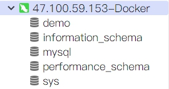
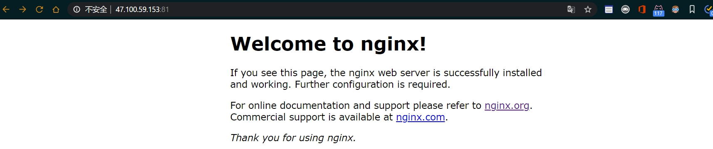

## 1. 概念

> - 镜像：相当于java中的类,镜像由一层层只读层堆在一起
> - 容器：镜像只读层+读写层，运行态容器为由一个可读写的文件系统「静态容器」+ 隔离的进程空间和其中的进程构成(可以理解为**虚拟机中的虚拟机**)


### 1.1 查看镜像

```shell
docker images
```


### 1.2 查看容器

```shell
docker ps -a
```


## 2. 安装Mysql


### 2.1 下载mysql5.7的docker镜像

```shell
docker pull mysql:5.7
```


### 2.2 使⽤docker命令启动容器

```shell
mkdir /mydata/mysql/mysql5.7 #先在根目录创建容器来存放mysql相关
#将容器的3306端口映射到主机的3307接口，适合主机的3306接口被主机Mysql占用情况下
docker run -p 3307:3306 --name mysql5.7 \
-v /mydata/mysql/mysql5.7/log:/var/log/mysql5.7 \
-v /mydata/mysql/mysql5.7/data:/var/lib/mysql5.7 \
-v /mydata/mysql/mysql5.7/conf:/etc/mysql5.7 \
-e MYSQL_ROOT_PASSWORD=root \
-d mysql:5.7
```

参数说明 

> - --restart=always：容器自启动
> - -p 3307:3306：将容器的3306端⼝映射到主机的3307端⼝        
> - -v /mydata/mysql/conf:/etc/mysql：将配置⽂件夹挂在到主机
> - -v /mydata/mysql/log:/var/log/mysql：将⽇志⽂件夹挂载到主机
> - -v /mydata/mysql/data:/var/lib/mysql/：将数据⽂件夹挂载到主机
> - -e MYSQL_ROOT_PASSWORD=root：初始化root⽤户的密码


### 2.3 进⼊运⾏mysql的docker容器

```shell
docker exec -it mysql5.7 /bin/bash
```


### 2.4 使⽤Mysql命令打开客户端

```shell
mysql -uroot -proot
```


### 2.5 测试连接

使用Navicat连接工具


连接成功




## 3. 安装Nginx


### 3.1 下载Nginx1.10的docker镜像

```shell
docker pull nginx:1.18
```


### 3.2 先运⾏⼀次容器（为了拷⻉配置⽂件）

```shell
docker run -p 81:80 --name nginx1.18 \
-v /mydata/nginx1.18/html:/usr/share/nginx1.18/html \
-v /mydata/nginx1.18/logs:/var/log/nginx1.18 \
-d nginx:1.18
```

> 注：加了 -d 参数默认不会进⼊容器，想要进⼊容器需要使⽤指令 `docker exec`。


### 3.3 将容器内的配置⽂件拷⻉到指定⽬录

```shell
docker container cp nginx1.18:/etc/nginx /mydata/nginx1.18/
```


### 3.4 修改⽂件名称

```shell
cd /mydata/nginx1.18 
mv nginx conf
```


### 3.5 终⽌并删除容器

```shell
docker stop nginx1.18
docker rm nginx1.18
```


### 3.6 再次使⽤docker命令启动

```shell
docker run -p 81:80 --name nginx1.18 \
-v /mydata/nginx1.18/html:/usr/share/nginx1.18/html \
-v /mydata/nginx1.18/logs:/var/log/nginx1.18 \
-v /mydata/nginx1.18/conf:/etc/nginx1.18 \
-d nginx:1.18
```


### 3.7 启动成功



