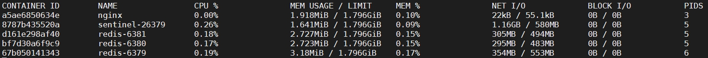

## 参考

参考

::: tip 参考

- [阮一峰Docker 入门教程](http://www.ruanyifeng.com/blog/2018/02/docker-tutorial.html)
- https://www.bilibili.com/read/cv6041687/
- [菜鸟教程 | Docker 教程](https://www.runoob.com/docker/docker-tutorial.html)

:::


官方

::: tip 官方

- [官方文档](https://docs.docker.com/)
- [仓库地址](https://hub.docker.com/)

:::


## 介绍

Docker 是一个开源的应用容器引擎，基于 Go 语言开发。Docker 可以让开发者打包他们的应用以及依赖包到一个轻 量级、可移植的容器中，然后发布到任何流行的 Linux 机器上，也可以实现虚拟化。容器是完全使用沙箱机制，相互 之间不会有任何接口（类似 iPhone 的 app）,更重要的是容器性能开销极低。

**Docker 属于 Linux 容器的一种封装，提供简单易用的容器使用接口。**它是目前最流行的 Linux 容器解决方案。

Docker 将应用程序与该程序的依赖，打包在一个文件里面。运行这个文件，就会生成一个虚拟容器。程序在这个虚拟容器里运行，就好像在真实的物理机上运行一样。有了 Docker，就不用担心环境问题。

总体来说，Docker 的接口相当简单，用户可以方便地创建和使用容器，把自己的应用放入容器。容器还可以进行版本管理、复制、分享、修改，就像管理普通的代码一样。


### 用途

Docker 的主要用途，目前有三大类。

::: info 用途

- **提供一次性的环境**。比如，本地测试他人的软件、持续集成的时候提供单元测试和构建的环境。
- **提供弹性的云服务**。因为 Docker 容器可以随开随关，很适合动态扩容和缩容。
- **组建微服务架构**。通过多个容器，一台机器可以跑多个服务，因此在本机就可以模拟出微服务架构。
- Web 应用的自动化打包和发布
- 自动化测试和持续集成、发布
- 在服务型环境中部署和调整数据库或其他的后台应用

:::


使用Docker可以实现开发人员的开发环境、测试人员的测试环境、运维人员的生产环境的一致性。


### 组成


### 底层原理


## 安装

::: tip 参考

- [CentOS Docker 安装](https://www.runoob.com/docker/centos-docker-install.html)
- [Install Docker Engine on CentOS](https://docs.docker.com/engine/install/centos/)
- [视频狂神说](https://www.bilibili.com/video/BV1og4y1q7M4?p=6)

:::


### docker可视化界面

::: tip 参考

- https://www.cnblogs.com/frankdeng/p/9686735.html

:::


## docker镜像容器原理

::: tip 参考

- http://dockone.io/article/783
- https://zhuanlan.zhihu.com/p/93085215
- https://blog.51cto.com/liuleis/2070461

:::


## 常用命令

参考

::: tip 参考

- http://dockone.io/article/783
- https://www.bilibili.com/read/cv6041687/
- https://www.cnblogs.com/duanxz/p/7905233.html
- https://jishuin.proginn.com/p/763bfbd2a0a8

:::


### 镜像(images)


**查看镜像**

```bash
#查看所有本地主机上的镜像
docker images

#帮助
[root@VM-151-171-centos ~]# docker images --help

Usage:  docker images [OPTIONS] [REPOSITORY[:TAG]]

List images

Options:
  -a, --all             Show all images (default hides intermediate images)
      --digests         Show digests
  -f, --filter filter   Filter output based on conditions provided
      --format string   Pretty-print images using a Go template
      --no-trunc        Don't truncate output
  -q, --quiet           Only show numeric IDs
```


**搜索镜像**

```bash
#搜索mysql镜像
docker search mysql

[root@VM-151-171-centos ~]# docker search --help

Usage:  docker search [OPTIONS] TERM

Search the Docker Hub for images

Options:
  -f, --filter filter   Filter output based on conditions provided
      --format string   Pretty-print search using a Go template
      --limit int       Max number of search results (default 25)
      --no-trunc        Don't truncate output


#搜索stars大于3000的镜像
[root@VM-151-171-centos ~]# docker search mysql --filter=STARS=3000
NAME                DESCRIPTION                                     STARS               OFFICIAL            AUTOMATED
mysql               MySQL is a widely used, open-source relation…   10444               [OK]                
mariadb             MariaDB is a community-developed fork of MyS…   3880                [OK] 
```


**下载镜像**


可以看到部分文件已经存在，无需重复下载


**删除镜像**

```shell
#删除镜像，参数可以使镜像名也可以是镜像id
[root@VM-151-171-centos ~]# docker rmi --help

Usage:  docker rmi [OPTIONS] IMAGE [IMAGE...]

Remove one or more images

Options:
  -f, --force      Force removal of the image
      --no-prune   Do not delete untagged parents


#删除多个镜像
docker rmi -f [] []

#删除全部镜像
docker rmi -f $(docker images -aq)
```


### 容器(container)

参考参考:[https://www.bilibili.com/read/cv6041687/](https://www.bilibili.com/read/cv6041687/)


::: warning 注意

- start是启动已创建好的，run是运行一个全新的容器
- `run`的时候`--rm`代表用完容器自动删除容器
- `run`的时候`-P`大写的P是随机端口

:::


### 其他

```shell
#查看各个容器状态（CPU等）
docker stats
#查看指定容器
docker stats [容器]
```




```shell
#7.在使⽤ -d 参数时，容器启动后会进⼊后台。此时想要进⼊容器，可以通过以下指令进⼊
docker attach 容器名称/id #不推荐使⽤，因为退出时会导致容器的停⽌
docker exec -it 容器名称/id /bin/bash #在进⼊容器后可使⽤linux命令，退出使⽤exit

#8.导出
docker export 容器名称/id > 名称.tar

#9.导⼊，可以使⽤ docker import 从容器快照⽂件中再导⼊为镜像，以下实例将快照⽂件指定
路径的tar 导⼊到镜像 test/test:v1:
cat tar路径 | docker import - test/test:v1
#也可以通过指定 URL 或者某个⽬录来导⼊
docker import http://example.com/exampleimage.tgz example/imagerepo

#10.删除容器
docker rm -f 容器名称/id

#11.启动&停止docker
service docker start#启动docker
service docker stop#停止docker
service docker restart#重启docker

#12.开机自启动docker
systemctl enable docker
```


## 日志 | 元数据 | 文件传输 


### 日志

```shell
[root@VM-151-171-centos ~]# docker logs --help

Usage:  docker logs [OPTIONS] CONTAINER

Fetch the logs of a container

Options:
      --details        Show extra details provided to logs
  -f, --follow         Follow log output
      --since string   Show logs since timestamp (e.g. 2013-01-02T13:23:37) or relative (e.g. 42m for 42 minutes)
      --tail string    Number of lines to show from the end of the logs (default "all")
  -t, --timestamps     Show timestamps
      --until string   Show logs before a timestamp (e.g. 2013-01-02T13:23:37) or relative (e.g. 42m for 42 minutes)
```


### 元数据

```shell
#查看关于容器的所有信息
docker inspect [容器id/名]
```


### 文件传输

拷贝宿主机文件到容器

```shell
#将主机文件拷贝到容器中
docker cp [主机文件] [容器]:[容器路径]
```


拷贝容器中的文件到宿主机

```shell
#将主机文件拷贝到容器中
docker cp [容器]:[容器文件] [主机路径]
```


## 容器数据卷/目录挂载

::: tip 参考

- https://www.cnblogs.com/ruanraun/p/dockervolumes.html
- https://www.cnblogs.com/ivictor/p/4834864.html
- https://www.cnblogs.com/loveyous/p/11372034.html

:::


在容器中管理数据主要有两种方式：

- 数据卷(Volumes)
- 挂载主机目录(Bind mounts)


::: warning

Docker中提供了两种挂载方式，`-v`和`-mount`

Docker新用户应该选择 --mount参数

经验丰富的Docker使用者对-v或者--volume已经很熟悉了，但是推荐使用-mount参数。

:::


### 目录挂载

持久化容器里面的数据到本地，通过`目录挂载`的方式

可以在创建容器的时候，将宿主机的目录与容器内的目录进行映射，这样我们就可以通过修改宿主机某个目录的文件从而去影响容器，也就意味着挂载的目录`互相同步`。 

创建容器时添加`-v`参数，后边为`宿主机目录:容器目录`，例如： docker run -di -v /usr/local/test:/usr/local/test -- name=mycentos3 centos:7

创建linux宿主机器要挂载的目录

```shell
mkdir /usr/local/test
```


创建并启动容器mycentos3,并挂载linux中的/usr/local/test目录到容器的/usr/local/test；也就是在

linux中的/usr/local/test中操作相当于对容器相应目录操作

```shell
docker run -di -v /usr/local/test:/usr/local/test --name=mycentos3 centos:7
```


在linux下创建文件

```shell
touch /usr/local/test/def.txt
```


进入容器

```shell
docker exec -it mycentos3 /bin/bash 
```


在容器中查看目录中是否有对应文件def.txt

```shell
ll /usr/local/test 
```


然后查看容器元数据中的挂载目录信息

```json
"Mounts": [
  {
    "Type": "bind",
    "Source": "/usr/local/docker/nginx/html",
    "Destination": "/data/html",
    "Mode": "rw",
    "RW": true,
    "Propagation": "rprivate"
  },
  {
    "Type": "bind",
    "Source": "/usr/local/docker/nginx/img",
    "Destination": "/data/img",
    "Mode": "rw",
    "RW": true,
    "Propagation": "rprivate"
  },
  {
    "Type": "bind",
    "Source": "/usr/local/docker/nginx/conf.d",
    "Destination": "/etc/nginx/conf.d",
    "Mode": "rw",
    "RW": true,
    "Propagation": "rprivate"
  }
],

```


### 具名和匿名挂载

```shell
# 如何确实是具名/匿名挂载，还是指定路径挂载
#匿名挂载
-v 容器内路径

#具名挂载
-v 卷名:容器内路径

#指定路径挂载
-v /宿主机路径:容器内路径
```


### 容器挂载目录权限

在`容器内路径`后加`:ro`为可读，加`:rw`为可读可写

::: info

- **ro**:宿主机只能读取容器的数据卷内容不能修改
- **rw**:默认，即可读可写

:::


### 数据卷容器共享

如我我们经常需要多个容器之间进行数据共享我们需要用到命令`--volumes-from`


具体示例

1. 我们从仓库拉一个centos的容器镜像

```bash
Copy$ docker pull centos
```

2）然后运行这个镜像并创建一个数据卷挂载到/mydata

```bash
$ docker run -it -v /mydata --name mycentos centos
```

2. 再运行两个容器，在这两个容器中使用--volumes-from来挂载mycentos容器中的数据卷.

```bash
$ docker run -it --volumes-from mycentos --name soncentos1 centos

$ docker run -it --volumes-from mycentos --name soncentos2 centos
```

此时，容器soncentos1和soncentos2都挂载同一个数据卷到相的/mydata目录。三个容器任何一方在该目录下的写入数据，其他容器都可以看到。


::: warning 注意

可以多次使用`--volumes-**from**`参数来从多个容器挂载多个数据卷。还可以从其他已经挂载了容器卷的容器来挂载数据卷。 使用--volumes-**from**参数所挂载数据卷的容器自身并不需要保持在运行状态。 

如果删除了挂载的容器（包括dbdata、db1和db2），数据卷并不会被自动删除。如果要删除一个数据卷，必须在删除最后一个还挂载着它 的容器时显式使用docker rm -v命令来指定同时删除关联的容器。

:::


## 制作镜像


### 使用commit命令

```shell
# 提交某个容器为镜像
docker commit [容器]

[root@izuf6f489inattnq5zpfcxz ~]# docker commit --help

Usage:  docker commit [OPTIONS] CONTAINER [REPOSITORY[:TAG]]

Create a new image from a container's changes

Options:
  -a, --author string    Author (e.g., "John Hannibal Smith <hannibal@a-team.com>")
  -c, --change list      Apply Dockerfile instruction to the created image
  -m, --message string   Commit message
  -p, --pause            Pause container during commit (default true)

```


## Dockerfile-制作镜像

::: tips 参考

- [Dockerfile reference](https://docs.docker.com/engine/reference/builder/#dockerfile-examples)
- [菜鸟教程 | Dockerfile](https://www.runoob.com/docker/docker-dockerfile.html)

:::


### 命令


`CMD`&`ENTRYPOINT`的区别

::: warning CMD&ENTRYPOINT的区别

- CMD：指定这个容器启动的时候要运行的命令，只有最后一个会生效，可被替代
- ENTRYPOINT：指定这个容器启动的时候要运行的命令，可以追加命令

:::


举例通过构建两个不同的dockerfile

`dockerfile-cmd`

```shell
# 构建镜像为centos-cmd
FROM centos
CMD ["ls", "-a"]
```

`dockerfile-entrypoint`

```shell
# 构建镜像为centos-entrypoint
FROM centos
ENTRYPOINT ["ls", "-a"]
```


构建镜像再运行

`centos-cmd`

```shell

[root@izuf6f489inattnq5zpfcxz ~]# docker run centos-cmd
.
..
.dockerenv
bin
dev
etc
home
lib
lib64
lost+found
media
mnt
opt
proc
root
run
sbin
srv
sys
tmp
usr
var
[root@izuf6f489inattnq5zpfcxz ~]#

```


`centos-entrypoint`

```shell
[root@izuf6f489inattnq5zpfcxz ~]# docker run centos-entrypoint
.
..
.dockerenv
bin
dev
etc
home
lib
lib64
lost+found
media
mnt
opt
proc
root
run
sbin
srv
sys
tmp
usr
var
[root@izuf6f489inattnq5zpfcxz ~]#
```


此时我们在`run`时追加命令，由于`cmd`是替换所以会报错，而`entrypoint`则不会

`centos-cmd`

```shell
[root@izuf6f489inattnq5zpfcxz ~]# docker run centos-cmd -l
docker: Error response from daemon: OCI runtime create failed: container_linux.go:349: starting container process caused "exec: \"-l\": executable file not found in $PATH": unknown.
[root@izuf6f489inattnq5zpfcxz ~]#
```


`centos-entrypoint`

```shell

[root@izuf6f489inattnq5zpfcxz ~]# docker run centos-entrypoint -l
total 56
drwxr-xr-x   1 root root 4096 Feb  8 16:19 .
drwxr-xr-x   1 root root 4096 Feb  8 16:19 ..
-rwxr-xr-x   1 root root    0 Feb  8 16:19 .dockerenv
lrwxrwxrwx   1 root root    7 Nov  3 15:22 bin -> usr/bin
drwxr-xr-x   5 root root  340 Feb  8 16:19 dev
drwxr-xr-x   1 root root 4096 Feb  8 16:19 etc
drwxr-xr-x   2 root root 4096 Nov  3 15:22 home
lrwxrwxrwx   1 root root    7 Nov  3 15:22 lib -> usr/lib
lrwxrwxrwx   1 root root    9 Nov  3 15:22 lib64 -> usr/lib64
drwx------   2 root root 4096 Dec  4 17:37 lost+found
drwxr-xr-x   2 root root 4096 Nov  3 15:22 media
drwxr-xr-x   2 root root 4096 Nov  3 15:22 mnt
drwxr-xr-x   2 root root 4096 Nov  3 15:22 opt
dr-xr-xr-x 151 root root    0 Feb  8 16:19 proc
dr-xr-x---   2 root root 4096 Dec  4 17:37 root
drwxr-xr-x  11 root root 4096 Dec  4 17:37 run
lrwxrwxrwx   1 root root    8 Nov  3 15:22 sbin -> usr/sbin
drwxr-xr-x   2 root root 4096 Nov  3 15:22 srv
dr-xr-xr-x  13 root root    0 Feb  8 16:19 sys
drwxrwxrwt   7 root root 4096 Dec  4 17:37 tmp
drwxr-xr-x  12 root root 4096 Dec  4 17:37 usr
drwxr-xr-x  20 root root 4096 Dec  4 17:37 var
[root@izuf6f489inattnq5zpfcxz ~]#

```

可以看到此时`-l`命令被追加到`ls -a`中，最后执行了`ls -a -l`


其他

::: info

- 每个保留关键字都是大写字母
- 执行顺序从上到下
- #表示注释
- 每一个指令都会创建提交一个`新的镜像层`，并提交

:::


### 示例：创建自己的centos镜像


编写`dockerfile`文件

```shell
FROM centos
MAINTAINER Chen Long

ENV MYPATH /usr/local
WORKDIR $MYPATH

RUN yum -y install vim
RUN yum -y install tree
RUN yum -y install net-tools

EXPOSE 80

CMD echo $MYPATH
CMD echo "---END---"
CMD /bin/bash
```


执行build命令

``` .shell
docker build -f [dockerfile文件] -t [镜像名] .
```


构建完毕

```shell
Successfully built 0532ada899d9
Successfully tagged mycentos:1.0.0
```


查看镜像

```shell
[root@izuf6f489inattnq5zpfcxz mydockerfile]# docker images
REPOSITORY            TAG                 IMAGE ID            CREATED             SIZE
mycentos              1.0.0               0532ada899d9        3 minutes ago       314MB
```


查看镜像构建历史

```shell
docker history [镜像]
```


重命名镜像/打标签

```shell
docker tag [镜像]
```


## docker-compose

