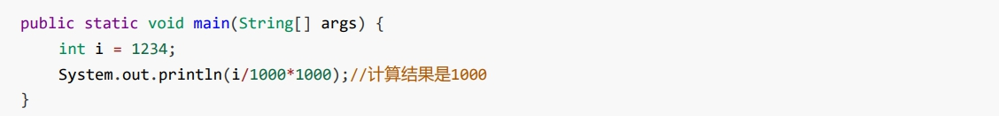
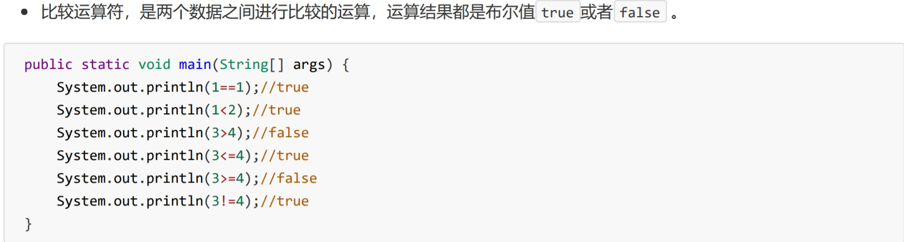

# 参考

> - [JavaSchool](http://www.51gjie.com/)


# 1 数据类型

Java的数据类型分为两大类： 

- **基本数据类型**：包括 整数 、 浮点数 、 字符 、 布尔 。 

- **引用数据类型**：包括 类 、 数组 、 接口 。

  


## 1.1 整型

整型用于表示没有小数部分的数值， 它允许是负数。Java 提供了 4 种整型，具体内容如下


### 注意

int类型声明为L时会报错，需要向下转型。long类型声明时可以加或不加`L或l`

```java
int a = 10L;//报错
int b = (int)10L;//正确
long c = 10L;//正确
long d = 10;//正确,相当于向上转型
```


## 1.2 浮点类型

浮点类型用于表示有小数部分的数值。在 Java 中有两种浮点类型


​		double 表示这种类型的数值精度是 float 类型的两倍（有人称之为双精度数值)。**绝大部分应用程序都采用 double 类型**。在很多情况下，**float 类型的精度很难满足需求**。实际上，只有很少的情况适合使用 float 类型，例如，需要单精度数据的库， 或者需要存储大量数据。 float 类型的数值有一个后缀 F 或 f (例如，3.14F。) 没有后缀 F 的浮点数值（如 3.14 ) 默 认为 double 类型。当然，也可以在浮点数值后面添加后缀 D 或 d (例如，3.14D) 。


### 注意

声明`float`时必须要加`F或f`，但是如果是整数则不用

```java
float a = 10;//正确
float b = 10.5F;//正确
float c = 10.5;//报错
```

`double`类型可加可不加D或d，因为声明为小数时，小数默认是double类型

```java
double a = 10;//正确
double b = 10.5;//正确
double c = 10.5D;//正确,D可加可不加
```


## 1.3 char类型

​		


## 1.4 boolean类型

boolean (布尔）类型有两个值：false 和 true, 用来判定逻辑条件 整型值和布尔值之间 不能进行相互转换。


# 2 运算符


## 2.1 算术运算符


Java中，整数使用以上运算符，无论怎么计算，也不会得到小数。





## 2.2 赋值运算符


## 2.3 比较运算符





### instanceof：比较一个对象是否为一个类的实例/或某个接口的实现类

参考

> - https://www.cnblogs.com/ysocean/p/8486500.html