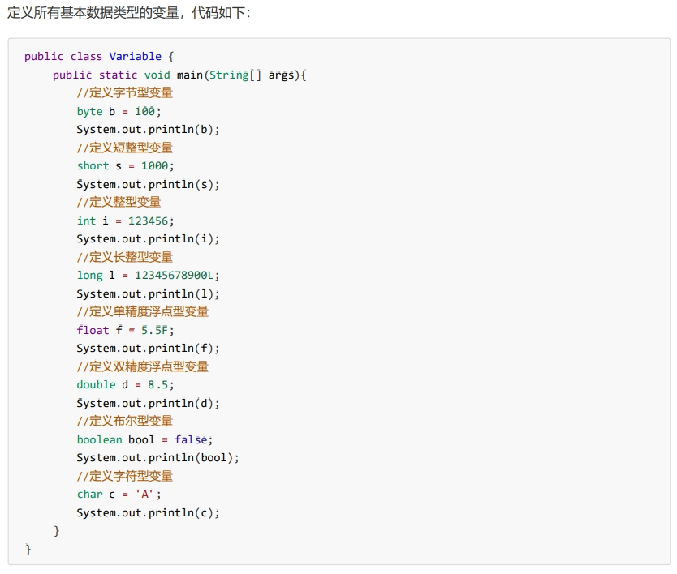

# 参考

> - [JavaSchool](http://www.51gjie.com/)


# 1 数据类型

Java的数据类型分为两大类： 

- **基本数据类型**：包括 整数 、 浮点数 、 字符 、 布尔 。 

- **引用数据类型**：包括 类 、 数组 、 接口 。

  





## 1.1 整型

整型用于表示没有小数部分的数值， 它允许是负数。Java 提供了 4 种整型，具体内容如下


### 注意

int类型声明为L时会报错，需要向下转型。long类型声明时可以加或不加

```java
int a = 10L;//报错
int b = (int)10L;//正确
long c = 10L;//正确
long d = 10;//正确,相当于向上转型
```


## 1.2 浮点类型

浮点类型用于表示有小数部分的数值。在 Java 中有两种浮点类型


### 注意

`123`


```java
13131
```

