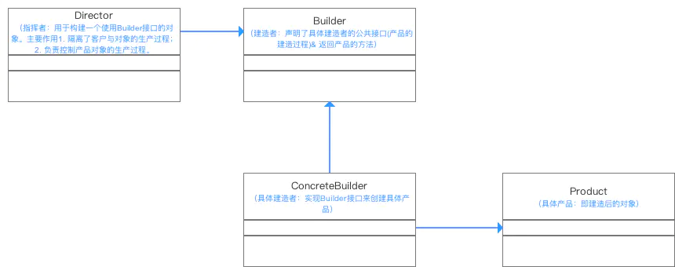

## 参考


::: tip 参考

- https://www.runoob.com/design-pattern/design-pattern-intro.html
- http://c.biancheng.net/view/1317.html
- [设计模式之禅](TheZen0fDesignPattern_2.pdf)

:::


## 1. 单例模式（创建型模式）

`创建型模式`


参考

> - https://www.runoob.com/design-pattern/singleton-pattern.html


单例模式（Singleton Pattern）是 Java 中最简单的设计模式之一。这种类型的设计模式属于创建型模式，它提供了一种创建对象的最佳方式。

这种模式涉及到一个单一的类，该类负责创建自己的对象，同时确保只有单个对象被创建。这个类提供了一种访问其唯一的对象的方式，可以直接访问，不需要实例化该类的对象。

单例模式保证了系统内存中只存在一个对象，节省了系统资源,对于一些需要`频繁创建销毁`的对象,使用单例模式可以提高系统性能。当想实例化一个单例类的时候,必须要记住使用相应的获取对象的方法,而不是使用new

单例模式使用的场景:

> 需要频繁的进行创建和销毁的对象，创建对象时耗时过多或耗费资源过多(即:重量级对象),但又经常用到的对象、工具类对象、频繁访问数据库或文件的对象(比如数据源、 session工厂等)


- 1、单例类只能有一个实例。
- 2、单例类必须自己创建自己的唯一实例。
- 3、单例类必须给所有其他对象提供这一实例。


### 实现点

- 是否线程安全
- 是否懒加载
- 是否反射可破坏


### 1.1 步骤


#### 步骤 1：创建一个 `Singleton` 类


```java
public class SingleObject {
 
   //创建 SingleObject 的一个对象
   private static SingleObject instance = new SingleObject();
 
   //让构造函数为 private，这样该类就不会被实例化
   private SingleObject(){}
 
   //获取唯一可用的对象
   public static SingleObject getInstance(){
      return instance;
   }
 
   public void showMessage(){
      System.out.println("Hello World!");
   }
}
```


#### 步骤 2：从 `singleton` 类获取唯一的对象


```java
public class SingletonPatternDemo {
   public static void main(String[] args) {
 
      //不合法的构造函数
      //编译时错误：构造函数 SingleObject() 是不可见的
      //SingleObject object = new SingleObject();
 
      //获取唯一可用的对象
      SingleObject object = SingleObject.getInstance();
 
      //显示消息
      object.showMessage();
   }
}
```


### 1.2 懒汉式，线程不安全


| 名称             | 描述 |
| ---------------- | ---- |
| 是否 Lazy 初始化 | 是   |
| 是否多线程安全   | 否   |
| 实现难度         | 易   |


描述

> 这种方式是最基本的实现方式，这种实现最大的问题就是不支持多线程。因为没有加锁 `synchronized`，所以严格意义上它并不算单例模式。这种方式 lazy loading 很明显，不要求线程安全，在多线程不能正常工作。**实际不推荐使用**


```java
public class Singleton {  
    private static Singleton instance;  
    private Singleton (){}  
  
    public static Singleton getInstance() {  
    if (instance == null) {  
        instance = new Singleton();  
    }  
    return instance;  
    }  
}
```


### 1.3 懒汉式，线程安全


| 名称             | 描述 |
| ---------------- | ---- |
| 是否 Lazy 初始化 | 是   |
| 是否多线程安全   | 是   |
| 实现难度         | 易   |


描述

> 这种方式具备很好的 lazy loading，能够在多线程中很好的工作，但是，效率很低，只有第一次创建的时候需要同步，99% 情况下不需要同步。优点：第一次调用才初始化，避免内存浪费。缺点：必须加锁 `synchronized` 才能保证单例，但加锁会影响效率。getInstance() 的性能对应用程序不是很关键（该方法使用不太频繁）。**实际不推荐使用**


```java
public class Singleton {  
    private static Singleton instance;  
    private Singleton (){}  
    public static synchronized Singleton getInstance() {  
    if (instance == null) {  
        instance = new Singleton();  
    }  
    return instance;  
    }  
}
```


### 1.4 饿汉式

| 名称             | 描述 |
| ---------------- | ---- |
| 是否 Lazy 初始化 | 否   |
| 是否多线程安全   | 是   |
| 实现难度         | 易   |


描述

> 这种方式比较常用，但容易产生垃圾对象。它基于 classloader 机制避免了多线程的同步问题，不过，instance 在类装载时就实例化，虽然导致类装载的原因有很多种，在单例模式中大多数都是调用 getInstance 方法， 但是也不能确定有其他的方式（或者其他的静态方法）导致类装载，这时候初始化 instance 显然没有达到 lazy loading 的效果。
>
> 优点：没有加锁，执行效率会提高。
>
> 缺点：类加载时就初始化，浪费内存。


```java
public class Singleton {
    private static Singleton instance = new Singleton();  
    private Singleton (){}  
    public static Singleton getInstance() {  
    return instance;  
    }  
}


```


静态代码块写法

```java
public class Singleton_Hungry {
    private static Singleton_Hungry instance;
    static {
        instance = new Singleton_Hungry();
    }
    private Singleton_Hungry() {
    }
    public static Singleton_Hungry getInstance() {
        return instance;
    }
}
```


### 1.5 双重校验锁懒汉式（DCL，即 double-checked locking）


| 名称             | 描述   |
| ---------------- | ------ |
| 是否 Lazy 初始化 | 是     |
| 是否多线程安全   | 是     |
| 实现难度         | 较复杂 |


描述

> JDK1.5 起。这种方式采用双锁机制，安全且在多线程情况下能保持高性能。`getInstance()` 的性能对应用程序很关键。推荐使用


```java
public class Singleton {  
    private volatile static Singleton singleton;  
    private Singleton (){}  
    public static Singleton getSingleton() {  
    if (singleton == null) {  
        synchronized (Singleton.class) {  
        if (singleton == null) {  
            singleton = new Singleton();  
        }  
        }  
    }  
    return singleton;  
    }  
}
```


另外，需要注意 uniqueInstance 采⽤ `volatile` 关键字修饰也是很有必要。`volatile`作用是防止在new实例的时候,还没初始化完,有其他线程进来,实例此时已经不为空.多线程拿到的实例数据就不一致,加了该关键字后,先初始化完成后在赋值给实例。 uniqueInstance = new Singleton(); 这段代码其实是分为三步执⾏： 

1. 为 uniqueInstance 分配内存空间 
2. 初始化 uniqueInstance 
3. 将 uniqueInstance 指向分配的内存地址 


但是由于 JVM 具有指令重排的特性，执⾏顺序有可能变成 1>3>2。指令重排在单线程环境下不会出 现问题，但是在多线程环境下会导致⼀个线程获得还没有初始化的实例。例如，线程 T1 执⾏了 1 和 3，此时 T2 调⽤ getUniqueInstance() 后发现 uniqueInstance 不为空，因此返回 uniqueInstance，但此时 uniqueInstance 还未被初始化。 使⽤ volatile 可以禁⽌ JVM 的指令重排，保证在多线程环境下也能正常运⾏。


### 1.6 静态内部类

参考

> - https://blog.csdn.net/mnb65482/article/details/80458571


| 名称             | 描述   |
| ---------------- | ------ |
| 是否 Lazy 初始化 | 是     |
| 是否多线程安全   | 是     |
| 实现难度         | 较复杂 |


描述

> 静态内部类的优点是：上升为顶级类，外部类加载时并不需要立即加载内部类，内部类不被加载则不去初始化`INSTANCE`，故而不占内存。即当`SingleTon`第一次被加载时，并不需要去加载`SingletonInstance`，只有当`getInstance()`方法第一次被调用时，才会去初始化`INSTANCE`,第一次调用`getInstance()`方法会导致虚拟机加载`SingleTonHoler`类，这种方法不仅能确保线程安全，也能保证单例的唯一性，同时也延迟了单例的实例化。
>
> 这种方式采用了类装载的机制来保证初始化实例时只有一个线程。静态内部类方式在 `Singleton`类被装载时并不会立即`实例化`,而是在需要实例化时,调用 `getInstance`方法,才会装载 `Singletoninstance`类,从而完成 `Singleton`的实例化。类的静态属性只会在第一次加载类的时候初始化,所以在这里,帮助我们保证了线程的安全性,在类进行初始化时,别的线程是无法进入的。优点:避免了线程不安全,利用静态内部类特点实现延迟加载,效率高。结论:推荐使用  


```java
public class Singleton{
    private Singleton() {
    }

    private static class SingletonInstance{
        private static final Singleton INSTANCE = new Singleton();
    }


    public static Singleton getInstance() {
        return SingletonInstance.INSTANCE;
    }
}
```


> 我们再回头看下getInstance()方法，调用的是SingleTonHoler.INSTANCE，取的是SingleTonHoler里的INSTANCE对象，跟上面那个DCL方法不同的是，getInstance()方法并没有多次去new对象，故不管多少个线程去调用getInstance()方法，取的都是同一个INSTANCE对象，而不用去重新创建。当getInstance()方法被调用时，SingleTonHoler才在SingleTon的运行时常量池里，把符号引用替换为直接引用，这时静态对象INSTANCE也真正被创建，然后再被getInstance()方法返回出去，这点同饿汉模式。那么INSTANCE在创建过程中又是如何保证线程安全的呢？在《深入理解JAVA虚拟机》中，有这么一句话:
>
> 虚拟机会保证一个类的<\clinit>()方法在多线程环境中被正确地加锁、同步，如果多个线程同时去初始化一个类，那么只会有一个线程去执行这个类的<\clinit>()方法，其他线程都需要阻塞等待，直到活动线程执行<\clinit>()方法完毕。如果在一个类的<\clinit>()方法中有耗时很长的操作，就可能造成多个进程阻塞(需要注意的是，其他线程虽然会被阻塞，但如果执行<\clinit>()方法后，其他线程唤醒之后不会再次进入<\clinit>()方法。同一个加载器下，一个类型只会初始化一次。)，在实际应用中，这种阻塞往往是很隐蔽的。
>
> 故而，可以看出INSTANCE在创建过程中是线程安全的，所以说静态内部类形式的单例可保证线程安全，也能保证单例的唯一性，同时也延迟了单例的实例化。
>
> 那么，是不是可以说静态内部类单例就是最完美的单例模式了呢？其实不然，静态内部类也有着一个致命的缺点，就是传参的问题，由于是静态内部类的形式去创建单例的，故外部无法传递参数进去，例如Context这种参数，所以，我们创建单例时，可以在静态内部类与DCL模式里自己斟酌。


### 1.7 枚举式（拒绝反射构造）

```java
public enum SingleTon{
  INSTANCE;
        public void method(){
        //TODO
     }
}

SingleTon.INSTANCE
```


描述

> 枚举在java中与普通类一样，都能拥有字段与方法，而且枚举实例创建是线程安全的，在任何情况下，它都是一个单例。还能防止反序列化重新创建新的对象


## 2. 工厂/抽象工厂模式（创建型模式）

`创建型模式`


工厂模式（Factory Pattern）是 Java 中最常用的设计模式之一。这种类型的设计模式属于创建型模式，它提供了一种创建对象的最佳方式。

在工厂模式中，我们在创建对象时不会对客户端暴露创建逻辑，并且是通过使用一个共同的接口来指向新创建的对象。


参考

> - https://www.runoob.com/design-pattern/factory-pattern.html
> - 反射在工厂模式的使用：https://www.cnblogs.com/ssrs-wanghao/articles/8993338.html


用反射的工厂

```java
    public static <T extends Shape> T getShape(Class<T> clz){
        T t = null;
        try {
            t = (T) Class.forName(clz.getName()).newInstance();
        } catch (Exception e) {
            e.printStackTrace();
        }
        return t;

    }
```


## 3. 建造者模式（创建型模式）

`创建型模式`


::: tip 参考

- https://www.runoob.com/design-pattern/builder-pattern.html
- [一篇文章就彻底弄懂建造者模式(Builder Pattern)](https://www.jianshu.com/p/3d1c9ffb0a28)

:::


### 3.1 介绍


建造者模式（Builder Pattern）使用多个简单的对象一步一步构建成一个复杂的对象。这种类型的设计模式属于创建型模式，它提供了一种创建对象的最佳方式。创建者模式隐藏了复杂对象的创建过程，它把复杂对象的创建过程加以抽象，通过`子类继承或者重载`的方式，动态的创建具有复合属性的对象。

一个 `Builder` 类会一步一步构造最终的对象。该 `Builder` 类是独立于其他对象的。


**介绍**

::: info 介绍

- **意图**：将一个复杂的构建与其表示相分离，使得同样的构建过程可以创建不同的表示。
- **主要解决**：主要解决在软件系统中，有时候面临着"一个复杂对象"的创建工作，其通常由各个部分的子对象用一定的算法构成；由于需求的变化，这个复杂对象的各个部分经常面临着剧烈的变化，但是将它们组合在一起的算法却相对稳定。
- **何时使用**：一些基本部件不会变，而其组合经常变化的时候。
- **如何解决**：将变与不变分离开。
- **关键代码**：建造者：创建和提供实例，导演：管理建造出来的实例的依赖关系。
- **应用实例**： 1、去肯德基，汉堡、可乐、薯条、炸鸡翅等是不变的，而其组合是经常变化的，生成出所谓的"套餐"。 2、JAVA 中的 StringBuilder。
- **优点**： 1、建造者独立，易扩展。 2、便于控制细节风险。
- **缺点**： 1、产品必须有共同点，范围有限制。 2、如内部变化复杂，会有很多的建造类。
- **使用场景**： 1、需要生成的对象具有复杂的内部结构。 2、需要生成的对象内部属性本身相互依赖。
- **注意事项**：与工厂模式的区别是：建造者模式更加关注与零件装配的顺序。

:::


**使用场景**

::: tip 使用场景

- 隔离复杂对象的创建和使用，相同的方法，不同执行顺序，产生不同事件结果
- 多个部件都可以装配到一个对象中，但产生的运行结果不相同
- 产品类非常复杂或者产品类因为调用顺序不同而产生不同作用
- 初始化一个对象时，参数过多，或者很多参数具有默认值
- Builder模式不适合创建差异性很大的产品类
   产品内部变化复杂，会导致需要定义很多具体建造者类实现变化，增加项目中类的数量，增加系统的理解难度和运行成本
- 需要生成的产品对象有复杂的内部结构，这些产品对象具备共性；

:::


**主要作用**

::: info 主要作用

- 在用户不知道对象的建造过程和细节的情况下就可以直接创建复杂的对象。

- 用户只需要给出指定复杂对象的类型和内容；
- 建造者模式负责按顺序创建复杂对象（把内部的建造过程和细节隐藏起来)

:::


**解决的问题**

::: tip 解决的问题

- 方便用户创建复杂的对象（不需要知道实现过程）
- 代码复用性 & 封装性（将对象构建过程和细节进行封装 & 复用）

> 例子：造汽车 & 买汽车。
>
> 1. 工厂（建造者模式）：负责制造汽车（组装过>程和细节在工厂内）
> 2. 汽车购买者（用户）：你只需要说出你需要的>型号（对象的类型和内容），然后直接购买就可>>以使用了
>     （不需要知道汽车是怎么组装的（车轮、车门、>发动机、方向盘等等））

:::


**优点**

::: info 优点

- 使用建造者模式可以使客户端不必知道产品内部组成的细节。
- 具体的建造者类之间是相互独立的，这有利于系统的扩展。
- 具体的建造者相互独立，因此可以对建造的过程逐步细化，而不会对其他模块产生任何影响。

:::


**缺点**

::: tip 缺点

- 建造者模式所创建的产品一般具有较多的共同点，其组成部分相似；如果产品之间的差异性很大，则不适合使用建造者模式，因此其使用范围受到一定的限制。
- 如果产品的内部变化复杂，可能会导致需要定义很多具体建造者类来实现这种变化，导致系统变得很庞大。

:::


### 3.2 原理




::: info 原理模式

- 指挥者（Director）直接和客户（Client）进行需求沟通；
- 沟通后指挥者将客户创建产品的需求划分为各个部件的建造请求（Builder）；
- 将各个部件的建造请求委派到具体的建造者（ConcreteBuilder）；
- 各个具体建造者负责进行产品部件的构建；
- 最终构建成具体产品（Product）。

:::


### 3.3 案例

用 builder 模式创建`共享单车`为例子，示例代码：


#### 产品Product类

`Bike.java`

```java
@Data
@ToString
public class Bike {
    /*框架*/
    private String frame;
    /*座椅*/
    private String seat;
    /*车胎*/
    private String tire;

}
```


#### 建造者Builder抽象类

`Builder.java`

```java
public abstract class Builder {
    // 创建产品对象
    protected  Bike bikeProduct = new Bike();

    // 具体部件建造过程在具体Builder中实现
    abstract void buildFrame();
    abstract void buildSeat();
    abstract void buildTire();

    // 定义工厂方法，返回一个完整产品对象
    public Bike getProduct(){
        return bikeProduct;
    }
}
```


#### 具体建造者ConcreteBuilder类

`MobikeBuilder.java` 

```java
public class MobikeBuilder extends Builder{

    @Override
    public void buildFrame() {
        bikeProduct.setFrame("MobikeFrame");
    }

    @Override
    public void buildSeat() {
        bikeProduct.setSeat("MobikeSeat");
    }

    @Override
    public void buildTire() {
        bikeProduct.setTire("MobikeTire");
    }

}
```


`OfoBuilder.java`

```java
public class OfoBuilder extends Builder{

    @Override
    public void buildFrame() {
        bikeProduct.setFrame("OfoFrame");
    }

    @Override
    public void buildSeat() {
        bikeProduct.setSeat("OfoSeat");
    }

    @Override
    public void buildTire() {
        bikeProduct.setTire("OfoTire");
    }

}
```


#### 指挥者Director类

`Director.java`

```java
public class Director {
    private Builder builder;

    // 方式一：通过构造函数设置实际的构造者
    // 传入类型是基类，面向抽象编程，符合里氏替换原则
    public Director(Builder builder) {
        this.builder = builder;
    }

    // 方式二：通过setter方法设置实际的构造者
    public void setBuilder(Builder builder) {
        this.builder = builder;
    }

    // 构建复杂产品对象
    public Bike construct() {
        builder.buildTire();
        builder.buildFrame();
        builder.buildSeat();
        return builder.getProduct();
    }
}
```


#### 客户端使用

`Client.java`

```java
public class Client {
    public static void main(String[] args) {

        //根据Ofo建造者创建Mobike实体类
        Director MobikeDirector = new Director(new MobikeBuilder());
        Bike MobikeBike = MobikeDirector.construct();
        System.out.println("MobikeBike = " + MobikeBike.toString());

        //根据Ofo建造者创建Ofo实体类
        Director OfoDirector = new Director(new OfoBuilder());
        Bike OfoBike = OfoDirector.construct();
        System.out.println("OfoBike = " + OfoBike.toString());

    }
}
```


### 3.4 使用静态内部类Build

当一个类构造器需要传入很多参数时，如果创建这个类的实例，代码可读性会非常差，而且很容易引入错误，此时就可以利用 builder模式进行重构，插件`lombok`的注解`@Builder`也是同样原理，重构的代码如下：


`BikeWithBuild.java`

```java
public class BikeWithBuild {
    /*框架*/
    private String frame;
    /*座椅*/
    private String seat;
    /*车胎*/
    private String tire;

    public BikeWithBuild() {}

  // 构造方法范围设为private意味着只能通过内部即内部的Builder来创建对象
    private BikeWithBuild(Builder builder) {
        frame = builder.frame;
        seat = builder.seat;
        tire = builder.tire;
    }

  //设为静态，当类BikeWithBuild调用此静态方法后即BikeWithBuild.builder()返回Builder实体，
  //即可以开始调用属性方法来构造，最后用Builder的build()返回实体类完成构造
    public static BikeWithBuild.Builder builder() {
        return new BikeWithBuild.Builder();
    }


  // 静态内部类Builder
    public static final class Builder {
        /*框架*/
        private String frame;
        /*座椅*/
        private String seat;
        /*车胎*/
        private String tire;

      // 空的构造方法
        public Builder() {}

        public BikeWithBuild.Builder frame(String frame) {
            frame = frame;
            return this;
        }
        public BikeWithBuild.Builder seat(String seat) {
            seat = seat;
            return this;
        }
        public BikeWithBuild.Builder tire(String tire) {
            tire = tire;
            return this;
        }

      //最后调用build将想要的属性赋值后的Builder作为参数来返回BikeWithBuild对象
        public BikeWithBuild build() {
            return new BikeWithBuild(this);
        }
    }
}

```


使用

```java
BikeWithBuild bikeWithBuild = BikeWithBuild.builder()
  .frame("frame")
  .seat("seat")
  .tire("tire")
  .build();
```


上面的示例代码只是传入三个参数，如果参数是十四个甚至更多，builder 模式的优势将会更加明显，传递参数更加灵活，代码具有更高的可读性.


优点是可以将构造器的setter方法名取成类似注释的方式，这样我们可以很清晰的知道刚才究竟设置的什么值，可读性较高

缺点是比较冗长。


### 3.5 建造者模式与抽象工厂模式的比较


::: info 建造者模式与抽象工厂模式的比较

- 与`抽象工厂模式`相比，`建造者模式`返回一个`组装好的完整产品`，而`抽象工厂模式`返回`一系列相关的产品`，这些产品位于`不同产品等级结构`，构成了一个`产品族` 。
- 在`抽象工厂模式`中，客户端实例化工厂类，然后调用工厂方法获取所需产品对象；而在`建造者模式`中，客户端可以不直接调用建造者的相关方法，而是通过指挥者类来指导如何生成对象，包括对象的组装过程和建造步骤，它侧重于一步步构造一个复杂对象，返回一个完整的对象 。
- 如果将`抽象工厂模式`看成汽车配件生产工厂，生产一个产品族的产品；那么`建造者模式`就是一个汽车组装工厂，通过对部件的组装可以返回一辆完整的汽车

:::


## 4. 原型模式（创建型模式）

`创建型模式`

原型模式（Prototype Pattern）是用于`创建重复的对象`，同时又能保证性能。这种类型的设计模式属于创建型模式，它提供了一种创建对象的最佳方式。

这种模式是实现了一个`原型接口`，该接口用于创建当前对象的克隆。当直接创建对象的代价比较大时，则采用这种模式。

例如，一个对象需要在一个高代价的数据库操作之后被创建。我们可以缓存该对象，在下一个请求时返回它的克隆，在需要的时候更新数据库，以此来减少数据库调用。


原型模式（Prototype Pattern）的简单程度仅次于单例模式和迭代器模式。正是由于简 单，使用的场景才非常地多，其定义如下： 

::: info

Specify the kinds of objects to create using a prototypical instance,and create new objects by copying this prototype.（用原型实例指定创建对象的种类，并且通过拷贝这些原型创建新的对 象。）

:::


### 4.1 介绍


::: info 介绍

- **意图**：用原型实例指定创建对象的种类，并且通过拷贝这些原型创建新的对象。

- **主要解决**：在运行期建立和删除原型。

- **何时使用**

  > 1. 当一个系统应该独立于它的产品创建，构成和表示时。 
  > 2. 当要实例化的类是在运行时刻指定时，例如，通过动态装载。 
  > 3. 为了避免创建一个与产品类层次平行的工厂类层次时。 
  > 4. 当一个类的实例只能有几个不同状态组合中的一种时。建立相应数目的原型并克隆它们可能比每次用合适的状态手工实例化该类更方便一些。

- **如何解决**：利用已有的一个原型对象，快速地生成和原型对象一样的实例。

- **关键代码**：

  > 1. 实现`克隆操作`，在 JAVA `继承 Cloneable`，重写 `clone()`，在 .NET 中可以使用 Object 类的 MemberwiseClone() 方法来实现对象的浅拷贝或通过序列化的方式来实现深拷贝。 
  > 2. 原型模式同样用于隔离类对象的使用者和具体类型（易变类）之间的耦合关系，它同样要求这些"易变类"拥有稳定的接口。

- **应用实例**： 

  > 1. 细胞分裂。 
  > 2. JAVA 中的 `Object clone()` 方法。

- **优点**： 

  > 1. 性能提高。 
  > 2. 逃避构造函数的约束。

- **缺点**： 

  > 1. 配备克隆方法需要对类的功能进行通盘考虑，这对于全新的类不是很难，但对于已有的类不一定很容易，特别当一个类引用不支持串行化的间接对象，或者引用含有循环结构的时候。 
  > 2. 必须实现 `Cloneable` 接口。

- **使用场景**： 

  > 1. 资源优化场景。 
  > 2. 类初始化需要消化非常多的资源，这个资源包括数据、硬件资源等。 
  > 3. 性能和安全要求的场景。 
  > 4. 通过 new 产生一个对象需要非常繁琐的数据准备或访问权限，则可以使用原型模式。 
  > 5. 一个对象多个修改者的场景。 
  > 6. 一个对象需要提供给其他对象访问，而且各个调用者可能都需要修改其值时，可以考虑使用原型模式拷贝多个对象供调用者使用。 
  > 7. 在实际项目中，原型模式很少单独出现，一般是和工厂方法模式一起出现，通过 clone 的方法创建一个对象，然后由工厂方法提供给调用者。原型模式已经与 Java 融为浑然一体，大家可以随手拿来使用。

- **注意事项**：与通过对一个类进行实例化来构造新对象不同的是，原型模式是通过拷贝一个现有对象生成新对象的。浅拷贝实现 Cloneable，重写，深拷贝是通过实现 Serializable 读取二进制流。

:::


### 4.2 优点

::: info 优点

- 性能优良

  > 原型模式是在内存二进制流的拷贝，要比直接new一个对象性能好很多，特别是要在一 个循环体内产生大量的对象时，原型模式可以更好地体现其优点。 

- 逃避构造函数的约束 

  > 这既是它的优点也是缺点，直接在内存中拷贝，构造函数是不会执行的（参见13.4 节）。优点就是减少了约束，缺点也是减少了约束，需要大家在实际应用时考虑。

:::


### 4.3 使用场景

::: info 使用场景

- 资源优化场景 ：类初始化需要消化非常多的资源，这个资源包括数据、硬件资源等。 
- 性能和安全要求的场景：通过new产生一个对象需要非常繁琐的数据准备或访问权限，则可以使用原型模式。 
- 一个对象多个修改者的场景：一个对象需要提供给其他对象访问，而且各个调用者可能都需要修改其值时，可以考虑 使用原型模式拷贝多个对象供调用者使用。 在实际项目中，原型模式很少单独出现，一般是和工厂方法模式一起出现，通过clone的 方法创建一个对象，然后由工厂方法提供给调用者。原型模式已经与Java融为一体，大家可 以随手拿来使用。

:::


### 4.4 示例

现在电子账单越来越流行了，比如你的信用卡，每到月初的时候银行就会发一份电子邮 件给你，说你这个月消费了多少，什么时候消费的，积分是多少等，这是每个月发一次。还 有一种也是银行发的邮件你肯定非常有印象：广告信，现在各大银行的信用卡部门都在拉拢 客户，电子邮件是一种廉价、快捷的通信方式，你用纸质的广告信那个费用多高呀，比如我 行今天推出一个信用卡刷卡抽奖活动，通过电子账单系统可以一个晚上发送给600万客户， 为什么要用电子账单系统呢？直接找个发垃圾邮件的工具不就解决问题了吗？是个好主意， 但是这个方案在金融行业是行不通的，为什么？因为银行发送该类邮件是有要求的： 

::: info 要求

- 个性化服务 

  一般银行都要求个性化服务，发过去的邮件上总有一些个人信息吧，比如“××先 生”，“××女士”等。 

- 递送成功率

  邮件的递送成功率有一定的要求，由于大批量地发送邮件会被接收方邮件服务器误认是 垃圾邮件，因此在邮件头要增加一些伪造数据，以规避被反垃圾邮件引擎误认为是垃圾邮 件。 

:::


从这两方面考虑广告信的发送也是电子账单系统（电子账单系统一般包括：账单分析、 账单生成器、广告信管理、发送队列管理、发送机、退信处理、报表管理等）的一个子功 能，我们今天就来考虑一下广告信这个模块是怎么开发的。那既然是广告信，肯定需要一个 模板，然后再从数据库中把客户的信息一个一个地取出，放到模板中生成一份完整的邮件， 然后扔给发送机进行发送处理，类图如图13-1所示。 

在类图中AdvTemplate是广告信的模板，一般都是从数据库取出，生成一个BO或者是 DTO，我们这里使用一个静态的值来作代表；Mail类是一封邮件类，发送机发送的就是这个 类。我们先来看AdvTemplate，如代码清单13-1所示。


代码清单13-1 广告信模板代码

```java
public class AdvTemplate {
  //广告信名称
  private String advSubject ="XX银行国庆信用卡抽奖活动";
  //广告信内容
  private String advContext = "国庆抽奖活动通知：只要刷卡就送你一百万！...";
  //取得广告信的名称
  public String getAdvSubject(){
    return this.advSubject;
  }
  //取得广告信的内容
  public String getAdvContext(){
    return this.advContext;
  }
}
```

代码清单13-2 邮件类代码

```java
public class Mail {
  //收件人
  private String receiver;
  //邮件名称
  private String subject;
  //称谓
  private String appellation;
  //邮件内容
  private String contxt;
  //邮件的尾部，一般都是加上"XXX版权所有"等信息
  private String tail;
  //构造函数
  public Mail(AdvTemplate advTemplate){
    this.contxt = advTemplate.getAdvContext();
    this.subject = advTemplate.getAdvSubject();
  }
  //省略getter/setter方法
 
}
```


Mail类就是一个业务对象，虽然比较长，还是比较简单的。我们再来看业务场景类是如 何对邮件继续处理的，如代码清单11-3所示。

代码清单13-3 场景类

```java
public class Client {
  //发送账单的数量，这个值是从数据库中获得
  private static int MAX_COUNT = 6;
  public static void main(String[] args) {
    //模拟发送邮件
    int i=0;
    //把模板定义出来，这个是从数据库中获得
    Mail mail = new Mail(new AdvTemplate());
    mail.setTail("XX银行版权所有");
    while(i<MAX_COUNT){
      //以下是每封邮件不同的地方
      mail.setAppellation(getRandString(5)+" 先生（女士）");
      mail.setReceiver(getRandString(5)+"@"+getRandString(8) +".com");
      //然后发送邮件
      sendMail(mail);
      i++;
    }
  }
  
  //发送邮件
  public static void sendMail(Mail mail){
    System.out.println("标题："+mail.getSubject() + "\t收件人："+mail.getReceiver()+"\t...发送成功！");
  }
  
  //获得指定长度的随机字符串
  public static String getRandString(int maxLength){
    String source ="abcdefghijklmnopqrskuvwxyzABCDEFGHIJKLMNOPQRSTUVWXYZ";
    StringBuffer sb = new StringBuffer();
    Random rand = new Random();
    for(int i=0;i<maxLength;i++){
      sb.append(source.charAt(rand.nextInt(source.length())));
    }
    return sb.toString();
  }
}
```


运行结果如下所示：

::: info 运行结果

标题：XX银行国庆信用卡抽奖活动 收件人：fjQUm@ZnkyPSsL.com ...发送成功！ 

标题：XX银行国庆信用卡抽奖活动 收件人：ZIKnC@NOKdloNM.com ...发送成功！ 

标题：XX银行国庆信用卡抽奖活动 收件人：zNkMI@HpMMSZaz.com ...发送成功！ 

标题：XX银行国庆信用卡抽奖活动 收件人：oMTFA@uBwkRjxa.com ...发送成功！ 

标题：XX银行国庆信用卡抽奖活动 收件人：TquWT@TLLVNFja.com ...发送成功！ 

标题：XX银行国庆信用卡抽奖活动 收件人：rkQbp@mfATHDQH.com ...发送成功！

:::


由于是随机数，每次运行都有所差异，不管怎么样，我们这个电子账单发送程序是编写 出来了，也能正常发送。我们再来仔细地想想，这个程序是否有问题？Look here，这是一个 线程在运行，也就是你发送的是单线程的，那按照一封邮件发出去需要0.02秒（够小了，你 还要到数据库中取数据呢），600万封邮件需要33个小时，也就是一个整天都发送不完，今 天的没发送完，明天的账单又产生了，日积月累，激起甲方人员一堆抱怨，那怎么办？ 


好办，把sendMail修改为多线程，但是只把sendMail修改为多线程还是有问题的呀，产 生第一封邮件对象，放到线程1中运行，还没有发送出去；线程2也启动了，直接就把邮件对 象mail的收件人地址和称谓修改掉了，线程不安全了。说到这里，你会说这有N多种解决办 法，其中一种是使用一种新型模式来解决这个问题：通过对象的复制功能来解决这个问题， 类图稍做修改，如图13-2所示。


增加了一个`Cloneable接口`（Java自带的一个接口）， Mail实现了这个接口，在Mail类中 覆写`clone()`方法，我们来看Mail类的改变，如代码清单13-4所示。


代码清单13-4 修改后的邮件类

```java {18-28}
public class Mail implements Cloneable{
  //收件人
  private String receiver;
  //邮件名称
  private String subject;
  //称谓
  private String appellation;
  //邮件内容
  private String contxt;
  //邮件的尾部，一般都是加上"XXX版权所有"等信息
  private String tail;
  //构造函数
  public Mail(AdvTemplate advTemplate){
    this.contxt = advTemplate.getAdvContext();
    this.subject = advTemplate.getAdvSubject();
  }

  @Override
  public Mail clone(){
    Mail mail =null;
    try {
      mail = (Mail)super.clone();
    } catch (CloneNotSupportedException e) {
      // TODO Auto-generated catch block
      e.printStackTrace();
    }
    return mail;
  }
}
```

注意看粗体部分，实现了一个接口，并重写了`clone`方法，大家可能看着这个类有点奇 怪，先保留你的好奇，我们继续讲下去，稍后会给你清晰的答案。我们再来看场景Client的 变化，如代码清单13-5所示。


代码清单13-5 修改后的场景类

```java
public class Client {
  //发送账单的数量，这个值是从数据库中获得
  private static int MAX_COUNT = 6;
  public static void main(String[] args) {
    //模拟发送邮件
    int i=0;
    //把模板定义出来，这个是从数据中获得
    Mail mail = new Mail(new AdvTemplate());
    mail.setTail("XX银行版权所有");
    while(i<MAX_COUNT){
      //以下是每封邮件不同的地方
      Mail cloneMail = mail.clone();
      cloneMail.setAppellation(getRandString(5)+" 先生（女士）");
      cloneMail.setReceiver(getRandString(5)+"@"+getRandString(8)+".com");
      //然后发送邮件
      sendMail(cloneMail);
      i++;
    }
  }
}
```


运行结果不变，一样完成了电子广告信的发送功能，而且sendMail即使是多线程也没有 关系。注意，看Client类中的粗体字mail.clone()这个方法，把对象复制一份，产生一个新的 对象，和原有对象一样，然后再修改细节的数据，如设置称谓、设置收件人地址等。这种不 通过new关键字来产生一个对象，而是通过对象复制来实现的模式就叫做原型模式。


原型模式的核心是一个`clone`方法，通过该方法进行对象的拷贝，Java 提供了一个`Cloneable接口`来标示这个对象是`可拷贝的`，为什么说是“标示”呢？翻开JDK的帮助看看Cloneable是一个方法都没有的，这个接口只是一个`标记作用`，在JVM中具有这个标记 的对象才有可能被拷贝。那怎么才能从“有可能被拷贝”转换为“可以被拷贝”呢？方法是`覆盖 clone()`方法，是的，你没有看错是`重写clone()`方法，看看我们上面Mail类中的clone方法，如 代码清单13-6所示。

```java
@Override
public Mail clone(){}
```


注意，在clone()方法上增加了一个注解@Override，没有继承一个类为什么可以覆写 呢？想想看，在Java中所有类的老祖宗是谁？对嘛，Object类，每个类默认都是继承了这个 类，所以用覆写是非常正确的——覆写了Object类中的clone方法！ 在Java中原型模式是如此简单，我们来看通用源代码，如代码清单13-7所示。

```java
public class PrototypeClass implements Cloneable{
  //覆写父类Object方法
  @Override
  public PrototypeClass clone(){
    PrototypeClass prototypeClass = null;
    try {
      prototypeClass = (PrototypeClass)super.clone();
    } catch (CloneNotSupportedException e) {
      //异常处理
    }
    return prototypeClass;
  }
}
```


