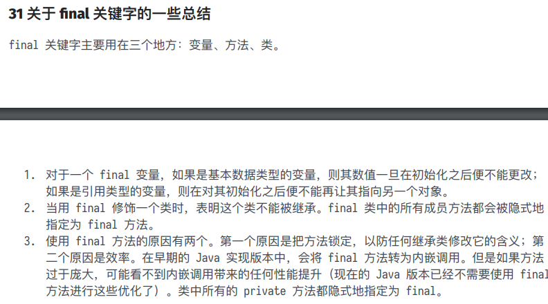
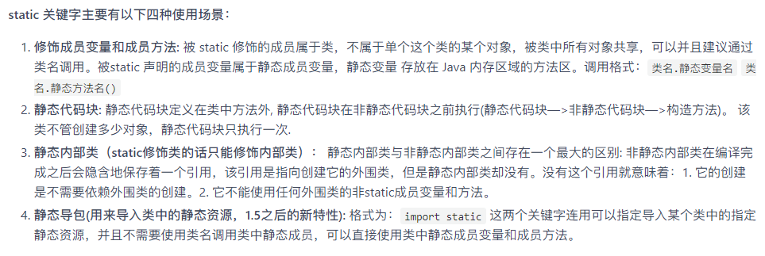
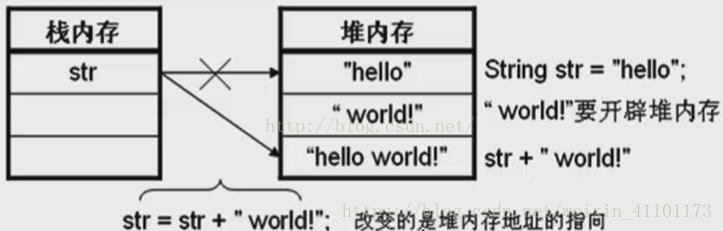
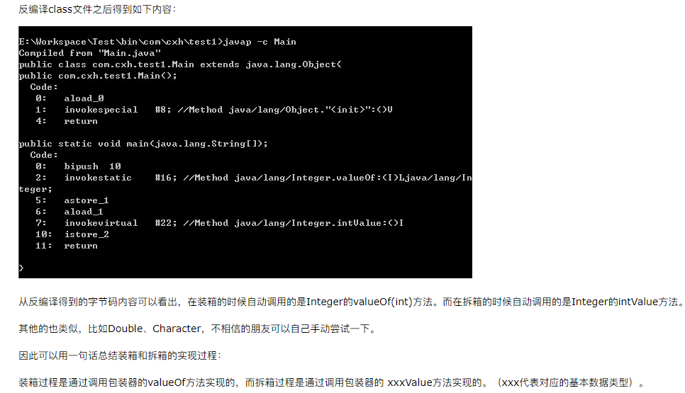
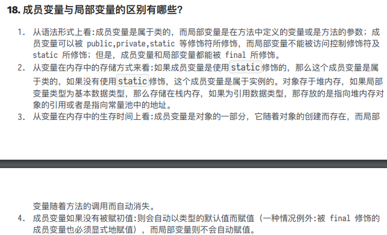

## 学习路线


## JDK和JRE区别

- **<u>JDK（Java Development Kit）</u>**是针对Java开发员的产品，是整个Java的核心，包括了Java运行环境JRE、Java工具和Java基础类库。
- **<u>Java Runtime Environment（JRE）</u>**是运行JAVA程序所必须的环境的集合，包含JVM标准实现及Java核心类库。
- **<u>Java Virtual Machine（Java虚拟机JVM）</u>**的缩写，是整个java实现跨平台的最核心的部分，能够运行以Java语言写作的软件程序。


### JDK（Java Development Kit）

- JDK中包含JRE，在JDK的安装目录下有一个名为jre的目录，里面有两个文件夹bin和lib，在这里可以认为bin里的就是jvm，lib中则是jvm工作所需要的类库，而jvm和 lib和起来就称为jre。
- JDK是整个JAVA的核心，包括了Java运行环境JRE（Java Runtime Envirnment）、一堆Java工具（javac/java/jdb等）和Java基础的类库（即Java API 包括rt.jar）。

**类型**

- SE(J2SE)，standard edition，标准版，是我们通常用的一个版本，从JDK 5.0开始，改名为Java SE。
- EE(J2EE)，enterprise edition，企业版，使用这种JDK开发J2EE应用程序，从JDK 5.0开始，改名为Java EE。
- ME(J2ME)，micro edition，主要用于移动设备、嵌入式设备上的java应用程序，从JDK 5.0开始，改名为Java ME。


### JRE（Java Runtime Environment）

​		是运行基于Java语言编写的程序所不可缺少的运行环境。RE中包含了Java virtual machine（JVM），runtime class libraries和Java application launcher，这些是运行Java程序的必要组件。**但是在运行编译好的程序中包含Servlet时，需要JDK**


### JVM（Java Virtual Machine）

​		就是我们常说的java虚拟机，它是整个java实现跨平台的最核心的部分，所有的java程序会首先被编译为.class的类文件，这种类文件可以在虚拟机上执行。

也就是说class并不直接与机器的操作系统相对应，而是经过虚拟机间接与操作系统交互，由虚拟机将程序解释给本地系统执行。

只有JVM还不能成class的执行，因为在解释class的时候JVM需要调用解释所需要的类库lib，而jre包含lib类库。

JVM屏蔽了与具体操作系统平台相关的信息，使Java程序只需生成在Java虚拟机上运行的目标代码（字节码）,就可以在多种平台上不加修改地运行。JVM在执行字节码时，实际上最终还是把字节码解释成具体平台上的机器指令执行。


## 重载和重写


### 重载(Overload)

1. 重载Overload是一个类中多态性的一种表现或者一个类中多个构造器的实现
2. 重载要求同名方法的参数列表不同(参数类型，参数个数甚至是参数顺序)
3. 重载的时候，返回值类型可以相同也可以不相同。无法以返回型别作为重载函数的区分标准

```java
public class Father {

    public static void main(String[] args) {
        // TODO Auto-generated method stub
        Father s = new Father();
        s.sayHello();
        s.sayHello("wintershii");

    }

    public void sayHello() {
        System.out.println("Hello");
    }

    public void sayHello(String name) {
        System.out.println("Hello" + " " + name);
    }
}
```


### 重写(Override)

1. **发生在父类与子类之间**
2. **方法名，参数列表，返回类型（除过子类中方法的返回类型是父类中返回类型的子类）必须相同**
3. 访问修饰符的限制一定要**大于**被重写方法的访问修饰符（public>protected>default>private)
4. 重写方法一定不能抛出新的检查异常或者比被重写方法申明更加宽泛的检查型异常

```java
public class Father {

    public static void main(String[] args) {
        // TODO Auto-generated method stub
        Son s = new Son();
        s.sayHello();
    }

    public void sayHello() {
        System.out.println("Hello");
    }
}

class Son extends Father{

    @Override
    public void sayHello() {
        // TODO Auto-generated method stub
        System.out.println("hello by ");
    }

}
```


### 重载（Overload）和重写（Override）的区别

​		方法的重载和重写都是实现多态的方式，区别在于前者实现的是编译时的多态性，而后者实现的是运行时的多态性。重载发生在一个类中，同名的方法如果有不同的参数列表（参数类型不同、参数个数不同或者二者都不同）则视为重载；重写发生在子类与父类之间，重写要求子类被重写方法与父类被重写方法有相同的参数列表，有兼容的返回类型，比父类被重写方法更好访问，不能比父类被重写方法声明更多的异常（里氏代换原则）。重载对返回类型没有特殊的要求，不能根据返回类型进行区分。


### 构造器Constructor是否可被Override(重写)

​		构造器Constructor不能被继承，因此不能被**重写(Override)**，但是可以被**重载（Overload）**。如果父类自定义了有参构造函数，则子类无论定义构造函数与否，定义有参构造函数与否，都会报错，正确的做法是在子类的构造方法中添上super（参数），以表明子类构造之前先构造父类，而这句话必须放在第一句，否则报"Constructor call must be the first statement in a constructor"的错误。


## 类的加载顺序

1. 父类的静态代码块/初始化静态变量（两者优先级相同）
2. 执行子类的静态代码/初始化静态变量（两者优先级相同，谁写在前面谁先执行）
3. 初始化父类成员变量/执行代码块{}（两者优先级相同），父类的构造器
4. 子类的成员变量/代码块，最后子类的构造器。


例如：

```java
public class Test {
    Person person = new Person("Test");
    static{
        System.out.println("test static");
    }
     
    public Test() {
        System.out.println("test constructor");
    }
     
    public static void main(String[] args) {
        new MyClass();
    }
}
 
class Person{
    static{
        System.out.println("person static");
    }
    public Person(String str) {
        System.out.println("person "+str);
    }
}
 
 
class MyClass extends Test {
    Person person = new Person("MyClass");
    static{
        System.out.println("myclass static");
    }
     
    public MyClass() {
        System.out.println("myclass constructor");
    }
}
```

结果：

> - test static
> - myclass static
> - person static
> - person Test
> - test constructor
> - person MyClass
> - myclass constructor


顺序解析：

> - 首先加载Test类，因此会执行Test类中的static块。
> - 接着执行new MyClass()，而MyClass类还没有被加载，因此需要加载MyClass类。在加载MyClass类的时候，发现MyClass类继承自Test类，但是由于Test类已经被加载了，所以只需要加载MyClass类，那么就会执行MyClass类的中的static块。
> - 在加载完之后，就通过构造器来生成对象。而在生成对象的时候，必须先初始化父类的成员变量，因此会执行Test中的Person person = new Person()，而Person类还没有被加载过，因此会先加载Person类并执行Person类中的static块，
> - 接着执行父类的构造器，完成了父类的初始化，然后就来初始化自身了，因此会接着执行MyClass中的Person person = new Person()，最后执行MyClass的构造器。


## 三大特性封装继承多态


### 封装

​		封装（Encapsulation）是面向对象方法的重要原则，就是把对象的属性和操作（或服务）结合为一个独立的整体，并尽可能隐藏对象的内部实现细节。实体类那些属性就是被封装

- 将类的某些信息隐藏在类的内部，不允许外部程序进行直接的访问调用。
- 通过该类提供的方法来实现对隐藏信息的操作和访问。
- 隐藏对象的信息。
- 留出访问的对外接口。


### 继承

​		继承就是子类继承父类的特征和行为，使得子类对象（实例）具有父类的实例域和方法，或子类从父类继承方法，使得子类具有父类相同的行为。当然，如果在父类中拥有私有属性(`private`修饰)，**则子类是不能被继承的。**

只支持单继承，即一个子类只允许有一个父类，但是可以实现多级继承，及子类拥有唯一的父类，而父类还可以再继承。

-  子类可以拥有父类的属性和方法。
-  子类可以拥有自己的属性和方法。
-  子类可以重写覆盖父类的方法。


#### 使用

在父子类关系继承中，**如果成员变量重名**，则创建子类对象时，访问有两种方式。

- 直接通过子类对象访问成员变量

   等号左边是谁，就优先使用谁，如果没有就向上找。

- 间接通过成员方法访问成员变量

  该方法属于谁，谁就优先使用，如果没有就向上找。

```java
public class FU {
    int numFU = 10;
    int num = 100;
    public void method(){
        System.out.println("父类成员变量："+numFU);
    }
    public void methodFU(){
        System.out.println("父类成员方法!");
    }
}

public class Zi extends FU{
    int numZi = 20;
    int num = 200;
    public void method(){
        System.out.println("父类成员变量："+numFU);
    }
    public void methodZi(){
        System.out.println("子类方法！");
    }
}

public class ExtendDemo {
    public static void main(String[] args) {
        FU fu = new FU();
        // 父类的实体对象只能调用父类的成员变量
        System.out.println("父类：" + fu.numFU);   // 结果：10
        
        Zi zi = new Zi();
        System.out.println("调用父类：" + zi.numFU); // 结果：10
        System.out.println("子类：" + zi.numZi);   // 结果：20

        /** 输出结果为200，证明在重名情况下，如果子类中存在则优先使用，
         *  如果不存在则去父类查找，但如果父类也没有那么编译期就会报错。
         */
        System.out.println(zi.num); // 结果：200
        /**
         * 通过成员方法调用成员变量
         */
        zi.method();    // 结果：10
    }
}
```


### 多态

参考

> - https://blog.csdn.net/qq_31655965/article/details/54746235


指允许不同类的对象对同一消息做出响应。即同一消息可以根据发送对象的不同而采用多种不同的行为方式。动态绑定（dynamic binding），是指在执行期间判断所引用对象的实际类型，根据其实际的类型调用其相应的方法。

**实现方式**

- 接口多态性。
- 继承多态性。
- 通过抽象类实现的多态性。


#### 举例

多态，简而言之就是同一个行为具有多个不同表现形式或形态的能力。比如说，有一杯水，我不知道它是温的、冰的还是烫的，但是我一摸我就知道了。我摸水杯这个动作，对于不同温度的水，就会得到不同的结果。这就是多态。

```java
public class Water {
    public void showTem(){
        System.out.println("我的温度是: 0度");
    }
}

public class IceWater extends Water {
    public void showTem(){
        System.out.println("我的温度是: 0度");
    }
}

public class WarmWater extends Water {
    public void showTem(){
        System.out.println("我的温度是: 40度");
    }
}

public class HotWater extends Water {
    public void showTem(){
        System.out.println("我的温度是: 100度");
    }
}

public class TestWater{
    public static void main(String[] args) {
        Water w = new WarmWater();
        w.showTem();

        w = new IceWater();
        w.showTem();

        w = new HotWater();
        w.showTem();

    }
}

//结果:
//我的温度是: 40度
//我的温度是: 0度
//我的温度是: 100度
```

这里的方法`showTem()`就相当于你去摸水杯。我们定义的water类型的引用变量w就相当于水杯，你在水杯里放了什么温度的水，那么我摸出来的感觉就是什么。就像代码中的那样，放置不同温度的水，得到的温度也就不同，但水杯是同一个。


#### 分类


- **重写式多态**：也叫编译时多态。也就是说这种多态再编译时已经确定好了。重载大家都知道，方法名相同而参数列表不同的一组方法就是重载。在调用这种重载的方法时，通过传入不同的参数最后得到不同的结果。

  

- **重载式多态**：也叫运行时多态。这种多态通过动态绑定（dynamic binding）技术来实现，是指在执行期间判断所引用对象的实际类型，根据其实际的类型调用其相应的方法。也就是说，只有程序运行起来，你才知道调用的是哪个子类的方法。
  这种多态通过`函数的重写`以及`向上转型`来实现，我们上面代码中的例子就是一个完整的重写式多态。我们接下来讲的所有多态都是重写式多态，因为它才是面向对象编程中真正的多态。


#### 条件


- **继承**：在多态中必须存在有继承关系的子类和父类。
- **重写**：子类对父类中某些方法进行重新定义，在调用这些方法时就会调用子类的方法。
- **向上转型**：在多态中需要将子类的引用赋给父类对象，只有这样该引用才能够具备技能调用父类的方法和子类的方法。


### 向上转型

参考

> - https://blog.csdn.net/qq_31655965/article/details/54746235


```java
public class Animal {
    public void eat(){
        System.out.println("animal eatting...");
    }
}

public class Cat extends Animal{

    public void eat(){

        System.out.println("我吃鱼");
    }
}

public class Dog extends Animal{

    public void eat(){

        System.out.println("我吃骨头");
    }

    public void run(){
        System.out.println("我会跑");
    }
}

public class Main {

    public static void main(String[] args) {

        Animal animal = new Cat(); //向上转型
        animal.eat();

        animal = new Dog();
        animal.eat();
    }

}

//结果:
//我吃鱼
//我吃骨头

```


**注意事项**

- 向上转型时，子类单独定义的方法会丢失。比如上面`Dog`类中定义的`run`方法，当`animal`引用指向`Dog`类实例时是访问不到`run`方法的，`animal.run()`会报错。
- 子类引用不能指向父类对象。`Cat c = (Cat)new Animal()`这样是不行的。


**好处**

- 减少重复代码，使代码变得简洁。
- 提高系统扩展性。

坏处

- 无法使用子类特定的方法

使用场景

- 不需要面对子类型，通过提高扩展性，或者使用父类的功能即可完成操作，就是使用向上转型。


比如我现在有很多种类的动物，要喂它们吃东西。如果不用向上转型，那我需要像下面这样写

```java
public void eat(Cat c){
    c.eat();
}

public void eat(Dog d){
    d.eat();
}
//......

eat(new Cat());
eat(new Cat());
eat(new Dog());
//......
```

> 此时每增加一种动物就要多写一个方法来接收不同的参数


如果使用向上转型

```java
public void eat(Animal a){
    a.eat();
}

eat(new Cat());
eat(new Cat());
eat(new Dog());
//.....
```

> 因为其他动物类是Animal的子类，可以接收，就像`double`类型可以接收`int`，但`int`类型接收`double`就会精度缺失。而且这个时候，如果我又有一种新的动物加进来，我只需要实现它自己的类，让他继承Animal就可以了，而不需要为它单独写一个eat方法


**经典案例**

```java
class A {
    public String show(D obj) {
        return ("A and D");
    }

    public String show(A obj) {
        return ("A and A");
    }

}

class B extends A{
  //父类没有此方法，虽然方法名字一样，但是由于参数不同不是重写
    public String show(B obj){
        return ("B and B");
    }

    public String show(A obj){
        return ("B and A");
    }
}

class C extends B{

}

class D extends B{

}

public class Demo {
    public static void main(String[] args) {
        A a1 = new A();
        A a2 = new B();
        B b = new B();
        C c = new C();
        D d = new D();

        System.out.println("1--" + a1.show(b));
        System.out.println("2--" + a1.show(c));
        System.out.println("3--" + a1.show(d));
        System.out.println("4--" + a2.show(b));
        System.out.println("5--" + a2.show(c));
        System.out.println("6--" + a2.show(d));
        System.out.println("7--" + b.show(b));
        System.out.println("8--" + b.show(c));
        System.out.println("9--" + b.show(d));
    }
}
//结果：
//1--A and A
//2--A and A
//3--A and D
//4--B and A
//5--B and A
//6--A and D
//7--B and B
//8--B and B
//9--A and D
```

当父类对象引用变量引用子类对象时，被引用对象的类型决定了调用谁的成员方法，引用变量类型决定可调用的方法。**如果子类中没有覆盖该方法，那么会去父类中寻找**。

> 继承链中对象方法的调用的优先级：this.show(O)、super.show(O)、this.show((super)O)、super.show((super)O)。
>
> 事实上，子类继承了父类的方法，所以所谓super.show(O)时调用的是在子类中继承下来的方法


解析第四个

> a2为指向B对象的A类的引用类型，当调用`show(B obj)`时，会首先去父类找是否有此方法，如果没有那么即使子类有此方法但不会去调用(超出范围)，因为引用类型决定了能调用的方法(即使不是调用自己类的方法)，所以B类中的`show(B obj)`没有被调用(如果有就会调用子类的`show(B obj)`)。这时候按照顺序会调用`this.show((super)O)`,参数为能向上转型的类型，可以发现A类中有`show(A obj)`，那么就去子类中看是否有此方法，发现有那么调用子类的`show(A obj)`（如果没有就直接调用父类A类的此方法）。所以最后`a2.show(b)`调用的是子类B类方法`show(A obj)`，结果返回`"B and A"`


解析第九个

> 虽然b的引用类型和指向对象都是B，但是在调用`b.show(d)`是我们以为会调用B类中的`show(B obj)`方法，但由于B继承下来A类中`show(D obj)`方法，相当于B类中有此方法，所以会调用B类中`show(D obj)`。所以结果为`"A and D"`


### 向下转型


好处

- 不仅能继承父类的方法，还可以使用子类型的特有功能

坏处

- 面对具体的子类型，向下转型具有风险。即容易发生`ClassCastException`，只要转换类型和对象不匹配就会发生。解决方法：使用关键字`instanceof`。


```java
//还是上面的animal和cat dog
Animal a = new Cat();
Cat c = ((Cat) a);
c.eat();
//输出  我吃鱼
Dog d = ((Dog) a);
d.eat();
// 报错 ： java.lang.ClassCastException：com.chengfan.animal.Cat cannot be cast to com.chengfan.animal.Dog
Animal a1 = new Animal();
Cat c1 = ((Cat) a1);
c1.eat();
// 报错 ： java.lang.ClassCastException：com.chengfan.animal.Animal cannot be cast to com.chengfan.animal.Cat
```

> - 向下转型的前提是父类对象指向的是子类对象（也就是说，在向下转型之前，它得先向上转型）
> - 向下转型只能转型为本类对象（猫是不能变成狗的）。


为什么要向下转型

```java
public void eat(Animal a){
    if(a instanceof Dog){  
        Dog d = (Dog)a;
        d.eat();
        d.run();//狗有一个跑的方法      
    } 
    if(a instanceof Cat){  
        Cat c = (Cat)a;
        c.eat();
        System.out.println("我也想跑，但是不会"); //猫会抱怨    
    } 
    a.eat();//其他动物只会吃
}

eat(new Cat());
eat(new Cat());
eat(new Dog());
//.....
```


### 里氏替换原则


::: tip 参考

- https://blog.csdn.net/sunpeiv/article/details/107424253
- https://www.douban.com/note/363404356/

:::


#### 里氏替换原则的定义

 

::: info 里氏替换原则的定义

- 里氏替换原则通俗的来讲就是：子类可以扩展父类的功能，但不能改变父类原有的功能。
- 里氏代换原则告诉我们，在软件中将一个基类对象替换成它的子类对象，程序将不会产生任何错误和异常（`向下转型`），反过来则不成立（`向上转型`），如果一个软件实体使用的是一个子类对象的话，那么它不一定能够使用基类对象。
- 里氏代换原则是实现`开闭原则`的重要方式之一，由于使用基类对象的地方都可以使用子类对象，因此在程序中尽量使用基类类型来对对象进行定义，而在运行时再确定其子类类型，用子类对象来替换父类对象。

 :::


#### 里氏替换原则包含的含义

 


**1、子类可以实现父类的抽象方法，但是不能覆盖父类的非抽象方法**

::: info 

在我们做系统设计时，经常会设计接口或抽象类，然后由子类来实现抽象方法，这里使用的其实就是里氏替换原则。子类可以实现父类的抽象方法很好理解，事实上，子类也必须完全实现父类的抽象方法，哪怕写一个空方法，否则会编译报错。

里氏替换原则的关键点在于不能覆盖父类的非抽象方法。父类中凡是已经实现好的方法，实际上是在设定一系列的规范和契约，虽然它不强制要求所有的子类必须遵从这些规范，但是如果子类对这些非抽象方法任意修改，就会对整个继承体系造成破坏。而里氏替换原则就是表达了这一层含义。

:::


**2、子类中可以增加自己特有的方法**

::: info 

在继承父类属性和方法的同时，每个子类也都可以有自己的个性，在父类的基础上扩展自己的功能。前面其实已经提到，当功能扩展时，子类尽量不要重写父类的方法，而是另写一个方法

:::


**3、当子类覆盖或实现父类的方法时，方法的前置条件（即方法的形参）要比父类方法的输入参数更宽松**


## this | super | final | static关键字


### this

- 本类成员方法中，访问**本类**的成员变量。
- 本类成员方法中，访问**本类**的另一个成员方法。
- 本类的构造方法中，访问**本类**的另一个构造方法。


### super

- 子类的成员方法中，访问**父类**的成员变量。
- 子类的成员方法中，访问**父类**的成员方法。
- 子类的构造方法中，访问**父类**的构造方法。


**注意**

- this关键字同super一样，必须在构造方法的第一个语句，且是唯一的。
- this与super不能同时存在。


### final




### static




### Java中是否可以覆盖(override)一个`private`或者是`static`的方法？

java中也不可以覆盖private的方法，因为private修饰的变量和方法只能在当前类中使用，如果是其他的类继承当前类是不能访问到private变量或方法的，当然也不能覆盖。


### 是否可以在`static`环境中访问`非static`变量？

static变量在Java中是属于类的，它在所有的实例中的值是一样的。当类被Java虚拟机载入的时候，会对static变量进行初始化。如果你的代码尝试不用实例来访问非static的变量，编译器会报错，因为这些变量还没有被创建出来，还没有跟任何实例关联上。


## String StringBuffer 和 StringBuilder 的区别是什么? String 为什么是不可变的?


### Java String 类：String字符串常量

需要注意的是，String的值是不可变的，这就导致每次对String的操作都会生成**新的String对象**，这样不仅效率低下，而且大量浪费有限的内存空间。我们来看一下这张对String操作时内存变化的图：



我们可以看到，初始String值为“hello”，然后在这个字符串后面加上新的字符串“world”，这个过程是需要重新在栈堆内存中开辟内存空间的，最终得到了“hello world”字符串也相应的需要开辟内存空间，**这样短短的两个字符串，却需要开辟三次内存空间**，不得不说这是对内存空间的**极大浪费**。为了应对经常性的字符串相关的操作，就需要使用Java提供的其他两个操作字符串的类——StringBuffer类和StringBuild类来对此种变化字符串进行处理。


### StringBuffer 和 StringBuilder 类——StringBuffer、StringBuilder字符串变量


当对字符串进行修改的时候，需要使用 **StringBuffer(线程安全)** 和 **StringBuilder(线程不安全)** 类。

和 String 类不同的是，StringBuffer 和 StringBuilder 类的对象能够被多次的修改，并且不产生新的未使用对象。

StringBuilder 类在 Java 5 中被提出，它和 StringBuffer 之间的最大不同在于 **StringBuilder 的方法不是线程安全的（不能同步访问）**。

由于 StringBuilder 相较于 StringBuffer 有速度优势，所以多数情况下建议使用 StringBuilder 类。然而在应用程序要求线程安全的情况下，则必须使用 StringBuffer 类。


### 区别

- **String：**不可变字符串；
- **StringBuffer：**可变字符串、效率低、线程安全；
- **StringBuilder：**可变字符序列、效率高、线程不安全；

初始化上的区别，String可以空赋值，后者不行，报错


## 装箱与拆箱

https://www.cnblogs.com/dolphin0520/p/3780005.html





### 面试题


​		从这2段代码可以看出，在通过valueOf方法创建Integer对象的时候，如果数值在**[-128,127]**之间，便返回指向IntegerCache.cache中已经存在的对象的引用；否则创建一个新的Integer对象。

​		上面的代码中i1和i2的数值为100，因此会直接从cache中取已经存在的对象，所以i1和i2指向的是同一个对象，而i3和i4则是分别指向不同的对象。


## 在 Java 中定义⼀个不做事且没有参数的构造⽅法的作⽤

​		Java 程序在执⾏⼦类的构造⽅法之前，如果没有⽤ **super()** 来调⽤⽗类特定的构造⽅法，则会调⽤ **⽗类中“没有参数的构造⽅法”**。因此，如果⽗类中只定义了有参数的构造⽅法，⽽在⼦类的构造⽅法中 ⼜没有⽤ super() 来调⽤⽗类中特定的构造⽅法，则编译时将发⽣错误，因为 Java 程序在⽗类中找 不到没有参数的构造⽅法可供执⾏。解决办法是在⽗类⾥加上⼀个不做事且没有参数的构造⽅法。


## 接⼝和抽象类


## 成员变量与局部变量的区别有哪些？




## 静态⽅法和实例⽅法有何不同

- 在外部调用静态方法时，可以使用**"类名.方法名"**的方式，也可以使用**"对象名.方法名"**的方式。而实例方法只有后面这种方式。也就是说，调用静态方法可以无需创建对象。
- 静态方法在访问本类的成员时，只允许访问静态成员（即静态成员变量和静态方法），而不允许访问实例成员变量和实例方法；实例方法则无此限制。


## ==与equals()


## hashcode()与equals()

参考

> - https://blog.csdn.net/zj15527620802/article/details/88547914
> - [equals()和hashCode()之间的关系](https://www.cnblogs.com/chenpi/p/5489494.html)
> - https://www.cnblogs.com/skywang12345/p/3324958.html


### 第一种 不会创建“类对应的散列表”


## 为什么 Java 中只有值传递？

参考

> https://blog.csdn.net/bjweimengshu/article/details/79799485


## Java中异常处理

参考

> https://blog.csdn.net/sugar_no1/article/details/88593255


### StackOverFlow的几种(TODO)


### 异常处理的三种方式

参考

> - https://blog.csdn.net/qq_22067469/article/details/82930798


#### 1. 系统自动抛出异常

当程序语句出现一些逻辑错误、主义错误或者类型转换错误时，系统会自动抛出异常

```java
public static void main(String[] args) {
	int a = 5;
	int b = 0;
	System.out.println( a / b);
}

```

运行结果

```java
Exception in thread "main" java.lang.ArithmeticException: / by zero
	at io.renren.modules.sys.controller.SysUserController.main(SysUserController.java:154)
```


#### 3. try{ } catch{}抛出异常

在try中放入待执行代码，如果程序正常运行就会执行try中的代码，如果出现异常，就会执行catch中的代码，当然，try后面可以跟多个catch，当通过try catch这种方法抛出异常的时候要注意抛出异常的顺序，异常范围小的放在前面，异常范围大的放在后面，在这里举个例子：

```java
try{
                  //待执行的代码
        } catch (FileNotFoundException e) {
            System.out.println("找不到文件");
        } catch (IOException e) {
            System.out.println("IO操作失败");
        }
```


#### 4. throw

throw是语句抛出一个异常，一般是在代码的内部，当程序出现某种逻辑错误时同程序主动抛出某种特定类型的异常

```java
public static void main(String[] args) {
	String str = "NBA";
	if (str.equals("NBA")) {
		throw new NumberFormatException();
	} else {
		System.out.println(str);
	}
}

```


#### 5. throws

throws是方法可能会抛出一个异常(用在`声明方法`时，表示该方法可能要抛出异常),当某个方法可能会抛出某种异常时用于throws 声明可能抛出的异常，然后交给上层调用它的方法程序处理

```java
public static void testThrows() throws NumberFormatException {
	String str = "NBA";
	System.out.println(Integer.parseInt(str));
}

public static void main(String[] args) {
	try {
		testThrows();
	} catch (NumberFormatException e) {
		e.printStackTrace();
		System.out.println("非数直类型不能强制类型转换");
	}
}


```


### throw与throws的比较


- throws出现在方法函数头，而throw出现在函数体。
- throws表示出现异常的一种可能性，并不一定会发生这些异常，throw则是抛出了异常，执行throw则一定抛出了某种异常对象。
- 两者都是消极处理异常的方式（这里的消极并不是说这种方式不好），只是抛出或者可能抛出异常，但不会由函数去处理异常，真正的处理异常由函数的上层调用处理。


### 编程习惯


- 在写程序时，对可能会出现异常的部分通常要用try{…}catch{…}去捕捉它并对它进行处理；
- 用try{…}catch{…}捕捉了异常之后一定要对在catch{…}中对其进行处理，那怕是最简单的一句输出语句，或栈输入e.printStackTrace();
- 如果是捕捉IO输入输出流中的异常，一定要在try{…}catch{…}后加finally{…}把输入输出流关闭；
- 如果在函数体内用throw抛出了某种异常，最好要在函数名中加throws抛异常声明，然后交给调用它的上层函数进行处理。


## 获取⽤键盘输⼊常⽤的两种⽅法


### 输入一个字符

```java
Scanner input = new Scanner(System.in);
char c = input.next().charAt(0);
```


### next()和nextLine()

- **next()：**不可以读取空格。它不能读两个由空格或符号隔开的单词。此外，next()在读取输入后将光标放在同一行中。(next()只读空格之前的数据,并且光标指向本行)
- **nextLine()：**可以读取空格，包括单词之间的空格和除回车以外的所有符号(即。它读到行尾)。读取输入后，nextLine()将光标定位在下一行。


## 泛型使用

参考

> https://www.cnblogs.com/jpfss/p/9928747.html


## 浅拷贝 | 深拷贝

- 浅拷贝（shallowCopy）只是增加了一个指针指向已存在的内存地址
- 深拷贝（deepCopy）是增加了一个指针并且申请了一个新的内存，使这个增加的指针指向这个新的内存


## 串行化 | 并行化

::: tip 参考

- https://www.cnblogs.com/xh0102/p/5759803.html
- https://blog.csdn.net/kuangpeng1956/article/details/83817369

:::


## 内部类

::: tips 参考

- https://www.cnblogs.com/dolphin0520/p/3811445.html
- https://blog.csdn.net/weixin_42762133/article/details/82890555

:::


## BIO | NIO | AIO

