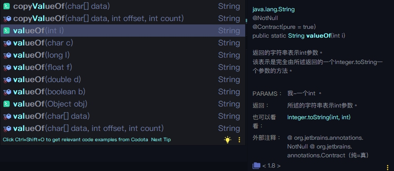

# 1. Java集合


## 1.1 Collection


### 1.1.1 排序操作

```java
void reverse(List list)//反转
void shuffle(List list)//随机排序
void sort(List list)//按自然排序的升序排序
void sort(List list, Comparator c)//定制排序，由Comparator控制排序逻辑
void swap(List list, int i , int j)//交换两个索引位置的元素
void rotate(List list, int distance)//旋转。当distance为正数时，将list后distance个元素整体移到前面。当distance为负数时，将 list的前distance个元素整体移到后面。
```

示例代码

```java
ArrayList<Integer> arrayList = new ArrayList<Integer>();
		arrayList.add(-1);
		arrayList.add(3);
		arrayList.add(3);
		arrayList.add(-5);
		arrayList.add(7);
		arrayList.add(4);
		arrayList.add(-9);
		arrayList.add(-7);
	System.out.println("原始数组:");
	System.out.println(arrayList);
	// void reverse(List list)：反转
		Collections.reverse(arrayList);
		System.out.println("Collections.reverse(arrayList):");
		System.out.println(arrayList);


		Collections.rotate(arrayList, 4);
		System.out.println("Collections.rotate(arrayList, 4):");
		System.out.println(arrayList);

		// void sort(List list),按自然排序的升序排序
		Collections.sort(arrayList);
		System.out.println("Collections.sort(arrayList):");
		System.out.println(arrayList);

		// void shuffle(List list),随机排序
		Collections.shuffle(arrayList);
		System.out.println("Collections.shuffle(arrayList):");
		System.out.println(arrayList);

		// void swap(List list, int i , int j),交换两个索引位置的元素
		Collections.swap(arrayList, 2, 5);
		System.out.println("Collections.swap(arrayList, 2, 5):");
		System.out.println(arrayList);

		// 定制排序的用法
		Collections.sort(arrayList, new Comparator<Integer>() {

			@Override
			public int compare(Integer o1, Integer o2) {
				return o2.compareTo(o1);
			}
		});
		System.out.println("定制排序后：");
		System.out.println(arrayList);
```


### 1.1.2 查找,替换操作

```java
int binarySearch(List list, Object key)//对List进行二分查找，返回索引，注意List必须是有序的
int max(Collection coll)//根据元素的自然顺序，返回最大的元素。 类比int min(Collection coll)
int min(Collection coll)//最小值
int max(Collection coll, Comparator c)//根据定制排序，返回最大元素，排序规则由Comparatator类控制。类比int min(Collection coll, Comparator c)
void fill(List list, Object obj)//用指定的元素代替指定list中的所有元素。
int frequency(Collection c, Object o)//统计元素出现次数
int indexOfSubList(List list, List target)//统计target在list中第一次出现的索引，找不到则返回-1，类比int lastIndexOfSubList(List source, list target).
boolean replaceAll(List list, Object oldVal, Object newVal)//用新元素替换旧元素
```


**示例代码**

```java
ArrayList<Integer> arrayList = new ArrayList<Integer>();
		arrayList.add(-1);
		arrayList.add(3);
		arrayList.add(3);
		arrayList.add(-5);
		arrayList.add(7);
		arrayList.add(4);
		arrayList.add(-9);
		arrayList.add(-7);
		ArrayList<Integer> arrayList2 = new ArrayList<Integer>();
		arrayList2.add(-3);
		arrayList2.add(-5);
		arrayList2.add(7);
		System.out.println("原始数组:");
		System.out.println(arrayList);

		System.out.println("Collections.max(arrayList):");
		System.out.println(Collections.max(arrayList));

		System.out.println("Collections.min(arrayList):");
		System.out.println(Collections.min(arrayList));

		System.out.println("Collections.replaceAll(arrayList, 3, -3):");
		Collections.replaceAll(arrayList, 3, -3);
		System.out.println(arrayList);

		System.out.println("Collections.frequency(arrayList, -3):");
		System.out.println(Collections.frequency(arrayList, -3));

		System.out.println("Collections.indexOfSubList(arrayList, arrayList2):");
		System.out.println(Collections.indexOfSubList(arrayList, arrayList2));

		System.out.println("Collections.binarySearch(arrayList, 7):");
		// 对List进行二分查找，返回索引，List必须是有序的
		Collections.sort(arrayList);
		System.out.println(Collections.binarySearch(arrayList, 7));
```


### 1.1.3 其它操作

```java
List<T> nCopies(int i , T t)//根据泛型t复制i次，最后组成一个List<T>并返回
```


ArrayList


### 共有方法

1. **boolean add(E e)**

   > 添加一个元素

2. **boolean addAll(Collection\<? extends E\> c)**

   > 将集合中的所有元素添加到其他集合中

3. **clear()**

   > 暴力清除集合中所有元素

4. **boolean contains(Object o)**

   > 判断集合是否包含某个元素，包含返回true

5. **boolean isEmpty()**

   > 如果此集合不包含元素，则返回true

6. **int size()**

   > 返回集合个数

7. **Iterator iterator()**

   > 迭代器，返回Iterator类型

   

## 1.2 List特有


## 1.2 Map


### 1.2.1 增删查改类


### V put(K key , V value)

向map中添加键值对，并返回`value`值，如果`key`重复，则返回之前的`oldValue`值

```java
///*Integer*/map.put("1", 1);//向map中添加值(返回这个key以前的值,如果没有返回null)
         HashMap<String, Integer> map=new HashMap<>();
         System.out.println(map.put("1", 1));//null
         System.out.println(map.put("1", 2));//1
```


### V putIfAbsent(K key , V Value)

`JDK1.8`

如果当前 `Map` 不存在键 *key* 或者该 *key* 关联的值为 `null`，那么就执行 `put(key, value)`；否则，便不执行 `put` 操作并返回null

```java
HashMap<String, Integer> map=new HashMap<>();
/*boolean*///判断map中是否存在这个key
map.put("DEMO1", 1);
map.put("DEMO2", 2);
System.out.println(map);//{DEMO1=1, DEMO2=2}
System.out.println(map.putIfAbsent("DEMO1", 12222));//1
System.out.println(map.putIfAbsent("DEMO3", 12222));//null
System.out.println(map);//{DEMO1=1, DEMO2=2,DEMO3=12222}
```


### Map\<K , V\> putAll(Map\<? extends K, ? extends V\> m)

putAll可以合并两个相同类型的Map，被合并的类型必须是相等或继承的类型，只不过如果有相同的key那么用被合并的覆盖前面的

```java
HashMap map3=new HashMap();
map3.put("1", "A");

HashMap map4 = new HashMap();
map4.put("1", "B");
map4.put("3", "C");

map3.putAll(map4);

System.out.println(map3);
//{3=C, 1=B},key为1value为“A“被覆盖
```


### V get(K key)

得到map中key相对应的value的值,为空返回null


### Map\<K , V\> clone()

克隆map

  

### void clear()

清空map


### int Size()

返回大小


### V replace(K key , V newValue)

`JDK1.8新方法`

在指定的键已经存在并且有与之相关的映射值时才会将指定的键映射到指定的值（新值）, 并返回`旧的oldValue值`

在指定的键不存在时，方法会return回来一个`null`


### boolean replace(K key , V oldValue , V newValue)

`JDK1.8新方法`

当`Map.Entry<key , oldValue>`存在时，也就是说存在`key-oldValue`这个键值对时才进行替换操作

成功返回`true`，否则`false`

```java
HashMap<String, String> map3=new HashMap();
map3.put("1", "a");
System.out.println(map3.replace("1" , "a" , "b"));//true
System.out.println(map3.replace("2" , "a" , "b"));//false,key不同，value相同
System.out.println(map3.replace("1" , "s" , "b"));//false,key相同，value不同
```


### boolean remove(K key)

根据key删除此键值对下的键值对


### boolean remove(K key , V value)

删除key和value都符合的键值对


### boolean isEmpty()

判断是否为空


### boolean containsKey(K key)

查看是否包含此key


### boolean containsValue(V value)

查看是否包含此value


### 1.2.2 遍历类


### Collection\<V\> values()

获取map中所有的key并返回为`Collection<V>`类型


### Set\<V\> keySet()

获取map中所有的key并返回`Set<V>`类型，因为Set的元素是独一无二之的，之后可以用迭代器`iterator()`遍历

```java
Iterator ot = map.keySet().iterator();
while (ot.hasNext()){
  System.out.println(ot.next());
}
```


### Set\<Map.Entry\<K,V\>\> entrySet()

返回所有结点，类型为`Set<Map.Entry<K,V>>`。也可以转换为迭代器`iterator()`遍历

```java
Set<Map.Entry<String,String>> es = map.entrySet();
Iterator<Map.Entry<String,String>> it = es.iterator();
 while(it.hasNext()){
	Map.Entry<String, String> mey = it.next();
               
	//getKey()和getValue是接口Map.Entry<K,V>中的方法，返回对应的键和对应的值
	String key = mey.getKey();
	String value = mey.getValue();
	System.out.println(key+":"+value);
   
}
```


# 2. 数组Arrays

Arrays类位于java.util 包中，主要包含了操纵数组的各种方法


参考

> - https://blog.csdn.net/u013256816/article/details/50924762


# 3. String字符串


参考

> - https://www.cnblogs.com/windbyside/p/9393716.html


## char charAt(int index)

返回指定索引位置的字符

```java
String str = new String("String");
System.out.println(str.charAt(0));
//return "S";
```


## String substring(int beginIndex)

返回指定起始位置至字符串末尾的字符串

```java
String str = new String("String");
System.out.println(str.substring(1));
//return "tring";
```


## **String** substring(int beginIndex, int endIndex)

返回指定起始位置（含）到结束位置（不含）之间的字符串

```java
String str = new String("String");
System.out.println(str.substring(1, 3));
//return "tr";
```


## int indexOf(String str)

返回指定字符串的索引位置， 没有则返回-1

```java
String str = new String("String");
System.out.println(str.indexOf("i"));
//return "3";

System.out.println(str.indexOf("ing"));
//return "3";
```


## int indexOf(String str, int fromIndex)

返回从指定索引位置fromIndex开始的str的索引位置,如果没有返回-1

```java
String str = new String("String");
System.out.println(str.indexOf("ing", 2));
//return "3";
```


## int lastIndexOf(String str)

返回子字符串最后出现的位置。没有找到，则返回 -1。

```java
String str = new String("StringString");
System.out.println(str.indexOf("String"));
//return "6";
```


## String replace(CharSequence oldString, CharSequence newString):

用newString替换字符串中的oldString，注意相当于new了个新的String，原String不变

```java
String str = new String("String");
System.out.println(str.replace("g", "gs"));
//return "Strings";
```


## String trim()

返回一个去除两头空格的新字符串

```java
String str1 = new String();
　　str1 =  " "+"string"+" ";
　　System.out.println(str1.length());
　　//return "8"
　　str1 = str1.trim();
　　System.out.println(str.length());
　　//return "6"
```


## String[ ] split(String regex)

指定正则表达式分隔符，返回一个字符串数组

```java
String str2 = new String();
　　str2 = "A/B/C";
　　String s[] = str2.split("/");
　　System.out.println("s[0] = "+s[0]);
　　//return"A"
　　for(String ss: s) {
　　System.out.print(ss+" ");
　　}
　　//return"A B C"
```


## String[ ] split(String regex, int limit)

指定正则表达式分隔符regex和分隔份数limit，返回一个字符串数组

```java
String str2 = new String();
　　str2 = "A/B/C";
　　String s[] = str2.split("/", 2);
　　for(String ss: s) {
　　System.out.print(ss+" ");
　　}
　　//return"A B/C"
```


## String.copyValueOf(char[] charArray)

将字符数组转换为字符串

```java
char[] arr=['a','b','c'];
String string =String.copyValueOf(arr);
System.out.println(string);          //abc
```


## String toLowerCase()

转换为小写字母


## String toUpperCase()

转换为大写字母


## String intern()


- 如果字符串常量池已经包含一个等于此String对象的字符串（用equals(oject)方法确定），则返回池中的字符串的引用值。
- 如果不包含，将此String对象添加到池中，并返回字符串常量池此String对象的引用

JDK 1.7后，intern方法还是会先去查询常量池中是否有已经存在，如果存在，则返回常量池中的引用，这一点与之前没有区别，区别在于，**如果在常量池找不到对应的字符串，则不会再将字符串拷贝到常量池，而只是在常量池中生成一个对原字符串的引用简单的说，就是往常量池放的东西变了：原来在常量池中找不到时，复制一个副本放到常量池，1.7后则是将在堆上的地址引用复制到常量池。**


## String String.join(String str, String[] strArr)

在指定 String 数组B的每个元素之间串联指定的分隔符 A，从而产生单个串联的字符串

```java
String[] tmpStr={abc,def,ghi};
String jn = String.Join("-", tmpStr);
System.out.println("jn ："jn);
//jn："abc-def-ghi"
```


## boolean contains(String s)

该方法是判断字符串中是否有子字符串。如果有则返回true，如果没有则返回false。


## boolean startsWith(String prefix)

如果字符串以prefix开头返回true，否则返回false


## boolean endsWith(String suffix)

如果字符串以suffix结尾返回true，否则返回false


## boolean equals(Object other)

如果字符串与other相等返回true，否则返回false


## boolean equalsIgnoreCase(String other)

如果字符串与other相等（忽略大小写）返回true，否则返回false


## StringBuffer | StringBuilder


通用于**StringBuilder**,普通模式下建议用**StringBuilder非线程安全**。


### StringBuilder append(String s)

将其他类型拼接操作。可用于字符串数组转

.jpg)


### String toString()

转换为String。也可以通过构造方法进行转换

```java
StringBuilder stringBuilder = new StringBuilder("String");
stringBuilder.toString()
```


### StringBuilder reverse()

反转字符串

```java
StringBuilder stringBuilder = new StringBuilder("String");
stringBuilder.reverse()
System.out.println(stringBuilder);//"gnirtS"
```


## 字符串 | 数组 | 其它类型 互转


### char[] toCharArray()

字符串 -> 字符数组

```java
String str = new String("String");
System.out.println(str.toCharArray());
```


### String String.copyValueOf(char[] charArray)

字符数组 -> 字符串

```java
char[] arr=['a','b','c'];
String string =String.copyValueOf(arr);
System.out.println(string);          //abc
```


### String String.valueOf(Object obj)

将其它类型转换为字符串




### String[] split(String s)

字符串转字符串数组。split() 方法根据匹配给定的正则表达式来拆分字符串。 **. 、 | 和 *** 等转义字符，必须得加 \ \。多个分隔符，可以用 | 作为连字符。

```java
// 字符串转数组  java.lang.String
String str = "0,1,2,3,4,5";
String[] arr = str.split(","); // 用,分割
System.out.println(Arrays.toString(arr)); // [0, 1, 2, 3, 4, 5]
```

> 字符串数组转字符串可以使用**StringBuffer**的拼接操作**append(String s)**进行遍历拼接


### String | StringBuffer/StringBuilder 互转


#### String 转 StringBuffer/StringBuilder

```java
String s = "abc";

//通过构造方法
StringBuffer sb = new StringBuffer(s);

//通过append()方法
StringBuffer sb = new StringBuffer();
sb.append(s);
```


#### StringBuffer/StringBuilder 转 String

```java
StringBuffer sb = new StringBuffer("abc");

//通过构造方法
String s = new String(sb);

//通过toString()方法
String s = sb.toString();
```


# 4. 封装类型


## 静态成员变量

```java
public class Demo1 {
    public static void main(String[] args) {
        int max = Integer.MAX_VALUE;
        int min = Integer.MIN_VALUE;
        System.out.println("int最大值是："+max);
        System.out.println("int最小值是："+min);

        //根据上面的估计你就会做出举一反三的动作，如下：
        System.out.println("Long最大值是："+Long.MAX_VALUE);
        System.out.println("Long最小值是："+Long.MIN_VALUE);
        System.out.println("Double最大值是："+Double.MAX_VALUE);
        System.out.println("Double最小值是："+Double.MIN_VALUE);
    }
}


/*
以上代码执行结果如下：
int最大值是：2147483647
int最小值是：-2147483648
Long最大值是：9223372036854775807
Long最小值是：-9223372036854775808
Double最大值是：1.7976931348623157E308
Double最小值是：4.9E-324
*/
```


## 4.1 Integer


### 静态成员变量

```java
int max = Integer.MAX_VALUE;
int min = Integer.MIN_VALUE;
System.out.println("int最大值是："+max);
System.out.println("int最小值是："+min);
/*
以上代码执行结果如下：
int最大值是：2147483647
int最小值是：-2147483648
*/
```


### 构造方法


- Integer(int i)
- Integer(String str)：常用的构造方法Integer(String s)是将数字格式的字符串，传递到Integer类的构造方法中，创建Integer对象，包装的是一个字符串。将构造方法中的字符串转成基本数据类型，调用非静态方法。


### int intValue()

将Integer转换为int类型


### String Integer.toString(int , int radix)

Integer类中的静态方法toString()转换成字符串,将int整数转成指定的进制数radix

```java
int src = 32;
//将int整数转换成指定的进制数
String dest = Integer.toString(src,2);
System.out.println(dest);//100000
```


### int Integer.parseInt(String s)

用于将字符串转换成基本数据类型(int)，要求字符串必须是数字格式.

```java
String year = "2018";
int i = Integer.parseInt(year);
System.out.println(i/2);//1009
```


### int Integer.parseInt(String s,int radix)

将字符串s按照radix进行转换相应的进制数，然后运行的结果都是以十进制的形式打印。

```java
String year = "1110";
String age = "A";
//指定year的进制为2进制
int i = Integer.parseInt(year,2);
//指定age的进制为16进制
int i2 = Integer.parseInt(age,16);
System.out.println(i);//14
System.out.println(i2);//10
```


# 5. 随机数Random()

参考

> - https://blog.csdn.net/qq_36850813/article/details/90900744


