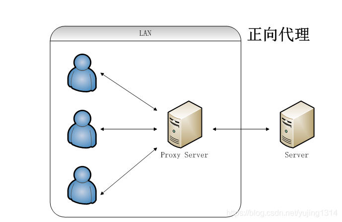
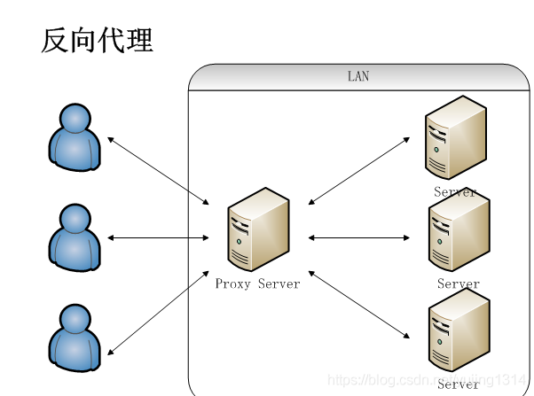

## 参考

::: tip 参考

- [Nginx学习笔记 基于docker](https://blog.csdn.net/m0_49558851/article/details/107786372)
- [当初我要是这么学习Nginx就好了！多图详解](https://www.jianshu.com/p/e90050dc89b6)
- [搞懂Nginx一篇文章就够了](https://blog.csdn.net/yujing1314/article/details/107000737)

:::


## 介绍

Nginx (engine x) 是一个高性能的 `Web 服务器`和`反向代理服务器`，也是一个 IMAP/POP3/SMTP 服务器：

Nginx是一款轻量级的高性能web服务器，同时也是一款非常优秀的负载均衡器和反向代理服务器。由于支持强大的正则匹配规则、动静分离、URLrewrite功能及安装配置简单且对网络稳定性依赖非常小等优点，所以常用来做为七层负载均衡使用。在硬件不差的情况下，通常可以稳定支持几万的并发连接，在硬件性能足够好，且对系统内核参数及Nginx配置进行优化甚至可以达到10万以上的并发。


## 特点


::: info 特点

- **反向代理，负载均衡器**
- **高可靠性、单 Master 多 Worker 模式**
- **高可扩展性、高度模块化**
- **非阻塞**
- **事件驱动**
- **低内存消耗**
- **热部署**

:::


## 应用场景


::: info 应用场景

- **静态文件服务器**
- **反向代理，负载均衡**
- **安全防御**
- **智能路由（企业级灰度测试、地图 POI 一键切流）**
- **灰度发布**
- **静态化**
- **消息推送**
- **图片实时压缩**
- **防盗链**

:::


## 配置文件整体架构


The_overall_structure_of_the_nginx_configuration_file.jpg


`nginx.conf`

```json
# 以下统称为全局块
# worker_processes的数值越大，Nginx的并发能力就越强
# error_log代表Nginx错误日志存放的位置
# pid是Nginx运行的一个标识

user  nginx;
worker_processes  1;
error_log  /var/log/nginx/error.log warn;
pid        /var/run/nginx.pid;


# events块
# worker_connections的数值越大，Nginx的并发能力就越强

events {
    worker_connections  1024;
}


# http块
# include代表引入一个外部文件
# include       /etc/nginx/mime.types;	mime.types中存放着大量媒体类型
#include /etc/nginx/conf.d/*.conf;	引入了conf.d下以.conf为结尾的配置文件

http {
    include       /etc/nginx/mime.types;
    default_type  application/octet-stream;

    log_format  main  '$remote_addr - $remote_user [$time_local] "$request" '
                      '$status $body_bytes_sent "$http_referer" '
                      '"$http_user_agent" "$http_x_forwarded_for"';

    access_log  /var/log/nginx/access.log  main;

    sendfile        on;
    #tcp_nopush     on;

    keepalive_timeout  65;

    #gzip  on;

    include /etc/nginx/conf.d/*.conf;
}

```


## 反向代理


**正向代理**

::: info 正向代理

局域网中的电脑用户想要直接访问网络是不可行的，只能通过代理服务器来访问，这种代理服务就被称为正向代理。

:::





反向代理

::: info 反向代理

客户端无法感知代理，因为客户端访问网络不需要配置，只要把请求发送到反向代理服务器，由反向代理服务器去选择目标服务器获取数据，然后再返回到客户端，此时反向代理服务器和目标服务器对外就是一个服务器，暴露的是代理服务器地址，隐藏了真实服务器IP地址。


Nginx在做反向代理时，提供性能稳定，并且能够提供配置灵活的转发功能。Nginx可以根据不同的正则匹配，采取不同的转发策略，比如图片文件结尾的走文件服务器，动态页面走web服务器，只要你正则写的没问题，又有相对应的服务器解决方案，你就可以随心所欲的玩。并且Nginx对返回结果进行错误页跳转，异常判断等。如果被分发的服务器存在异常，他可以将请求重新转发给另外一台服务器，然后自动去除异常服务器。

:::





两者的区别在于代理的对象不一样

::: info 区别

**正向代理是为客户端代理，反向代理是为服务端代理。**

:::


## 负载均衡

::: tip 参考

- [Nginx负载均衡的实现和调度算法](https://blog.51cto.com/7424593/1744111)
- [Nginx 负载均衡算法](https://www.cnblogs.com/canflyfish/p/11580417.html)
- [简单了解Nginx七层负载均衡的几种调度算法](https://www.jb51.net/article/173410.htm)

:::


### round robin（轮询，默认）

::: info 轮询（默认）

每个请求按`时间顺序逐一分配`到不同的后端服务，它均衡地对待后端的每一台服务器，而不关心服务器实际的连接数和当前的系统负载。如果后端某台服务器死机，自动剔除故障系统，使用户访问不受影响。

**适用于**：后端服务器硬件性能配置完全一致，业务无特殊要求时使用

:::


```bash
upstream backendserver { 
  server 192.168.0.14：80 max_fails=2 fail_timeout=10s; 
  server 192.168.0.15：80 max_fails=2 fail_timeout=10s; 
}
```


### weight（加权值轮询）

::: info weight（轮询权值）

指定轮询几率，weight值(权重)和访问比例成正比，weight的值越大分配到的访问概率越高。或者仅仅为在主从的情况下设置不同的权值，达到合理有效的地利用主机资源。

**适用于**：主要用于后端每台服务器性能不均衡的情况下

:::


```bash
upstream backendserver { 
  server 192.168.0.14:80 weight=5 max_fails=2 fail_timeout=10s; 
  server 192.168.0.15:80 weight=10 max_fails=2 fail_timeout=10s;
}
```


### least_conn（最小连接数）

::: info least_conn

least_connected 方式可以更公平的将负载分配到多个机器上面。由于后端服务器的配置不尽相同，对于请求的处理有快有慢，最小连接数法根据后端服务器当前的连接情况，动态地选取其中当前积压连接数最少的一台服务器来处理当前的请求，尽可能地提高后端服务的利用效率，将负责合理地分流到每一台服务器。

**适用于**：适用于客户端与后端服务器需要保持长连接的业务

:::


```bash
upstream backendserver { 
  least_conn;
  server 192.168.0.14:80 max_fails=2 fail_timeout=10s; 
  server 192.168.0.15:80 max_fails=2 fail_timeout=10s; 
} 
```


### ip_hash

::: info ip_hash

每个请求按`访问IP的哈希结果`分配，使来自同一个IP的访客固定访问一台后端服务器，并且可以有效解决动态网页存在的session共享问题。

**适用于**：适用于需要账号登录的系统，会话连接保持的业务

:::


```bash
upstream backendserver { 
  ip_hash; 
  server 192.168.0.14:80 max_fails=2 fail_timeout=10s; 
  server 192.168.0.15:80 max_fails=2 fail_timeout=10s; 
}
```


### fair

::: info fair

> 需编译安装第三方模块 `ngx_http_upstream_fair_module`

比 weight、ip_hash更加智能的负载均衡算法，fair算法可以根据页面大小和加载时间长短智能地进行负载均衡，也就是根据`后端服务器的响应时间`来分配请求，响应时间短的优先分配。

**适用于**：对访问响应速度有一定要求的业务。


:::

```bash
upstream backendserver {
  fair; 
  server 192.168.0.14:80 max_fails=2 fail_timeout=10s; 
  server 192.168.0.15:80 max_fails=2 fail_timeout=10s; 
}
```


### url_hash

::: info url_hash

> 需编译安装第三方模块 `ngx_http_upstream_hash_module`

按`访问的URL的哈希结果`来分配请求，使每个URL定向到一台后端服务器，可以进一步提高后端缓存服务器的效率。

**适用于**：适用于后端服务器为缓存服务器时比较有效。

:::


```bash
upstream backendserver { 
  server 192.168.0.14:80 max_fails=2 fail_timeout=10s;
  server 192.168.0.15:80 max_fails=2 fail_timeout=10s; 
  hash $request_uri; 
}
```

