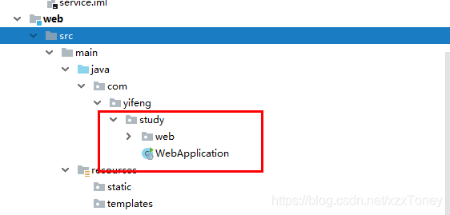

## SpringBoot相关


### 解决SpringBoot无法注入service的原因之一TestController required a bean of type ‘com.yifeng.study.service.UserService’ that could not be found.报错

参考

::: tip

[参考](https://blog.csdn.net/xzxToney/article/details/105248704?utm_medium=distribute.pc_relevant.none-task-blog-BlogCommendFromBaidu-1.control&depth_1-utm_source=distribute.pc_relevant.none-task-blog-BlogCommendFromBaidu-1.control)

:::


#### 原因

如果此时service上已经加了注解`@Service`或者没有其他基本问题，那么可能是**主启动类与被扫描的文件夹不在同一路径**下，所以扫描不到。


#### 解决办法

将启动器类放在与扫描包同级即可，一般是和controller包的上一层的包的同一级。例如

> 我在这里多了一层web,将主启动类放入study文件夹下，和web同级即可。





### 将枚举类型输出时转换为JSON类型

加上注解

```java
@JsonFormat(shape = JsonFormat.Shape.OBJECT)
```


### security的key最短四个字符

报错

secret key byte array cannot be null or empty.


## MybatisPlus


### myabtisplus执行方法异常 Cause: java.lang.IndexOutOfBoundsException: Index: 22, Size: 22

调用自带方法  selectById()

### The error occurred while handling results
### Cause: java.lang.IndexOutOfBoundsException: Index: 22, Size: 22

解决办法
方法一：去除@Builder注解。

方法二：增加构造函数，如Lombok提供的@NoArgsConstructor、@AllArgsConstructor。


