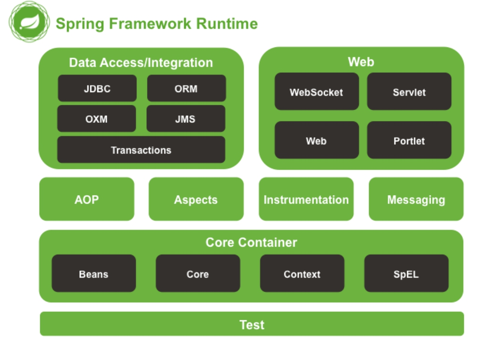

## 参考

::: tip

- [脑图参考](https://www.processon.com/mindmap/60abc60407912906fbcf50ba)
- [脑图参考](https://my.oschina.net/u/3080373/blog/891918)
- [尚硅谷笔记](https://blog.csdn.net/weixin_47872288/article/details/117921644?spm=1001.2014.3001.5501)

:::


什么是 Spring 框架? Spring 是⼀种轻量级开发框架，旨在提⾼开发⼈员的开发效率以及系统的可维护性。

Spring 官⽹：https://spring.io/。 

我们⼀般说 Spring 框架指的都是 Spring Framework，它是很多模块的集合，使⽤这些模块可以很⽅ 便地协助我们进⾏开发。这些模块是：核⼼容器、数据访问/集成,、Web、AOP（⾯向切⾯编程）、⼯ 具、消息和测试模块。⽐如：Core Container 中的 Core 组件是Spring 所有组件的核⼼，Beans 组件 和 Context 组件是实现IOC和依赖注⼊的基础，AOP组件⽤来实现⾯向切⾯编程。


## Spring特征

Spring 官⽹列出的 Spring 的 6 个特征:


::: info Spring 的 6 个特征


- **核心技术** ：依赖注⼊(DI)，AOP，事件(events)，资源，i18n，验证，数据绑定，类型转换， SpEL。 
- **测试** ：模拟对象，TestContext框架，Spring MVC 测试，WebTestClient。 
- **数据访问** ：事务，DAO⽀持，JDBC，ORM，编组XML。 
- **Web⽀持** : Spring MVC和Spring WebFlux Web框架。 
- **集成** ：远程处理，JMS，JCA，JMX，电⼦邮件，任务，调度，缓存。 
- **语⾔** ：Kotlin，Groovy，动态语⾔。


:::


## Spring优点

- IOC方便解耦，简便开发
- AOP不改变源代码，增加其功能
- 方便程序测试
- 方便其他程序的整合
- 降低API的开发难度


## Spring七大模块

::: tip 参考


> - https://www.cnblogs.com/lukelook/p/9604609.html
> - https://www.cnblogs.com/xiaobaizhiqian/p/7616453.html


:::





## IOC（控制反转）

所需依赖

- beans
- context
- core
- expression


### 概念

IOC（Inverse of Control:控制反转）是依赖倒置原则⼀种设计思想，就是把原先在代码里面需要实现的对象创建、对象之间的依赖，通过抽象交由给IOC容器来管理。IOC容器实际上就是个Map（key，value）,Map 中存放的是各种对象。

- 将对象之间的相互依赖关系交给 IoC 容器来管理，并由 IoC 容器完成对象的注⼊。这样可以很⼤程度 上简化应用的开发，把应⽤从复杂的依赖关系中解放出来。 
- IoC 容器就像是⼀个工厂⼀样，当我们需 要创建⼀个对象的时候，只需要配置好配置⽂件/注解即可，完全不⽤考虑对象是如何被创建出来的。 
- 在实际项⽬中⼀个 Service 类可能有⼏百甚⾄上千个类作为它的底层，假如我们需要实例化这个 Service，你可能要每次都要搞清这个 Service 所有底层类的构造函数，这可能会把⼈逼疯。如果利⽤ IoC 的话，你只需要配置好，然后在需要的地⽅引⽤就⾏了，这⼤⼤增加了项⽬的可维护性且降低了开 发难度。 


Spinrg中通过下面来实现

- xml配置
- 工厂模式
- 反射


### 好处

- 它将最小化应用程序中的代码量。
- 它将使您的应用程序易于测试，因为它不需要单元测试用例中的任何单例或 JNDI 查找机制。
- 它以最小的影响和最少的侵入机制促进松耦合。
- 它支持即时的实例化和延迟加载服务。
- 集中管理，实现类的可配置和易管理。
- 降低了类与类之间的耦合度。


### IOC容器接口

- BeanFactory：Spring内部使用接口，不提供给开发人员。`懒加载`，加载配置xml解析不会创建对象，只有getBean才会创建对象
- ApplicationContext：是BeanFactory`子接口`，功能强大，开发人员可使用，加载配置就会创建对象
  - ClassPathXmlApplicationContext：相对路径，src下
  - FileSystemXmlApplicationContext：绝对路径，src下


#### BeanFactory | ApplicationContext对比


**功能上区别**

`BeanFactory`是Spring里面最底层的接口，包含了各种Bean的定义，读取bean配置文档，管理bean的加载、实例化，控制bean的生命周期，维护bean之间的依赖关系。

`ApplicationContext`接口作为`BeanFactory`的派生，是应用上下文，除了提供BeanFactory所具有的功能外，还提供了更完整的框架功能：


> - 国际化（MessageSource）
> - 访问资源，如URL和文件（ResourceLoader）
> - 载入多个（有继承关系）上下文 ，使得每一个上下文都专注于一个特定的层次，比如应用的web层  
> - 消息发送、响应机制（ApplicationEventPublisher）
> - AOP（拦截器）


**两者装载bean的区别**

> - ==BeanFactory==：BeanFactory在启动的时候不会去实例化Bean，只有从容器中拿Bean的时候才会去实例化
> - ==ApplicationContext==：ApplicationContext在启动的时候就把所有的Bean全部实例化了。它还可以为Bean配置`lazy-init=true`来让Bean延迟实例化


**占用内存空间区别**

相对于基本的`BeanFactory`，`ApplicationContext` 唯一的不足是占用内存空间。当应用程序配置Bean较多时，程序启动较慢。


**创建方式区别**

`BeanFactory`通常以`编程的方式`被创建，`ApplicationContext`还能以`声明的方式`创建，如使用ContextLoader。


**我们该用BeanFactory还是ApplicationContent**

> - ==延迟实例化的优点BeanFactory==：应用启动的时候占用资源很少；对资源要求较高的应用，比较有优势
>
> - ==不延迟实例化的优点ApplicationContent==：
>
>   > - 所有的Bean在启动的时候都加载，系统运行的速度快； 
>   > - 在启动的时候所有的Bean都加载了，我们就能在系统启动的时候，尽早的发现系统中的`配置问题` 
>   > - 建议web应用，在启动的时候就把所有的Bean都加载了。（把费时的操作放到系统启动中完成）


### Bean生命周期管理（基于xml)

参考

- [xml官方文档](https://docs.spring.io/spring-framework/docs/current/reference/html/core.html#beans-factory-metadata)


#### 对象创建

```xml
<bean id="userService" class="com.atguigu.spring5.service.UserService">
```

```java
//1 加载spring配置文件
ApplicationContext context =new ClassPathXmlApplicationContext("bean2.xml");

//2 获取配置创建的对象
UserService userService = context.getBean("userService", UserService.class);
```

默认调用的是`无参构造函数`完成对象创建


#### 属性注入

- 使用set方式
- 使用有参构造函数
- 使用xml注入属性


使用xml注入属性

```XML
<bean id="book" class="com.atguigu.spring5.Book">
    <property name="码农研究僧" value="99999"></property>
</bean>
```


使用有参构造函数

```xml
<bean id="orders" class="com.atguigu.spring5.Orders">
    <constructor-arg name="oname" value="电脑"></constructor-arg>
    <constructor-arg name="address" value="China"></constructor-arg>
</bean>
```


#### 自动装配

参考：[https://www.cnblogs.com/bear7/p/12531016.html](https://www.cnblogs.com/bear7/p/12531016.html)


### 基于注解：声明为bean

我们⼀般使⽤ `@Autowired` 注解⾃动装配 bean，要想把类标识成可⽤于 `@Autowired` 注解⾃动装 配的 bean 的类,采⽤以下注解可实现： 

- @Component ：通⽤的注解，可标注任意类为 Spring 组件。如果⼀个Bean不知道属于哪个 层，可以使⽤ @Component 注解标注。 
- @Repository : 对应持久层即 Dao 层，主要⽤于数据库相关操作。 
- @Service : 对应服务层，主要涉及⼀些复杂的逻辑，需要⽤到 Dao层。 
- @Controller : 对应 Spring MVC 控制层，主要⽤户接受⽤户请求并调⽤ Service 层返回数 据给前端页面，也可用@RestController


### 基于注解：属性注入@Autowired和@Qualifier


## Spring Bean


::: tip 参考


- https://www.awaimai.com/2596.html
- https://blog.csdn.net/qq_39411208/article/details/88395875
- [Spring IOC中Bean的作⽤域与⽣命周期](https://blog.csdn.net/qq_43709204/article/details/109991097)
- https://blog.csdn.net/kongmin_123/article/details/82048392


:::


### 什么是bean

Spring 官方文档对 Bean 的解释是：

> In Spring, the objects that form the backbone of your application and that are managed by the Spring IoC container are called beans. A bean is an object that is instantiated, assembled, and otherwise managed by a Spring IoC container.

翻译过来就是：

> 在 Spring 中，构成应用程序`主干`并由`Spring IoC容器`管理的`对象`称为`bean`。bean是一个由`Spring IoC`容器实例化、组装和管理的对象。


Bean也是基于用户提供容器的配置元数据创建


### Bean生命周期

参考

- [https://www.cnblogs.com/javazhiyin/p/10905294.html](https://www.cnblogs.com/javazhiyin/p/10905294.html)


具体过程


- 如果实现InstantiationAwareBeanPostProcessor接口，那么会调用postProcessBeforeInstantiation方法，如果该方法返回非null则不会走后续流程
- Spring对bean通过构造器进行实例化，构造器的推断可以使用@Autowired注解，如果有多个自定义构造方法，那么根据可注入性，顺序性来注入
- Spring将值和bean的引用注入到bean对应的属性中； 
- 如果bean实现了BeanNameAware接口，Spring将bean的ID传递给 setBean-Name()方法； 
- 如果bean实现了BeanFactoryAware接口，Spring将调用 setBeanFactory()方法，将BeanFactory容器实例传入；
- 如果bean实现了ApplicationContextAware接口，Spring将调用 setApplicationContext()方法，将bean所在的应用上下文的引用 传入进来； 
- 如果bean实现了BeanPostProcessor接口，Spring将调用它们的 post-ProcessBeforeInitialization()方法； 
- 如果bean实现了InitializingBean接口，Spring将调用它们的 after-PropertiesSet()方法。
- 调用bean标签指定的属性init-Method初始化方法
- 如果bean实现了BeanPostProcessor接口，Spring将调用它们的 post-ProcessAfterInitialization()方法；
- 此时，bean已经准备就绪，可以被应用程序使用了，它们将一直驻留在应用上下文中，直到该应用上下文被销毁； 
- 如果bean实现了DisposableBean接口，Spring将调用它的 destroy()接口方法。同样，如果bean使用destroy-method声明了 销毁方法，该方法也会被调用。
- 调用bean标签指定的属性detroy-Method毁灭方法


#### 各种接口方法分类

Bean的完整生命周期经历了各种方法调用，这些方法可以划分为以下几类：

::: info  

- Bean自身的方法：这个包括了Bean本身调用的方法和通过配置文件中\<bean\>的`init-method`和`destroy-method`指定的方法
- Bean级生命周期接口方法：这个包括了BeanNameAware、BeanFactoryAware、InitializingBean和DiposableBean这些接口的方法
- 容器级生命周期接口方法：这个包括了InstantiationAwareBeanPostProcessor 和 BeanPostProcessor 这两个接口实现，一般称它们的实现类为“后处理器”。
- 工厂后处理器接口方法：这个包括了AspectJWeavingEnabler, ConfigurationClassPostProcessor, CustomAutowireConfigurer等等非常有用的工厂后处理器接口的方法。工厂后处理器也是容器级的。在应用上下文装配配置文件之后立即调用。

:::


### Spring bean中五种作用域?

| 作用域      | 描述                                                         |
| ----------- | ------------------------------------------------------------ |
| singleton   | 在spring IoC容器仅存在一个Bean实例，Bean以单例方式存在，bean作用域范围的`默认值`。 |
| prototype   | 每次从容器中调用Bean时，都返回一个新的实例，即每次调用getBean()时，相当于执行newXxxBean()。 |
| request     | 每次HTTP请求都会创建一个新的Bean，该作用域仅适用于web的Spring WebApplicationContext环境。 |
| session     | 同一个HTTP Session共享一个Bean，不同Session使用不同的Bean。该作用域仅适用于web的Spring WebApplicationContext环境。 |
| application | 限定一个Bean的作用域为`ServletContext`的生命周期。该作用域仅适用于web的Spring WebApplicationContext环境。 |


#### singleton 作用域


::: warning 关于lazy-init


lazy-init是懒加载, 如果等于true时作⽤是指Spring容器启动的时候不会去实例化这个bean,⽽是在程序调⽤时才去实例化. 默认是false即Spring容器启动时实例化.


:::


实例


创建一个bean:

::: info SingletonBean.java

```java
package com.spring.demo;
public class  SingletonBean{
   private String message;
   public void setMessage(String message){
      this.message  = message;
   }
   public void getMessage(){
      System.out.println("Your Message : " + message);
   }
}
```

:::


在Spring的配置文件中配置该bean:

::: info Bean.xml

```xml
<?xml version="1.0" encoding="UTF-8"?>
<beans xmlns="http://www.springframework.org/schema/beans"
       xmlns:xsi="http://www.w3.org/2001/XMLSchema-instance"
       xsi:schemaLocation="
        http://www.springframework.org/schema/beans http://www.springframework.org/schema/beans/spring-beans.xsd">
 
    <bean id="SingletonBean" class="com.spring.demo.SingletonBean" scope="singleton"></bean>
    <!-- 或者 -->
    <!--  <bean id="SingletonBean" class="com.spring.demo.SingletonBean" ></bean> -->
</beans>
```

:::


测试该Bean是否为单例的:

::: info TestBean.java

```java
package com.spring.demo;
 
import org.springframework.context.ApplicationContext;
import org.springframework.context.support.ClassPathXmlApplicationContext;
import org.junit.Test;
 
public class TestBean {
 
    @Test
    public void textUser()
    {
        //1.获取spring文件
        ApplicationContext context = new ClassPathXmlApplicationContext("Bean.xml");
        //2.由配置文件返回对象
        SingletonBean singletonBeanA = (SingletonBean)context.getBean("SingletonBean");
        singletonBeanA.setMessage("I'm object A");
        singletonBeanA.getMessage();
        SingletonBean singletonBeanB = (SingletonBean)context.getBean("SingletonBean");
        singletonBeanB.getMessage();
    }
}
 
```

:::


运行结果:

::: info 运行结果


:::


`lazy-init`设置为`false`的好处

::: info 好处

可以提前发现潜在的配置问题

Bean 对象存在于缓存中，使⽤时不⽤再去实例化bean，加快程序运⾏效率

:::


适合作为单例的对象

::: info 适合作为单例的对象


就是作为适合创建bean例的类，⼀般来说对于⽆状态或状态不可改变的对象适合使⽤单例模式。（不存在会改变对象状态的成员变量）

比如：user类定义的是各种属性，但有的时候我们需要的只是user属性的一小部分，所以user就不适合作为单例，而controller层、service层、dao层里面的类似固定的操作固定的属性，不会发生什么变动，所以适合作为单例。


:::


#### prototype 作⽤域


当一个bean的作用域为`prototype`，表示一个bean定义对应多个对象实例。声明为prototype作用域的bean会导致在每次对该bean请求（将其注入到另一个bean中，或者以程序的方式调用容器的getBean()方法）时都会创建一个新的bean实例。prototype是原型类型，它在我们创建容器的时候并没有实例化，而是当我们获取bean的时候才会去创建一个对象，而且我们每次获取到的对象都不是同一个对象。

根据经验，对`有状态的bean`应该使用`prototype`作用域，而对`无状态的bean`则应该使用`singleton`作用域。


#### request 请求作用域

Spring容器会在每次用到`loginAction`来处理每个HTTP请求的时候都会创建一个新的`LoginAction`实例。也就是说，`loginAction`Bean的作用域是HTTP `Request`级别的。

当http请求调用作用域为request的bean的时候，每增加一个HTTP请求，Spring就会创建一个新的bean，在请求处理完成之后便及时销毁这个bean。开发者可以随意改变实例的状态，因为通过`loginAction`请求来创建的其他实例根本看不到开发者改变的实例状态，所有创建的Bean实例都是根据独立的请求来的。


#### session 会话作用域

Spring容器会在每次调用到`userPreferences时，`在一个单独的HTTP会话周期来创建一个新的`UserPreferences`实例。换言之`userPreferences`Bean的作用域是HTTP `Session`级别的。

Session中所有http请求共享同一个请求的bean实例。Session结束后就销毁bean。 在`request-scoped`作用域的Bean上，开发者可以随意的更改实例的状态。同样，使用从同一个userPreferences bean定义创建的其他HTTP Session实例在看不到不是自己的内部状态的修改，因为他们是单个的HTTP会话。每个Session请求都会创建新的`userPreferences`实例，所以开发者更改一个Bean的状态，对于其他的Bean仍然是不可见的。


#### application 全局作用域

Spring容器会在整个web应用范围使用到`appPreferences`的时候创建一个新的`AppPreferences`的实例。也就是说，`appPreferences`Bean是在`ServletContext`级别的，作为常规的ServletContext属性。这种作用域在一些程度上来说和Spring的单例作用域相似，但是也有如下不同之处：


- `application`作用域是每个`ServletContext`中包含一个，而不是每个Spring`ApplicationContext`之中包含一个（某些应用中可能包含不止一个`ApplicationContext`）。
- `application`作用域仅仅作为`ServletContext`的属性可见，单例Bean是`ApplicationContext`可见。


接下来再来简单的学习下在Spring当中如何自定义作用域：

在Spring 2.0中，Spring的Bean作用域机制是可以扩展的，这意味着，你不仅可以使用Spring提供的预定义Bean作用域，还可以定义自己的作用域，甚至重新定义现有的作用域（不提倡这么做，而且你不能覆盖内置的singleton和prototype作用域）


### BeanDefinition

`BeanDefinition`表示Bean定义，Spring根据`BeanDfinition`来创建Bean对象，`BeanDfinition`有很多属性用来描述Bean。


| 属性           | 描述                                                         |
| -------------- | ------------------------------------------------------------ |
| beanClass      | 表示一个bean类型。Spring在创建bean过程根据此属性来实例化得到对象 |
| scope          | 作用域                                                       |
| isLazy         | 是否懒加载。表示一个bean是不是需要懒加载,原型bean的 isLazy属性不起作用, 懒加载的单例bean,会在第一次 getBean的时候生成该bean,非懒加 载的单例bean,则会在 Spring启动过程中直接生成好。 |
| dependsOn      | 表示一个bean在创建之前所依赖的其他bean,在一个bean创建之前,它所依赖的这些bean得先全部创建好。 |
| primary        | 表示一个bean是主bean。在Spng中一个类型可以有多个bean对象, 在进行依赖注入时,如果根据类型找到了多个bean,此时会判断这些 bean中是否存在一个主bean,如果存在,则直接将这个bean注入给属性 |
| initMethodName | 表示一个bean的初始化方法。一个bean的生命周期过程中有一个步骤叫初始化,Spng会在这个步骤中去调用bean的初始化方法,初始化逻辑由程序员自己控制,表示程序员可以自定义逻辑对bean进行加 |


### BeanFactory

`BeanFactory`是创建Bean的Spring容器。

`BeanFactory`利用`BeanDefinition`作为模板来生成Bean对象


### Spring提供了哪些bean配置方式

::: tip 参考

- https://blog.csdn.net/qq_35744081/article/details/94986758

:::


::: info 三种配置方式

- 基于xml的配置
- 基于注解的配置
- 基于Java的配置

:::


### bean循环依赖问题

::: tip 参考

- [spring bean循环依赖的解决方法](https://www.cnblogs.com/yanggb/p/13125998.html)
- [Spring-bean的循环依赖以及解决方式](https://blog.csdn.net/u010853261/article/details/77940767)

:::


## AOP（Aspect-Oriented Programming）：面向切面编程


::: tip 参考

- https://www.cnblogs.com/joy99/p/10941543.html
- [SpringAOP详细配置与使用](https://blog.csdn.net/u010890358/article/details/80640433)
- https://www.jianshu.com/p/78ba8bafb90a

:::


`OOP`面向对象，允许开发者定义纵向的关系，但并适用于定义横向的关系，导致了大量代码的重复，而不利于各个模块的重用。


`AOP(Aspect-Oriented Programming)`:⾯向切⾯编程)能够将那些与业务⽆关，却为业务模块所共同调⽤的逻辑或责任（例如`事务处理`、`⽇志管理`、`权限控制`等）封装起来，便于减少系统的重复代码，降低模块间的耦合度，并有利于未来的可拓展性和可维护性。 


### 使用AOP的好处

::: info 好处

- 降低模块的耦合度
- 使系统容易扩展
- 提高代码复用性

:::


### AOP的基本概念

::: info AOP基本概念

| 名称                | 作用                                                         |
| ------------------- | ------------------------------------------------------------ |
| 连接点（JoinPoint） | 需要在程序中插入横切关注点的点，连接点可能是在类初始化、方法调用、字段调用或处理异常等等。Spring中只支持方法执行连接点，通俗来说就是可以被增强的方法 |
| 切入点（Pointcut）  | 一组相关连接点的集合，通俗来说就是实际被增强的方法           |
| 通知（Advice）      | 在连接点上执行的增强行为逻辑，增强提供了在AOP中需要在切入点所选择的连接点处进行扩展现有行为的手段。包括前置通知、后置通知 、环绕通知、异常通知、最终通知 |
| 切面（Aspect）      | 通知和切入点的结合，吧通知应用到切入点的过程                 |
| 织入（Weaving）     | 织入是一个过程，是将切面应用到目标对象从而创建出AOP代理对象的过程。 |
| 代理（Proxy）       | 通过代理方式来对目标对象应用切面。AOP代理可以用JDK动态代理或CGLIB代理实现。 |
| 目标对象（Target）  | 需要被织入关注点的对象。即被代理的对象。                     |

:::


### AOP运行原理/设计模式


实现AOP的主要设计模式就是动态代理。
Spring的动态代理有两种：一是`JDK的动态代理`；另一个是`cglib动态代理`。


#### 使用场景

1. 如果目标对象实现了接口，默认情况下会采用JDK的动态代理实现AOP ，可以强制使用CGLIB实现AOP 
2. 如果目标对象没有实现了接口，必须采用CGLIB库，spring会自动在JDK动态代理和CGLIB之间转换

如何强制使用CGLIB实现AOP？

- 添加CGLIB库，SPRING_HOME/cglib/*.jar
- 在spring配置文件中加入<aop:aspectj-autoproxy proxy-target-class="true"/>


#### 区别

- JDK动态代理只能对实现了接口的类生成代理，而不能针对类
- CGLIB是针对类实现代理，主要是对指定的类生成一个子类，覆盖其中的方法因为是继承，所以该类或方法最好不要声明成final 


### AspectJ

- 在@Configuration标记的类上加@EnableAspectJAutoProxy注解
- 在代理类中加@Component和@AspectJ并自定义通知方法

示例

```java
@Component
@Aspect
public class UserDaoProxy {
    //切入点抽取
    @Pointcut("execution(* com.longchen.spring5.web.dao.UserDao.add(..))")
    private void pointCut() {

    }

    //前置通知
    @Before("pointCut()")
    public void before() {
        System.out.println("before");
    }

    //环绕通知，其中的前置处理比前置通知顺序优先
    @Around("pointCut()")
    public void around(ProceedingJoinPoint proceedingJoinPoint) {
        System.out.println("around before");
        //方法执行
        try {
            proceedingJoinPoint.proceed();
        } catch (Throwable e) {
            e.printStackTrace();
        }
        System.out.println("around after");
    }

    //非异常时返回通知
    @AfterReturning("pointCut()")
    public void afterReturning() {
        System.out.println("afterReturning");
    }

    //异常时通知
    @AfterThrowing("pointCut()")
    public void afterThrowing() {
        System.out.println("afterThrowing");
    }

    //最终通知
    @After("pointCut()")
    public void after() {
        System.out.println("after");
    }
}
```


### Spring AOP 和 AspectJ AOP 有什么区别？

Spring AOP 属于运⾏时增强，⽽ AspectJ 是编译时增强。 Spring AOP 基于代理(Proxying)，⽽ AspectJ 基于字节码操作(Bytecode Manipulation)。 

Spring AOP 已经集成了 AspectJ ，AspectJ 应该算的上是 Java ⽣态系统中最完整的 AOP 框架了。 AspectJ 相⽐于 Spring AOP 功能更加强⼤，但是 Spring AOP 相对来说更简单。

 如果我们的切⾯少，那么两者性能差异不⼤。但是，当切⾯太多的话，最好选择 AspectJ ，它⽐ Spring AOP 快很多。


## jdbcTemplate

1. 声明Druid连接池并注入连接数据库四个属性
2. 声明jdbcTemplate并将Druid作为dataSource注入到其中然后可以使用


### 源码原理

参考

- [spring源码剖析（七）JdbcTemplate数据库封装原理解读](https://blog.csdn.net/fighterandknight/article/details/51358140)

