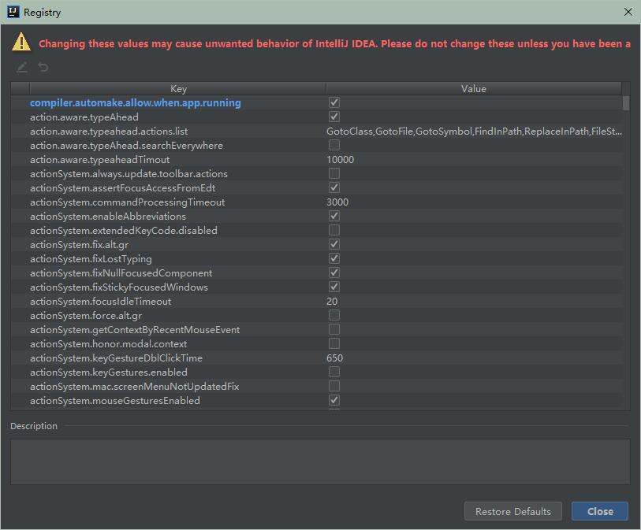

这种方式是属于项目重启（速度比较快的项目重启），会清空session中的值，也就是如果有用户登陆的话，项目重启后需要重新登陆。


## 参考

> - https://blog.csdn.net/chachapaofan/article/details/88697452
> - https://blog.csdn.net/isea533/article/details/70495714


## 1. 引入依赖

```xml
<!--devtools热部署-->
<dependency>
	<groupId>org.springframework.boot</groupId>
	<artifactId>spring-boot-devtools</artifactId>
	<optional>true</optional>
  <scope>runtime</scope>
</dependency>


<build>
        <plugins>
            <plugin>
                <groupId>org.springframework.boot</groupId>
                <artifactId>spring-boot-maven-plugin</artifactId>
                <configuration>
                    <fork>true</fork>
                  	<addResources>true</addResources>
                </configuration>
            </plugin>
        </plugins>
    </build>
```


## 2. 配置application.yml

```yml
spring:
  devtools:
    restart:
      enabled: true  #设置开启热部署
      additional-paths: src/main/java #重启目录
      exclude: WEB-INF/**
  freemarker:
    cache: false    #页面不加载缓存，修改即时生效
```


## 3. IDEA配置


### 3.1 第一步

File-Settings-Compiler-Build Project automatically


### 3.2 第二步

ctrl + shift + alt + / ,选择Registry,勾上 Compiler autoMake allow when app running





## 4. 热部署

修改文件后`Ctrl + F9`，即Build Project便会快速重启项目


## 5. 其他问题


### 解决 spring boot devtool热部暑后出现访问404问题

参考

> - https://www.cnblogs.com/yxfcnbg/p/11510426.html


DevTools的检测时间和idea的编译所需时间存在差异。在idea还没完成编译工作前，DevTools就开始进行重启和加载，导致@RequestMapping没有被全部正常处理。其他方法没试，就直接用了看起来最简单的方法：牺牲一点时间，去加长devtools的轮询时间，增大等待时间。

解决方案如下：

```yaml
spring.devtools.restart.poll-interval=3000ms
spring.devtools.restart.quiet-period=2999ms
```

