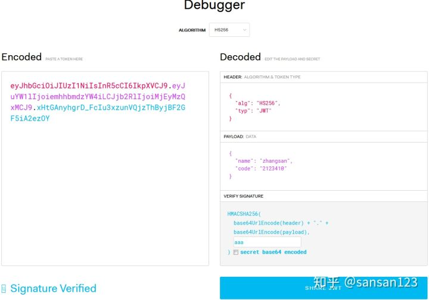

## 参考

::: tip 参考

- [五分钟带你了解啥是JWT](https://zhuanlan.zhihu.com/p/86937325)
- [【编程不良人】JWT认证原理、流程整合springboot实战应用,前后端分离认证的解决方案!](https://www.bilibili.com/video/BV1i54y1m7cP)

:::


## 介绍


### 是什么

::: info 是什么

JSON Web Token (JWT)是一个开放标准(RFC 7519)，它定义了一种紧凑的、自包含的方式，用于作为JSON对象在各方之间安全地传输信息。该信息可以被验证和信任，因为它是数字签名的。

:::


### 使用场景

::: info 使用场景

- Authorization (授权) : 这是使用JWT的最常见场景。一旦用户登录，后续每个请求都将包含JWT，允许用户访问该令牌允许的路由、服务和资源。单点登录是现在广泛使用的JWT的一个特性，因为它的开销很小，并且可以轻松地跨域使用。
- Information Exchange (信息交换) : 对于安全的在各方之间传输信息而言，JSON Web Tokens无疑是一种很好的方式。因为JWT可以被签名，例如，用公钥/私钥对，你可以确定发送人就是它们所说的那个人。另外，由于签名是使用头和有效负载计算的，您还可以验证内容没有被篡改。

:::


### 结构

::: info 结构

- Header
- Payload
- Signature

因此，一个典型的JWT看起来是这个样子的：

> xxxxx.yyyyy.zzzzz

:::


**Header**

典型的由两部分组成：token的类型（“JWT”）和算法名称（比如：HMAC SHA256或者RSA等等）。

例如

```python
{
    'alg': "HS256",
    'typ': "JWT"
}
```

然后，用Base64对这个JSON编码就得到JWT的第一部分，只是翻译回原来的样子，并不是`解密`


**Payload**

Payload JWT的第二部分是payload，它包含声明（要求）。声明是关于实体(通常是用户)和其他数据的声明。声明有三种类型: registered, public 和 private。

::: info

- Registered claims : 这里有一组预定义的声明，它们不是强制的，但是推荐。比如：iss (issuer), exp (expiration time), sub (subject), aud (audience)等。
- Public claims : 可以随意定义。
- Private claims : 用于在同意使用它们的各方之间共享信息，并且不是注册的或公开的声明。 下面是一个例子：

:::

也可以用Base64编码。注意，不要在JWT的payload或header中放置敏感信息，除非它们是加密的。


**Signature**

> 为了得到签名部分，你必须有编码过的header、编码过的payload、一个秘钥，签名算法是header中指定的那个，然对它们签名即可。

例如

> HMACSHA256(base64UrlEncode(header) + "." + base64UrlEncode(payload), secret)

签名是用于验证消息在传递过程中有没有被更改，并且，对于使用私钥签名的token，它还可以验证JWT的发送方是否为它所称的发送方。





Signature需要使用编码后的header和payload以及我们提供的一个密钥，最后使用header中指定的签名算法（HS256）进行签名。签名的作用是保证JWT没有被篡改过


### 如何工作

在认证的时候，当用户用他们的凭证成功登录以后，一个`JSON Web Token`将会被返回。此后，token就是用户凭证了，你必须非常小心以防止出现安全问题。一般而言，你保存令牌的时候不应该超过你所需要它的时间。

无论何时用户想要访问受保护的路由或者资源的时候，用户代理（通常是浏览器）都应该带上JWT，典型的，通常放在`Authorization header`中，用Bearer schema。

header应该看起来是这样的：

> Authorization: Bearer

服务器上的受保护的路由将会检查Authorization header中的JWT是否有效，如果有效，则用户可以访问受保护的资源。如果JWT包含足够多的必需的数据，那么就可以减少对某些操作的数据库查询的需要，尽管可能并不总是如此。

如果token是在授权头（Authorization header）中发送的，那么跨源资源共享(CORS)将不会成为问题，因为它不使用cookie。


### 其他

::: info 参考

[五分钟带你了解啥是JWT](https://zhuanlan.zhihu.com/p/86937325)

:::


## 基于Token的身份认证与基于服务器的身份认证


### 基于服务器的身份认证


在讨论基于Token的身份认证是如何工作的以及它的好处之前，我们先来看一下以前我们是怎么做的：

> HTTP协议是无状态的，也就是说，如果我们已经认证了一个用户，那么他下一次请求的时候，服务器不知道我是谁，我们必须再次认证

传统的做法是将已经认证过的用户信息存储在服务器上，比如`Session`。用户下次请求的时候带着`Session ID`，然后服务器以此检查用户是否认证过。

这种基于服务器的身份认证方式存在一些问题：


::: info

- **Sessions** : 每次用户认证通过以后，服务器需要创建一条记录保存用户信息，通常是在内存中，随着认证通过的用户越来越多，服务器的在这里的开销就会越来越大。
- **Scalability** : 由于Session是在内存中的，这就带来一些扩展性的问题。
- **CORS** : 当我们想要扩展我们的应用，让我们的数据被多个移动设备使用时，我们必须考虑跨资源共享问题。当使用AJAX调用从另一个域名下获取资源时，我们可能会遇到禁止请求的问题。
- **[CSRF](https://www.cnblogs.com/hyddd/archive/2009/04/09/1432744.html)** : 用户很容易受到CSRF攻击。CSRF（Cross-site request forgery），中文名称：跨站请求伪造，也被称为：one click attack/session riding，缩写为：CSRF/XSRF。

:::


### JWT与Session的差异

相同点是，它们都是存储用户信息；然而，`Session`是在`服务器端`的，而`JWT`是在`客户端`的。

- `Session`方式存储用户信息的最大问题在于要`占用大量服务器内存`，增加服务器的开销。而`JWT`方式将用户状态分散到了客户端中，可以明显减轻服务端的内存压力。
- `Session`的状态是存储在服务器端，客户端只有`session id`；而`Token`的状态是存储在`客户端`。


### 基于Token的身份认证是如何工作的 

基于Token的身份认证是无状态的，服务器或者Session中不会存储任何用户信息。

没有会话信息意味着应用程序可以根据需要扩展和添加更多的机器，而不必担心用户登录的位置。

虽然这一实现可能会有所不同，但其主要流程如下：

-用户携带用户名和密码请求访问 -服务器校验用户凭据 -应用提供一个token给客户端 -客户端存储token，并且在随后的每一次请求中都带着它 -服务器校验token并返回数据

注意：

-每一次请求都需要token -Token应该放在请求header中 -我们还需要将服务器设置为接受来自所有域的请求，用Access-Control-Allow-Origin: *


### 用Token的好处

- 无状态和可扩展性：Tokens存储在客户端。完全无状态，可扩展。我们的负载均衡器可以将用户传递到任意服务器，因为在任何地方都没有状态或会话信息。 
- 安全：Token不是Cookie。（The token, not a cookie.）每次请求的时候Token都会被发送。而且，由于没有Cookie被发送，还有助于防止`CSRF`攻击。即使在你的实现中将token存储到客户端的Cookie中，这个Cookie也只是一种存储机制，而非身份认证机制。没有基于会话的信息可以操作，因为我们没有会话!
- 还有一点，token在一段时间以后会过期，这个时候用户需要重新登录。这有助于我们保持安全。还有一个概念叫token撤销，它允许我们根据相同的授权许可使特定的token甚至一组token无效。


### JWT与OAuth的区别

OAuth2是一种授权框架 ，JWT是一种认证协议 -无论使用哪种方式切记用HTTPS来保证数据的安全性 

OAuth2用在使用第三方账号登录的情况(比如使用weibo, qq, github登录某个app)，而JWT是用在前后端分离, 需要简单的对后台API进行保护时使用。


## SpringBoot整合JWT