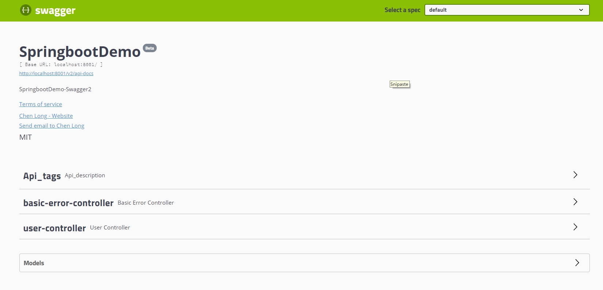
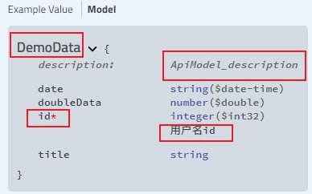

## 参考

> - https://blog.csdn.net/u014231523/article/details/54562695
> - https://leongfeng.github.io/2017/02/20/springboot-springfox-swagger2markup-spring-restdoc/
> - 官方wiki：https://github.com/swagger-api/swagger-core/wiki/Annotations


## 1. 引入依赖

```xml
				<!--Swagger依赖-->
        <dependency>
            <groupId>io.springfox</groupId>
            <artifactId>springfox-swagger2</artifactId>
            <version>2.9.2</version>
        </dependency>
        <dependency>
            <groupId>io.springfox</groupId>
            <artifactId>springfox-swagger-ui</artifactId>
            <version>2.9.2</version>
        </dependency>
```


## 2. 配置SwaggerConfiguration

创建`SwaggerConfiguration.java`配置类


加注解

> - @Configuration
> - @EnableSwagger2

```java
package com.pactera.sz.cmb202102.config;


import com.github.xiaoymin.swaggerbootstrapui.annotations.EnableSwaggerBootstrapUI;
import com.google.common.base.Function;
import com.google.common.base.Optional;
import com.google.common.base.Predicate;
import com.google.common.base.Predicates;
import org.springframework.context.annotation.Bean;
import org.springframework.context.annotation.Configuration;
import springfox.documentation.RequestHandler;
import springfox.documentation.builders.ApiInfoBuilder;
import springfox.documentation.builders.PathSelectors;
import springfox.documentation.builders.RequestHandlerSelectors;
import springfox.documentation.service.ApiInfo;
import springfox.documentation.service.Contact;
import springfox.documentation.spi.DocumentationType;
import springfox.documentation.spring.web.plugins.Docket;
import springfox.documentation.swagger2.annotations.EnableSwagger2;


/**
 * @WebName: SwaggerConfig
 * @Description: TODO
 * @author: Chen Long
 * @date: 2020/9/17  15:25
 * “Welcome,my master”
 */

@Configuration
@EnableSwagger2
@EnableSwaggerBootstrapUI
public class SwaggerConfig {

    // 定义分隔符
    private static final String SPLITOR = ";";

    private static final String project = "com.pactera.sz.cmb202102.";
    private static final String ChargeModule = "com.pactera.sz.cmb202102.charge";
    private static final String householdServiceModule = "com.pactera.sz.cmb202102.householdservice";
    private static final String financeServiceModule = "com.pactera.sz.cmb202102.financeservice";
    private static final String statisticsServiceModule = "com.pactera.sz.cmb202102.statisticsservice";
    private static final String managementModule = "com.pactera.sz.cmb202102";

    /**
     * 创建API应用
     * api() 增加API相关信息
     * 通过select()函数返回一个ApiSelectorBuilder实例,用来控制哪些接口暴露给Swagger来展现，
     * 本例采用指定扫描的包路径来定义指定要建立API的目录。
     *
     * @return
     */


    @Bean
    public Docket merchantDocket(){
        return new Docket(DocumentationType.SWAGGER_2)
                .groupName("商户管理平台模块")
                .apiInfo(apiInfo())
                .select()
                .apis(scanBasePackage(ChargeModule + SPLITOR + householdServiceModule + SPLITOR + financeServiceModule + SPLITOR + statisticsServiceModule))
                .paths(PathSelectors.any())
                .build();

        //是否将参数显示在请求后面
    }

    @Bean
    public Docket systemDocket(){
        return new Docket(DocumentationType.SWAGGER_2)
                .groupName("系统后台管理模块")
                .apiInfo(apiInfo())
                .select()
                .apis(scanBasePackage(managementModule))
                .paths(PathSelectors.any())
                .build();
        //是否将参数显示在请求后面
    }

    private ApiInfo apiInfo(){
        return new ApiInfoBuilder()
                .title("CMB202102-Swagger")
                .description("CMB202102实训项目-后台管理系统/商户管理平台")
                .termsOfServiceUrl("localhost:8000")
                .contact(new Contact("WebSite", "http://localhost:8081/login", "1138312802@qq.com"))
                .version("Beta")
                .license("MIT")
                .licenseUrl("")
                .build();

    }


    /**
     * 切割扫描的包生成Predicate<RequestHandler>
     * @param basePackage
     * @return
     */
    public static Predicate<RequestHandler> scanBasePackage(final String basePackage) {
        if(basePackage.length() == 0){
            throw new NullPointerException("basePackage不能为空，多个包扫描使用"+SPLITOR+"分隔");
        }
        String[] controllerPack = basePackage.split(SPLITOR);
        Predicate<RequestHandler> predicate = null;
        for (int i = controllerPack.length -1; i >= 0 ; i--) {
            String strBasePackage = controllerPack[i];
            Predicate<RequestHandler> tempPredicate = RequestHandlerSelectors.basePackage(strBasePackage);
            predicate = predicate == null ? tempPredicate : Predicates.or(tempPredicate,predicate);
        }
        if(predicate == null){
            throw new NullPointerException("basePackage配置不正确，多个包扫描使用"+SPLITOR+"分隔");
        }
        return predicate;
    }


}


```


输入http://localhost:8001/swagger-ui.html





### 2.1 多包扫描

参考

> - https://www.jianshu.com/p/b5068f121a49


## 3. 常用注解


| 注解                 | 描述                                         |
| -------------------- | -------------------------------------------- |
| @Api()               | 用于controller类上                           |
| @ApiOperation()      | 用于controller类中的请求方法                 |
| @ApiParam()          | 用于请求中的参数说明                         |
| @ApiImplicitParam()  | 用于请求方法中的参数说明，不过写在请求方法上 |
| @ApiImplicitParams() | 里面可以包含多个@ApiImplicitParam()          |
| @ApiModel()          | 写在实体类上，描述和重命名实体类             |
| @ApiModelProperty()  | 写在实体类属性上，描述，重命名，示例等       |
| @ApiResponses()      | 用于请求方法上，描述某个返回码               |
| @ApiIgnore()         | 作用于类，方法，属性上，使其忽略             |


### @Api()：描述Controller类

作用于`controller`类上

属性说明

| 属性        | 描述                                                       |
| ----------- | ---------------------------------------------------------- |
| tags        | 分组，在类上多个时会复制多个controller。也可以当做名字使用 |
| description | 小标题描述，已弃用，默认为controller类名                   |
| value       |                                                            |


例如

```java
@RestController
@RequestMapping("demoData")
@Api(value="Api_value",description="Api_description",tags={"Api_tags"})
public class DemoDataController {
}
```


### @ApiOperation()：描述请求方法

作用于controller类中的`请求方法`上


| 属性   | 描述                                         |
| ------ | :------------------------------------------- |
| value  | 表示标题，如果有多个值则会复制多个controller |
| notes  | 方法内容                                     |
| tags   | 分组                                         |
| hidden | 默认为`false`，`true`时隐藏                  |


例如

```java
@GetMapping("/exportExcel")
@ApiOperation(value="ApiOperation_Value",notes="ApiOperation_Notes")
public void exportExcel() throws IOException {
  
}
```


### @ApiParam()：参数

作用于controller类中的`请求方法形参上`上。用于方法，参数，字段说明，表示对参数的添加元数据（说明或是否必填等） 


> 注意，作用于参数时，在Swagger中会要求输入body类型(GET和HEAD无法接受BODY类型)。不想使用body可以在参数前加注解`@RequestParam`。或者直接使用注解`@ApiImplicitParam()`


| 属性     | 描述     |
| -------- | :------- |
| name     | 参数名   |
| value    | 参数说明 |
| required | 是否必填 |


例如

```java
public void exportExcel(@ApiParam(name="param",value="ApiParam_value",required=true) String param){

 }
```

`name`可以省略


### @ApiImplicitParams()

作用于`请求方法`上，对参数进行说明，包含多个`@ApiImplicitParam`

参考

> - https://blog.csdn.net/qq_35494342/article/details/104691636


#### @ApiImplicitParam

| 属性          | 描述                                                         |
| ------------- | :----------------------------------------------------------- |
| name          | 对应参数名                                                   |
| value         | 对参数进行说明                                               |
| required      | 参数是否必须传                                               |
| paramType     | 参数放在哪个地方，具体值在下方                               |
| dataType      | 参数类型，默认String，其它值dataType="Integer"，也可以写实体类 |
| dataTypeClass | 用类当做参数类型，但试过无效                                 |
| defaultValue  | 参数的默认值                                                 |


#### paramType参数

| 值     | 描述                                            |
| ------ | :---------------------------------------------- |
| header | 请求参数的获取：@RequestHeader                  |
| query  | 请求参数的获取：@RequestParam                   |
| path   | 用于restful接口， 请求参数的获取：@PathVariable |
| body   | @RequestBody                                    |
| form   | 表单                                            |


例如

```java
@ApiImplicitParams({
    @ApiImplicitParam(name = "name", value = "User's name", required = true, dataType = "string", paramType = "query"),
    @ApiImplicitParam(name = "email", value = "User's email", required = false, dataType = "string", paramType = "query"),
    @ApiImplicitParam(name = "id", value = "User ID", required = true, dataType = "long", paramType = "query")
  })
 public void doPost(HttpServletRequest request, HttpServletResponse response) throws ServletException, IOException {...}
```


### @ApiModel()：实体类

作用于实体类上

| 属性        | 描述       |
| ----------- | :--------- |
| value       | 实体类名称 |
| description | 实体类描述 |


### @ApiModelProperty：实体类参数上

| 属性     | 描述     |
| -------- | :------- |
| value    | 参数描述 |
| example  | 举例     |
| hidden   | 是否显示 |
| required | 是否必填 |


例如

```java
@ApiModel(value = "ApiModel_value", description = "ApiModel_description")
public class DemoData {
    @ApiModelProperty(value="用户名id",required = true)
    private Integer id;
}
```





### @ApiResponses：返回码描述

作用于请求方法。设置返回码和响应的描述信息，`@ApiResponses`可以设置多个`@ApiResponse`

例如

```java
    @ApiResponses(value = { 
            @ApiResponse(code = 400, message = "Invalid ID supplied"),
            @ApiResponse(code = 404, message = "Pet not found") 
    })
```


### @ApiIgnore：忽略类或方法或实体类属性

可作用于类，方法和实体类属性上


## 4. 集成swagger-bootstrap-ui

功能更强大bootstrap风格的UI界面


### 4.1 导入依赖

```java
        <!-- https://mvnrepository.com/artifact/com.github.xiaoymin/swagger-bootstrap-ui -->
        <dependency>
            <groupId>com.github.xiaoymin</groupId>
            <artifactId>swagger-bootstrap-ui</artifactId>
            <version>1.9.6</version>
        </dependency>
```


### 4.2 在SwaggerConfig上开启注解

```java
@EnableSwaggerBootstrapUI
```


### 4.3 访问网址

http://localhost:8000/doc.html


