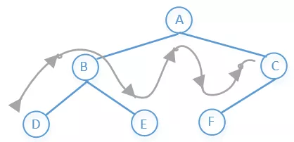

# 1. 时间复杂度计算


# 2. 算法


## 区别


### 动态规划和贪心算法的区别

相同点

- 动态规划和贪心算法都是一种递推算法 
- 均有局部最优解来推导全局最优解


不同点

- 贪心算法中，作出的每步贪心决策都无法改变，因为贪心策略是由上一步的最优解推导下一步的最优解，而上一部之前的最优解则不作保留。 
- 可以知道贪心法正确的条件是：每一步的最优解一定包含上一步的最优解。 
- 全局最优解中一定包含某个局部最优解，但不一定包含前一个局部最优解，因此需要记录之前的所有最优解 
- 动态规划的关键是状态转移方程，即如何由以求出的局部最优解来推导全局最优解 
- 边界条件：即最简单的，可以直接得出的局部最优解


# 3. 数据结构


## 3.1 稀疏数组

**只适用于大部分元素为相同时，比如五子棋**


**第一行记录总行和总列数和除0外有多少个非零数据，剩余的行则记录每个数据的位置和值**


**etc:五子棋**


**Java代码**

```java
public class SparseArray {
    public static void main(String[] args) {
        /*0：没有棋子，1：表示黑子，2：表示白子*/
        int chessArr[][] = new int[11][11];
        chessArr[1][2] = 1;
        chessArr[2][4] = 2;
        chessArr[3][8] = 10;
//        输出原始为二维数组
        System.out.println("原始二维数组");
        for(int[] row : chessArr){
            for(int data: row){
                System.out.printf("%d\t",data);
            }
            System.out.println();
        }

//        将二维数组转为稀疏数组
//        1.先遍历二维数组非0的个数
        int sum = 0;
        for(int i = 0; i < 11;i++){
            for(int j = 0; j < 11;j++){
                if(chessArr[i][j] != 0){
                    sum++;
                }
            }
        }

        System.out.println("非0个数为"+sum);

//        2.创建相应的稀疏数组
        int sparseArr[][] = new int[sum+1][3];
        sparseArr[0][0] = 11;
        sparseArr[0][1] = 11;
        sparseArr[0][2] = sum;

//        遍历二维数组，将非0的值存放到sparseArr中
        int count = 0;
        for(int i = 0; i < 11; i++){
            for(int j = 0; j < 11; j++){
                if(chessArr[i][j] != 0){
                    count++;
                    sparseArr[count][0] = i;
                    sparseArr[count][1] = j;
                    sparseArr[count][2] = chessArr[i][j];
                }
            }
        }

//        输出稀疏数组
        System.out.println();
        System.out.println("稀疏数组");
        for(int[] row : sparseArr){
            for(int data: row){
                System.out.printf("%d\t",data);
            }
            System.out.println();
        }

//        3.将稀疏数组转换为二维数组
//        声明数组
        int chessArry2[][] = new int[sparseArr[0][0]][sparseArr[0][1]];

        for(int i  = 1; i < sparseArr.length; i++){
            chessArry2[sparseArr[i][0]][sparseArr[i][1]] = sparseArr[i][2];
        }

        //        输出转换后的二维数组
        System.out.println("转换后的二维数组");
        for(int[] row : chessArr){
            for(int data: row){
                System.out.printf("%d\t",data);
            }
            System.out.println();
        }
    }

}
```


**运行结果**


## 3.2 队列

先进先出


### 用数组模拟队列实现


- 队列本身是**有序列表**,若使用数组的结构来存储队列的数据,则队列数组的声明如下图,其中**maxSize**是该队列的最大容量 

- 因为队列的输出、翰入是分别从前后端来处理,因此需要两个变量 **front** 及**rear**分别记录队列前后端的下标,**front会随着数据输出而改变,而rear则是随着数据输入而改变**,如图所示:  

  


1. **初始化队列**

```java
    private int maxSize;// 表示数组最大容量
    private int front; // 队列头指针指向队列头的前一个位置
    private int rear; // 队列尾指针
    private int[] arr; // 该数据用于存放数据，模拟队列

    //        创建队列的构造器
    public ArrayQueue(int arrMaxSize) {
        maxSize = arrMaxSize;
        arrQueue = new int[maxSize];
        front = -1; // 指向队列头部，分析出front是指向队列头的前一个位置，当队列执行出操作时++
        rear = -1; // 向队列队尾，指向队列尾的数据(队列最后一个数据)，当队列执行入操作时++
    }

```


2. **判断队列是否已满**

当 **rear = maxSize - 1** 时队列满

```java
    //        判断队列是否满
    public boolean isFull() {
        return rear == maxSize - 1;
    }
```


3. **判断队列是否为空**

当 **rear == front** 时队列为空

```java
    //        判断队列是否空
    public boolean isEmpty() {
        return rear == front;
    }
```


4. **入队操作 addQueue** 

**需要两个步骤**

- 先判断队列是否已满，当 **rear == maxSize-1** 时队列满无法插入
- 若尾指针 **rear** 小于队列的最大下标 **maxSize-1** ,则先将 **rear++**，再将数据n赋值给 **arrQueue[rear] = n**

```java
    //        入队操作
    public void addQueue(int n) {
        //        判断队列是否满
        if (isFull()) {
            System.out.println("队列已满");
            return;
        }
        rear++;
        arr[rear] = n;
    }
```


5. **出队操作 outQueue**

**需要两个步骤**

- 先判断队列是否为空，当 **rear == front** 时队列为空无法出队
- 若头指针 **front != rear** ，**front++** ，因为front指向队列头的前一个位置，所以返回的出队数据为 **arrQueue[front]**

```java
    //        出队操作
    public int outQueue() {
        //        判断队列是否满
        if (isEmpty()) {
            System.out.println("队列为空");
            throw new RuntimeException("队列为空");
        }
        front++;
        return arrQueue[front];
    }
```


6. **显示队列**

```java
    public void showQueue() {
        //遍历
        if (isEmpty()) {
            System.out.println("队列为空");
            return;
        }
        for (int i = front+1; i < rear+1; i++) {
            System.out.printf("arr[%d] = %d\n", i, arrQueue[i]);
        }
    }
```


7. **用数组实现队列模拟代码**

```java
public class ArrayQueue {
    private int maxSize;// 表示数组最大容量
    private int front; // 队列头指针指向队列头的前一个位置
    private int rear; // 队列尾指针
    private int[] arrQueue; // 该数据用于存放数据，模拟队列

    //        创建队列的构造器
    public ArrayQueue(int arrMaxSize) {
        maxSize = arrMaxSize;
        arrQueue = new int[maxSize];
        front = -1; // 指向队列头部，分析出front是指向队列头的前一个位置，当队列执行出操作时++
        rear = -1; // 向队列队尾，指向队列尾的数据(队列最后一个数据)，当队列执行入操作时++
    }

    //        判断队列是否满
    public boolean isFull() {
        return rear == maxSize - 1;
    }

    //        判断队列是否空
    public boolean isEmpty() {
        return rear == front;
    }

    //        入队操作
    public void addQueue(int n) {
        //        判断队列是否满
        if (isFull()) {
            System.out.println("队列已满");
            return;
        }
        rear++;
        arrQueue[rear] = n;
    }

    //        出队操作
    public int outQueue() {
        //        判断队列是否满
        if (isEmpty()) {
            System.out.println("队列为空");
            throw new RuntimeException("队列为空");
        }
        front++;
        return arrQueue[front];
    }

    //    查看未出队的数据
    public void showQueue() {
        //遍历
        if (isEmpty()) {
            System.out.println("队列为空");
            return;
        }
        for (int i = front+1; i < rear+1; i++) {
            System.out.printf("arr[%d] = %d\n", i, arrQueue[i]);
        }
    }

    //    显示队列的头数据，并不是取出操作
    public int headQueue() {
        if(isEmpty()) {
            throw new RuntimeException("队列为空");
        }
        return arrQueue[front + 1];
    }

    public static void main(String[] args) {
//        构造数组队列
        ArrayQueue arrayQueue = new ArrayQueue(2);
        char input;
        Scanner scanner = new Scanner(System.in);
        boolean loop = true;

        while (loop){
            System.out.println();
            System.out.println("a(add)：入队");
            System.out.println("g(get)：出队");
            System.out.println("s(show)：显示队列");
            System.out.println("h(head)：查看队列头数据");
            System.out.println("e(exit)：退出程序");

            input = scanner.next().charAt(0);
            switch (input){

                //输出队列
                case  's' :
                    arrayQueue.showQueue();
                    break;

                //入队操作
                case  'a' :
                    int value = scanner.nextInt();
                    arrayQueue.addQueue(value);
                    break;

                //出队操作
                case  'g' :
                    try {
                        System.out.println("出队的数据为 = " + arrayQueue.outQueue());
                    }catch (Exception e){
                        System.out.println(e.getMessage());
                    }
                    break;

                //输出队列头数据
                case  'h' :
                    try {
                        System.out.println("队列的头数据为 = " + arrayQueue.headQueue());
                    }catch (Exception e){
                        System.out.println(e.getMessage());
                    }
                    break;

                //退出
                case  'e' :
                    scanner.close();
                    loop = false;
                   break;

                default:
                    break;
            }
        }
    }
}
```


## 3.3 树


### 3.3.1 二叉树

参考

> - https://mp.weixin.qq.com/s/mBXfpH4nuIltyHm72zLryw


- 前序遍历：根结点 -> 左子树 -> 右子树 
- 中序遍历：左子树 -> 根结点 -> 右子树 
- 后序遍历：左子树 -> 右子树 -> 根结点


### 3.3.2 B树和B+树

参考

> - https://www.jianshu.com/p/ee10f01d3247
> - https://blog.csdn.net/weichi7549/article/details/107333942


B树

在计算机科学中，B树（B-tree）是一种树状数据结构，它能够存储数据、对其进行排序并允许以`O(log n)`的时间复杂度运行进行查找、顺序读取、插入和删除的数据结构。B树，概括来说是一个节点可以拥有多于2个子节点的二叉查找树。与自平衡二叉查找树不同，B-树为系统最优化**大块数据的读和写操作**。B-tree算法减少定位记录时所经历的中间过程，从而加快存取速度。普遍运用在**数据库**和**文件系统**。


B+树

B和B+树的区别在于，B+树的非叶子结点只包含导航信息，不包含实际的值，所有的叶子结点和相连的节点使用链表相连，便于区间查找和遍历。

优点在于

> - 由于B+树在内部节点上不好含数据信息，因此在内存页中能够存放更多的key。 数据存放的更加紧密，具有更好的空间局部性。因此访问叶子几点上关联的数据也具有更好的缓存命中率。
> - B+树的叶子结点都是相链的，因此对整棵树的便利只需要一次线性遍历叶子结点即可。而且由于数据顺序排列并且相连，所以便于区间查找和搜索。而B树则需要进行每一层的递归遍历。相邻的元素可能在内存中不相邻，所以缓存命中性没有B+树好。


区别

> - B树的每个结点都存储了key和data，B+树的data存储在叶子节点上。节点不存储data，这样一个节点就可以存储更多的key。可以使得树更矮，所以IO操作次数更少。非叶结点仅具有索引作用,跟记录有关的信息均存放在叶结点中。
> - 树的所有叶结点构成一个有序链表，可以按照关键码排序的次序遍历全部记录由于数据顺序排列并且相连，所以便于区间查找和搜索。而B树则需要进行每一层的递归遍历。相邻的元素可能在内存中不相邻，所以缓存命中性没有B+树好。


总的来说，通过对每个节点存储个数的扩展，使得对连续的数据能够进行较快的定位和访问，能够有效减少查找时间，提高存储的空间局部性从而减少IO操作。对于树来说，IO次数就是树的高度，而“矮胖”就是b树的特征之一


同时应用于数据库中两种数据库引擎实现的方式有些不同


#### 结点构造

```java
public class TreeNode {
    public int val;
    public TreeNode left;
    public TreeNode right;
 
     public TreeNode(int x) {
         val = x;
     }
 
    public TreeNode() {
    }

    @Override
    public String toString() {
        return "[" + val + "]";
    }
}

```


#### 前序遍历


```java
static ArrayList<Integer> arrayList = new ArrayList();
public static void preOrder(TreeNode tree) {
    if (tree == null)
        return;
  	arrayList.add(tree.val)
    preOrder(tree.left);
    preOrder(tree.right);
}
```


#### 中序遍历



```java
static ArrayList<Integer> arrayList = new ArrayList();
public static void inOrderTraversal(TreeNode node) {
    if (node == null)
        return;
    inOrderTraversal(node.left);
    arrayList.add(tree.val)
    inOrderTraversal(node.right);
}
```


#### 后序遍历


```java
static ArrayList<Integer> arrayList = new ArrayList();
public static void inOrderTraversal(TreeNode node) {
    if (node == null)
        return;
    inOrderTraversal(node.left);  
    inOrderTraversal(node.right);
  	arrayList.add(tree.val)
}
```


#### 根据前序和中序遍历构建二叉树


```java
class Solution {
    HashMap<Integer, Integer> dic = new HashMap<>();
    int[] po;
    public TreeNode buildTree(int[] preorder, int[] inorder) {
        po = preorder;
        for(int i = 0; i < inorder.length; i++) 
            dic.put(inorder[i], i);
        return recur(0, 0, inorder.length - 1);
    }
    TreeNode recur(int pre_root, int in_left, int in_right) {
        if(in_left > in_right) return null;
        TreeNode root = new TreeNode(po[pre_root]);
        int i = dic.get(po[pre_root]);
        root.left = recur(pre_root + 1, in_left, i - 1);
        root.right = recur(pre_root + i - in_left + 1, i + 1, in_right);
        return root;
    }
}
```


#### BFS(广度优先搜索)

一层一层往下访问


- BFS代码

```java
public static void levelOrder(TreeNode tree) {
     if (tree == null)
         return;
     LinkedList<TreeNode> list = new LinkedList<>();//链表，这里我们可以把它看做队列
     list.add(tree);//相当于把数据加入到队列尾部
     while (!list.isEmpty()) {
         TreeNode node = list.poll();//poll方法相当于移除队列头部的元素
         System.out.println(node.val);
        if (node.left != null)
            list.add(node.left);
        if (node.right != null)
            list.add(node.right);
    }
}
```


- 递归的写法

```java
public static void levelOrder(TreeNode tree) {
     int depth = depth(tree);
     for (int level = 0; level < depth; level++) {
         printLevel(tree, level);
     }
 }
 
 private static int depth(TreeNode tree) {
     if (tree == null)
        return 0;
    int leftDepth = depth(tree.left);
    int rightDepth = depth(tree.right);
    return Math.max(leftDepth, rightDepth) + 1;
}


private static void printLevel(TreeNode tree, int level) {
    if (tree == null)
        return;
    if (level == 0) {
        System.out.print(" " + tree.val);
    } else {
        printLevel(tree.left, level - 1);
        printLevel(tree.right, level - 1);
    }
}
```


#### 如果想把遍历的结果存放到list中，我们还可以这样写

```java
public static List<List<Integer>> levelOrder(TreeNode tree) {
     if (tree == null)
         return null;
     List<List<Integer>> list = new ArrayList<>();
     bfs(tree, 0, list);
     return list;
 }
 
 private static void bfs(TreeNode tree, int level, List<List<Integer>> list) {
    if (tree == null)
        return;
    if (level >= list.size()) {
        List<Integer> subList = new ArrayList<>();
        subList.add(tree.val);
        list.add(subList);
    } else {
        list.get(level).add(tree.val);
    }
    bfs(tree.left, level + 1, list);
    bfs(tree.right, level + 1, list);
}
```


# 4. 排序算法


## 4.1 时间复杂度比较

排序算法可以分为内部排序和外部排序，内部排序是数据记录在内存中进行排序，而外部排序是因排序的数据很大，一次不能容纳全部的排序记录，在排序过程中需要访问外存。常见的内部排序算法有：插入排序、希尔排序、选择排序、冒泡排序、归并排序、快速排序、堆排序、基数排序等。用一张图概括：


### 关于时间复杂度

平方阶 (O(n2)) 排序 各类简单排序：直接插入、直接选择和冒泡排序。

线性对数阶 (O(nlog2n)) 排序 快速排序、堆排序和归并排序；

O(n1+§)) 排序，§ 是介于 0 和 1 之间的常数。 希尔排序

线性阶 (O(n)) 排序 基数排序，此外还有桶、箱排序。

关于稳定性

稳定的排序算法：冒泡排序、插入排序、归并排序和基数排序。

不是稳定的排序算法：选择排序、快速排序、希尔排序、堆排序。

名词解释：

- n：数据规模
- k："桶"的个数
- `In-place`：占用常数内存，不占用额外内存
- `Out-place`：占用额外内存
- 稳定性：排序后 2 个相等键值的顺序和排序之前它们的顺序相同


## 4.2 冒泡排序

参考

> - https://www.runoob.com/w3cnote/bubble-sort.html


### 4.2.1 步骤


> 1. 比较相邻的元素。如果第一个比第二个大，就交换他们两个。
> 2. 对每一对相邻元素作同样的工作，从开始第一对到结尾的最后一对。这步做完后，最后的元素会是最大的数。
> 3. 针对所有的元素重复以上的步骤，除了最后一个。
> 4. 持续每次对越来越少的元素重复上面的步骤，直到没有任何一对数字需要比较。


### 4.2.3 什么时候最快

当输入的数据已经是正序时（都已经是正序了，我还要你冒泡排序有何用啊）。


### 4.2.4 什么时候最慢

当输入的数据是反序时（写一个 for 循环反序输出数据不就行了，干嘛要用你冒泡排序呢，我是闲的吗）。


### 4.2.5 代码实现

```java
public class BubbleSort {
    public static void main(String[] args) {
        int[] arr = {3,2,1,5};
        /*控制比较次数*/
        for (int i = 1; i < arr.length; i++) {
            boolean flag = true;
            /*控制比较次数*/
            for (int j = 0; j < arr.length - i; j++) {
                if(arr[j] > arr[j+1]){
                    int tmp = arr[j];
                    arr[j] = arr[j+1];
                    arr[j+1] = tmp;
                    flag = false;
                }
            }
            if(flag){
                break;
            }
        }
        System.out.println(Arrays.toString(arr));
    }
}
```


## 4.2 快速排序


参考

> - https://www.runoob.com/w3cnote/quick-sort-2.html
> - https://www.runoob.com/w3cnote/quick-sort.html
> - https://blog.csdn.net/nrsc272420199/article/details/82587933
> - https://www.sohu.com/a/246785807_684445


### 4.2.1 步骤

> 1. 从数列中挑出一个元素，称为 "基准"（pivot）;
> 2. 重新排序数列，所有元素比基准值小的摆放在基准前面，所有元素比基准值大的摆在基准的后面（相同的数可以到任一边）。在这个分区退出之后，该基准就处于数列的中间位置。这个称为分区（partition）操作；
> 3. 递归地（recursive）把小于基准值元素的子数列和大于基准值元素的子数列排序；


### 4.2.2 挖坑+分治

> - https://blog.csdn.net/nrsc272420199/article/details/82587933

```java
    public static void quickSort(int[] arr, int low, int high){
        if(low < high){
            int l = low, h = high;
            int pivot = arr[low];
            while (low < high){
                //从high指针往前，遇到小于基准数时将arr[low] = arr[high]
                while (low < high && arr[high] >= pivot){
                    high--;
                }
                arr[low] = arr[high];

                //从low指针往后，遇到大于基准数时将
                while (low < high && arr[low] <= pivot){
                    low++;
                }
                arr[high] = arr[low];
            }
            arr[low] = pivot;
            int index = low;
            
            quickSort(arr, l, index - 1);
            quickSort(arr, index + 1, h);
        }
    }
```


### 4.2.3 指针交换法

参考

> - https://www.sohu.com/a/246785807_684445

```java
    /*指针交换法*/
    public static void quickSort_2(int[] arr, int low, int high){
        if(low < high){
            int l = low, h = high;
            int pivot = arr[l];
            while (low < high){
                //从high指针往前，遇到小于基准数时将arr[low] = arr[high]
                while (low < high && arr[high] >= pivot){
                    high--;
                }
                //从low指针往后，遇到大于基准数时将
                while (low < high && arr[low] <= pivot){
                    low++;
                }
                int tmp = arr[low];
                arr[low] = arr[high];
                arr[high] = tmp;
            }
            arr[l] = arr[low];
            arr[low] = pivot;
            quickSort_2(arr, l, low - 1);
            quickSort_2(arr, low + 1, h);
        }
    }
```


## 4.3 选择排序


选择排序是一种简单直观的排序算法，无论什么数据进去都是 `O(n²)` 的时间复杂度。所以用到它的时候，数据规模越小越好。唯一的好处可能就是不占用额外的内存空间了吧。


### 4.3.1 步骤

> - 首先在未排序序列中找到最小（大）元素，存放到排序序列的起始位置。
> - 再从剩余未排序元素中继续寻找最小（大）元素，然后放到已排序序列的末尾。
> - 重复第二步，直到所有元素均排序完毕。


```java
    public static void SelectionSort(int[] arr){
        for (int i = 0; i < arr.length; i++) {
            int min = i;
            for (int j = i + 1; j < arr.length; j++) {
                if(arr[j] < arr[min]){
                    min = j;
                }
            }
            int tmp = arr[min];
            arr[min] = arr[i];
            arr[i] = tmp;
        }
    }
```


## 4.4 插入排序

> - https://www.cnblogs.com/coding-996/p/12275710.html


插入排序的代码实现虽然没有冒泡排序和选择排序那么简单粗暴，但它的原理应该是最容易理解的了，因为只要打过扑克牌的人都应该能够秒懂。插入排序是一种最简单直观的排序算法，它的工作原理是通过构建有序序列，对于未排序数据，在已排序序列中从后向前扫描，找到相应位置并插入。

插入排序和冒泡排序一样，也有一种优化算法，叫做拆半插入。


### 4.4.1 算法步骤

> - 将第一待排序序列第一个元素看做一个有序序列，把第二个元素到最后一个元素当成是未排序序列。
> - 从头到尾依次扫描未排序序列，将扫描到的每个元素插入有序序列的适当位置。（如果待插入的元素与有序序列中的某个元素相等，则将待插入元素插入到相等元素的后面。）


```java
    public static void InsertionSort(int[] arr){
        for (int i = 1; i < arr.length; i++) {
            for (int j = i; j > 0; j--) {
                /*如果要插入的数小于排好序的最后一个数，即arr[j] < arr[j - 1]那就交换*/
                if(arr[j] < arr[j - 1]){
                    int tmp = arr[j];
                    arr[j] = arr[j - 1];
                    arr[j - 1] = tmp;
                }
                /*否则直接退出遍历*/
                else{
                    break;
                }
            }
        }
    }
```


## 4.5 希尔排序

希尔排序，也称递减增量排序算法，是`插入排序`的一种更高效的改进版本。但希尔排序是非稳定排序算法。

希尔排序是基于插入排序的以下两点性质而提出改进方法的：

> - 插入排序在对几乎已经排好序的数据操作时，效率高，即可以达到线性排序的效率；
> - 但插入排序一般来说是低效的，因为插入排序每次只能将数据移动一位；

希尔排序的基本思想是：先将整个待排序的记录序列分割成为若干子序列分别进行直接插入排序，待整个序列中的记录"基本有序"时，再对全体记录进行依次直接插入排序。


### 4.5.1 算法步骤

> - 选择一个增量序列 t1，t2，……，tk，其中 ti > tj, tk = 1；
> - 按增量序列个数 k，对序列进行 k 趟排序；
> - 每趟排序，根据对应的增量 ti，将待排序列分割成若干长度为 m 的子序列，分别对各子表进行直接插入排序。仅增量因子为 1 时，整个序列作为一个表来处理，表长度即为整个序列的长度。


```java
    public static void ShellSort(int[] arr){
        /*这里设置gap增量每次为上一次的/2*/
        int gap = arr.length / 2;
        while (gap > 0){
            for (int i = gap; i < arr.length; i+=gap) {
                for (int j = i; j > 0; j--) {
                    /*如果要插入的数小于排好序的最后一个数，即arr[j] < arr[j - 1]那就交换*/
                    if(arr[j] < arr[j - 1]){
                        int tmp = arr[j];
                        arr[j] = arr[j - 1];
                        arr[j - 1] = tmp;
                    }
                    /*否则直接退出遍历排好序数组的过程*/
                    else{
                        break;
                    }
                }
            }
            gap = gap / 2;
        }
    }
```


## 4.6 归并排序


> - https://www.cnblogs.com/exzlc/p/12203681.html


### 4.6.1 算法步骤

> 1. 申请空间，使其大小为两个已经排序序列之和，该空间用来存放合并后的序列；
> 2. 设定两个指针，最初位置分别为两个已经排序序列的起始位置；
> 3. 比较两个指针所指向的元素，选择相对小的元素放入到合并空间，并移动指针到下一位置；
> 4. 重复步骤 3 直到某一指针达到序列尾；
> 5. 将另一序列剩下的所有元素直接复制到合并序列尾。


```java
    public static void merge(int[] arr, int low, int mid, int high) {
        /*首先定义一个辅助数组*/
        int[] helpArr = new int[high - low + 1];
        /*左指针*/
        int lPoint = low;
        /*右指针*/
        int hPoint = mid + 1;
        /*辅助指针*/
        int i = 0;
        //比较并填充辅助数组
        while (lPoint <= mid && hPoint <= high){
            if(arr[lPoint] <= arr[hPoint]){
                helpArr[i++] = arr[lPoint++];
            }else{
                helpArr[i++] = arr[hPoint++];
            }
        }
        //将剩余元素填充至辅助数组
        while (lPoint <= mid){
            helpArr[i++] = arr[lPoint++];
        }
        while (hPoint <= high){
            helpArr[i++] = arr[hPoint++];
        }
        //将辅助数组中的元素回填至原数组
        for (int j = 0; j < helpArr.length; j++) {
            arr[low + j] = helpArr[j];
        }

    }


    public static void mergeSort(int[] arr,int low,int high){
        if(arr == null || high == low){
            return ;//终止条件
        }
        //确定分割的边界
        int mid = low + (high - low) / 2;
        //对左半部分调用递归方法，使其有序
        mergeSort(arr,low,mid);
        //对右半部分调用递归方法，使其有序
        mergeSort(arr,mid + 1,high);
        //合并左右两部分，使整个数组有序
        merge(arr,low,mid,high);
    }
```


## 4.7 堆排序

> - https://www.cnblogs.com/chengxiao/p/6129630.html


堆排序（Heapsort）是指利用堆这种数据结构所设计的一种排序算法。堆积是一个`近似完全二叉树`的结构，并同时满足堆积的性质：即子结点的键值或索引总是小于（或者大于）它的父节点。堆排序可以说是一种利用堆的概念来排序的选择排序。分为两种方法：

> 1. 大顶堆：每个节点的值都大于或等于其子节点的值，在堆排序算法中用于升序排列；
> 2. 小顶堆：每个节点的值都小于或等于其子节点的值，在堆排序算法中用于降序排列；


同时，我们对堆中的结点按层进行编号，将这种逻辑结构映射到数组中就是下面这个样子(`大顶堆`)


该数组从逻辑上讲就是一个堆结构，我们用简单的公式来描述一下堆的定义就是：

> - 第一个非叶子结点为：`arr[arr.length/2-1]`
> - 左结点： `arr[2i+1]`
> - 右结点：`arr[2i+2]`
> - **大顶堆：arr[i] >= arr[2i+1] && arr[i] >= arr[2i+2]**  
> - **小顶堆：arr[i] <= arr[2i+1] && arr[i] <= arr[2i+2]**  
> - **它的父结点是：arr[(i-1)/2]**


### 4.7.1 算法步骤

> - https://www.cnblogs.com/chengxiao/p/6129630.html
> - https://www.cnblogs.com/jingmoxukong/p/4303826.html


> 1. 首先，按堆的定义将数组R[0..n]调整为堆（这个过程称为创建初始堆），交换R[0]和R[n]；
> 2. 然后，将R[0..n-1]调整为堆，交换R[0]和R[n-1]；
> 3. 如此反复，直到交换了R[0]和R[1]为止。


以上思想可归纳为两个操作：

> - 根据初始数组去**构造初始堆**（构建一个完全二叉树，保证所有的父结点都比它的孩子结点数值大）。
> - 每次**交换第一个和最后一个元素，输出最后一个元素**（最大值），然后把剩下元素**重新调整**为大根堆。 


设有一个无序序列 `{ 1, 3, 4, 5, 2, 6, 9, 7, 8, 0 }`。


构造了初始堆后，我们来看一下完整的堆排序处理：

还是针对前面提到的无序序列 { 1, 3, 4, 5, 2, 6, 9, 7, 8, 0 } 来加以说明。


```java
    public static void HeapSort(int []arr){
        //1.构建大顶堆
        for(int i = (arr.length / 2 - 1); i >= 0; i--){
            //从第一个非叶子结点从下至上，从右至左调整结构
            adjustHeap(arr, i, arr.length);
        }
        //2.调整堆结构+交换堆顶元素与末尾元素
        for(int j = arr.length - 1; j > 0; j--){
            //将堆顶元素与末尾元素进行交换
            int temp = arr[0];
            arr[0] = arr[j];
            arr[j] = temp;
            //因为首元素和末尾元素调换，不满足最大堆需要重新调整为大顶堆。
            //重新对堆进行调整,每次传入的j--作为堆的length即对除了末尾元素的堆重新调整将最大值调整在最上面
            adjustHeap(arr, 0, j);
        }

    }

    public static void adjustHeap(int[] arr, int i, int length){
        //先取出当前元素i
        int temp = arr[i];
        //从i结点的左子结点开始，也就是2i+1处开始
        for(int k = (i * 2 + 1); k < length ; k = (k * 2 + 1)){
            //如果左子结点小于右子结点，k指向右子结点
            if(k + 1 < length && arr[k] < arr[k + 1]){
                k++;
            }
            //如果子节点大于父节点，将子节点值赋给父节点（不用进行交换）
            if(arr[k] > temp){
                arr[i] = arr[k];
                //让i指向替换的值的下标，如果下一次循环的左右结点大于temp
                //就直接继续覆盖i指向下标的值
                //循环结束后，再将temp值赋给它被交换后在的位置，也就是i指向的位置
                i = k;
            }else{
                break;
            }
        }
        //将temp值放到最终的位置
        arr[i] = temp;
    }
```


## 4.8 计数排序


计数排序的核心在于将输入的数据值转化为键存储在额外开辟的数组空间中。作为一种线性时间复杂度的排序，计数排序要求输入的数据必须是有确定范围的整数。


### 4.8.1 计数排序的特征

当输入的元素是 n 个 0 到 k 之间的整数时，它的运行时间是 O(n + k)。计数排序不是比较排序，排序的速度快于任何比较排序算法。

由于用来计数的数组C的长度取决于待排序数组中数据的范围（等于待排序数组的最大值与最小值的差加上1），这使得计数排序对于数据范围很大的数组，需要大量时间和内存。例如：计数排序是用来排序0到100之间的数字的最好的算法，但是它不适合按字母顺序排序人名。但是，计数排序可以用在基数排序中的算法来排序数据范围很大的数组。

通俗地理解，例如有 10 个年龄不同的人，统计出有 8 个人的年龄比 A 小，那 A 的年龄就排在第 9 位,用这个方法可以得到其他每个人的位置,也就排好了序。当然，年龄有重复时需要特殊处理（保证稳定性），这就是为什么最后要反向填充目标数组，以及将每个数字的统计减去 1 的原因。


### 4.8.2 算法步骤

> 1. 找出待排序的数组中最大和最小的元素
> 2. 统计数组中每个值为i的元素出现的次数，存入数组C的第i项
> 3. 对所有的计数累加（从C中的第一个元素开始，每一项和前一项相加）
> 4. 反向填充目标数组：将每个元素i放在新数组的第C(i)项，每放一个元素就将C(i)减去1


```java
    public static void CountingSort(int[] arr) {
        int max = arr[0];
        /*获取最大值*/
        for(int val : arr){
            max = Math.max(val, max);
        }
        /*新建计数数组，长度为arr中最大值max*/
        int[] helpArr = new int[max + 1];
        for(int val : arr){
            helpArr[val]++;
        }
        /*重新填回原数组*/
        int index = 0;
        for (int i = 0; i < helpArr.length; i++) {
            if(helpArr[i] == 0){
                continue;
            }
            for (int j = 0; j < helpArr[i]; j++) {
                arr[index+j] = i;
            }
            index+=helpArr[i];
        }
    }
```


## 4.9 桶排序

> - https://blog.csdn.net/qq_27124771/article/details/87651495


**划分多个范围相同的区间，每个子区间自排序，最后合并**。


桶排序是`计数排序`的升级版。计数排序可以看成每个桶只存储相同元素，而桶排序每个桶存储一定范围的元素。它利用了函数的映射关系，高效与否的关键就在于这个映射函数的确定。桶排序需要尽量保证元素分散均匀，否则当所有数据集中在同一个桶中时，桶排序失效。为了使桶排序更加高效，我们需要做到这两点：

> - 在额外空间充足的情况下，尽量增大桶的数量
> - 使用的映射函数能够将输入的 N 个数据均匀的分配到 K 个桶中


### 4.9.1 什么时候最快

当输入的数据可以均匀的分配到每一个桶中。


### 4.9.2 什么时候最慢

当输入的数据被分配到了同一个桶中。


### 4.9.3 步骤

> - 找出最大值max和最小值min，然后根据`(max - min)/arr.length - 1`算出桶的数量，以此构建二维数组
> - 遍历待排序数组，通过`(arr[i] - min) / (arr.length)`计算该放到哪个桶
> - 遍历桶二维数组，对每个桶内部数据进行排序
> - 遍历桶二维数组，重新填回待排序数组


```java
    public static void BucketSort(int[] arr){
        if(arr.length <= 1){
            return;
        }
        // 计算最大值与最小值
        int max = arr[0];
        int min = arr[0];
        for(int i = 0; i < arr.length; i++){
            max = Math.max(max, arr[i]);
            min = Math.min(min, arr[i]);
        }

        // 计算桶的数量
        int bucketNum = (max - min) / arr.length + 1;
        ArrayList<ArrayList<Integer>> bucketArr = new ArrayList<>(bucketNum);
        for(int i = 0; i < bucketNum; i++){
            bucketArr.add(new ArrayList<Integer>());
        }

        // 将每个元素放入桶
        for(int i = 0; i < arr.length; i++){
            /*计算该放在哪个桶中*/
            int num = (arr[i] - min) / (arr.length);
            bucketArr.get(num).add(arr[i]);
        }

        // 对每个桶进行排序
        for(int i = 0; i < bucketArr.size(); i++){
            Collections.sort(bucketArr.get(i));
        }

        // 将桶中的元素赋值到原序列
        int index = 0;
        for (ArrayList<Integer> list : bucketArr){
            for (int val : list){
                arr[index++] = val;
            }
        }
    }
```


## 4.10 基数排序

参考

> - https://www.cnblogs.com/yangquanhui/p/4937464.html


基数排序是一种非比较型整数排序算法，其原理是将整数按位数切割成不同的数字，然后按每个位数分别比较。由于整数也可以表达字符串（比如名字或日期）和特定格式的浮点数，所以基数排序也不是只能使用于整数。


### 4.10.1 基数排序 vs 计数排序 vs 桶排序

这三种排序算法都利用了桶的概念，但对桶的使用方法上有明显差异：

> - 基数排序：根据键值的每位数字(个，十，百，千)来分配桶；
> - 计数排序：每个桶只存储单一键值；
> - 桶排序：每个桶存储一定范围的数值；


基数排序有两种方法：

> - 从低位到高位开始分配桶为`LSD（Least significant digital）`；
> - 从高位到低位分配为`MSD（Most significant digital）`


# 5. 查找算法


## 5.1 二分查找

参考

> - https://www.cnblogs.com/kyoner/p/11080078.html


### 5.1.1 最基本的二分查找算法

```java
    /*基本二分查找框架*/
    public static int binarySearch(int[] nums, int target) {
      if (nums.length == 0) return -1;
      	/*left指针指向下标为0，right指针指向最后一个元素*/
        int left = 0, right = nums.length - 1;
        while(left <= right) {
          /*mid赋值时防止当right + left数据过大时溢出*/
            int mid = left + (right - left) / 2;
            if (nums[mid] == target) {
                return mid;
            } else if (nums[mid] < target) {
                left = mid + 1;
            } else if (nums[mid] > target) {
                right = mid - 1;
            }
        }
        return -1;
    }
```


### 5.1.2 寻找左侧边界的二分查找

> 因为我们初始化 `right = nums.length` 所以决定了我们的「搜索区间」是 `[left, right)` 所以决定了 `while (left < right)` 同时也决定了 `left = mid+1` 和 `right = mid` 因为我们需找到 target 的最左侧索引 所以当 nums[mid] == target 时不要立即返回 而要收紧`右侧边界以锁定左侧边界`


```java
    /*查询最左侧索引*/
    public static int binarySearch_Left(int[] nums, int target){
        if (nums.length == 0){
            return -1;
        }

        int left = 0 , right = nums.length - 1;
        while (left <= right){
            int mid = left + (right - left) / 2;
            /*当相等时，并不是直接返回，而是收紧右侧区间在mid的前一个*/
            if(target == nums[mid]){
                right = mid - 1;
            }
            /*当target > nums[mid]时收紧左侧区间，即left = mid + 1*/
            else if(target > nums[mid]){
                left = mid + 1;
            }
            /*当target < nums[mid]时收紧右侧区间，即right = mid - 1*/
            else if(target < nums[mid]){
                right = mid - 1;
            }
        }
        return left;
    }
```


### 5.1.3 寻找右侧边界的二分查找

```java
    /*查询最右侧索引*/
    public static int binarySearch_Right(int[] nums, int target){
        if (nums.length == 0){
            return -1;
        }

        int left = 0 , right = nums.length - 1;
        System.out.println("nums.length : " + nums.length);

        while (left <= right){
            System.out.println("left : " + left);
            System.out.println("right : " + right);
            int mid = left + (right - left) / 2;
            /*当相等时，并不是直接返回，而是收紧左侧区间在mid的后一个，以此查找是否右边还有此值*/
            if(target == nums[mid]){
                left = mid + 1;
            }
            /*当target > nums[mid]时收紧左侧区间，即left = mid + 1*/
            else if(target > nums[mid]){
                left = mid + 1;
            }
            /*当target < nums[mid]时收紧右侧区间，即right = mid - 1*/
            else if(target < nums[mid]){
                right = mid - 1;
            }
        }
        return right;
    }
```


# tips


- 在写判定条件 && 运算时，尽量把简单的操作写在&&之前


