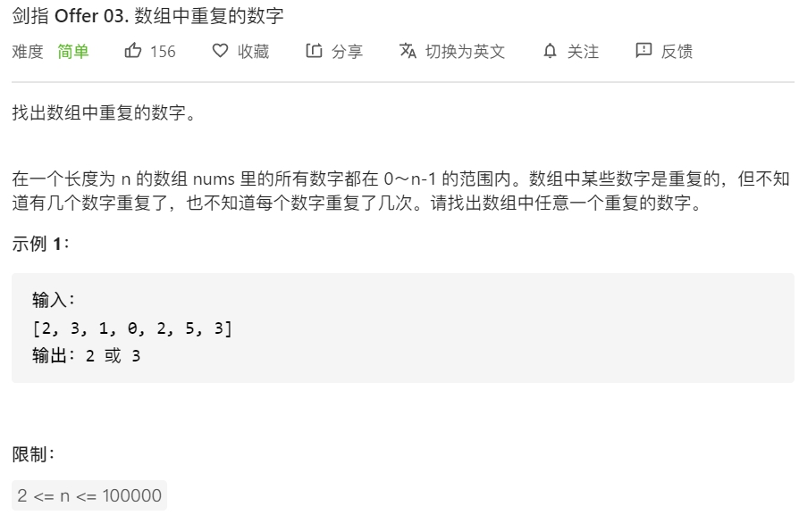
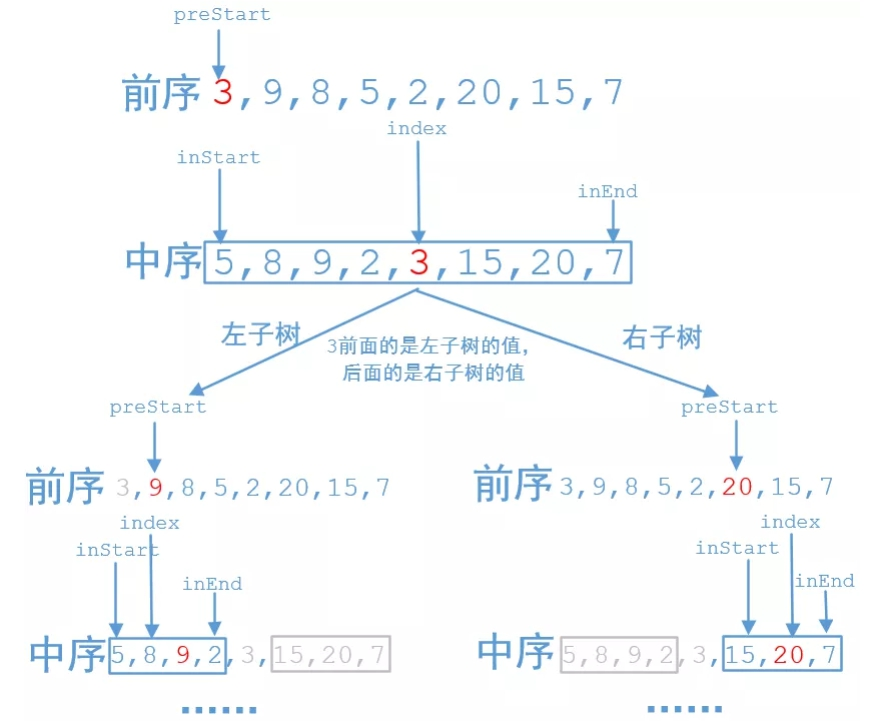

# 1. 通用操作


## 1.1 输入类


### 1.1.1 利用字符串输入不定长int数组，逗号隔开

输入时用`','`隔开

```java
        Scanner input = new Scanner(System.in);
        String str = input.nextLine().toString();
        String[] arr  = str.split(",");
        int[] nums = new int[arr.length];
        for(int j = 0; j<nums.length;j++) {
            nums[j] = Integer.parseInt(arr[j]);
        }
        int repeat = 0;
        System.out.println(Arrays.toString(nums));
```


### 1.1.2 输入定长二维数组字符

```java
Scanner in=new Scanner(System.in);
        int m=in.nextInt();
        int n=in.nextInt();
        in.nextLine();
        char[][] arr = new char[m][n];

        for (int i = 0; i <m ; i++) {
            String s = in.nextLine().toString();
            for (int j = 0; j <n ; j++) {
                arr[i][j]=s.charAt(j);
            }
        }

        for (int i = 0; i < m; i++) {
            for (int j = 0; j < n; j++) {
                System.out.print(arr[i][j]);
            }
            System.out.println();
        }
```


### 1.1.3 输入定长二维字符串

```java
        Scanner in=new Scanner(System.in);
        int m=in.nextInt();
        int n=in.nextInt();
        in.nextLine();//此行用来做缓冲ENTER按键
        String[][] arr = new String[m][n];

        for (int i = 0; i <m ; i++) {
            for (int j = 0; j <n ; j++) {

                arr[i][j]=in.nextLine();
                System.out.println("arr[i][j] : " + arr[i][j]);
            }
        }

        for (int i = 0; i < m; i++) {
            for (int j = 0; j < n; j++) {
                System.out.print(arr[i][j]);
            }
            System.out.println();
        }
```


## 1.2 将两个整数数组合并之后按照升序排序,并打印输出到控制台,注意不要去重


```java
public class 合并数组按照升序排序 {
    public static void main(String[] args) {
        int a[] = {1,3,5,7};
        int b[] = {2,4,5,8};
        int c[] = new int[a.length + b.length];
        int i =0, j = 0 , k = 0;
        while(i < a.length && j < b.length){
            if(a[i] < b[j]) {
                c[k++] = a[i++];
            }else{
                c[k++] = b[j++];
            }
        }
        while (i < a.length) {
            c[k++] = a[i++];
        }
        while (j < b.length) {
            c[k++] = b[j++];
        }
        System.out.println(Arrays.toString(c));
    }
}
```


## 1.3 给定一个数组，设计一个既高效又公平的方法随机打乱这个数组。


## 1.4 如何判断素数

```java
    public static boolean primeNumber(int i){
        int s = (int) Math.sqrt(i);
        int j = 0;
        for (j = 2; j <= s; j++) {
            if(i % j == 0){
                break;
            }
        }
        if(j > s){
            return true;
        }
        return false;
    }
    public static void main(String[] args) {
        System.out.println(primeNumber(19));

    }
```


## 1.5 数位和计算

通过转换为String再一一相加

```java
long i = 1111111111111111L;
String s = String.valueOf(i);
int sum = 0;
for (int j = 0; j < s.length(); j++) {
 sum += s.charAt(j) - '0';
}
System.out.println(sum);
```


循环求余

```java
int j = 11111;
int sum2 = 0;
while (j != 0){
 sum2 += j % 10;
 j = j / 10;
}
```


# 2. Leetcode

参考

> - https://krahets.gitee.io/views/sword-for-offer/2020-05-20-sword-for-offer-00.html


## [05. 最长回文子串](https://leetcode-cn.com/problems/longest-palindromic-substring/)

当 `s.length() < 2` 时直接返回


### 暴力法

直接计算每个子字符串是否为回文数，是的话就将此子字符串长度与 `maxLen` 比较，如果大于 `maxLen` ，就覆盖 `maxLen` 并覆盖起始位置 `begin` ，最后的时候返回 `s.subString(begin , begin + maxLen)` 即可

```java
    /*暴力法，遍历所有子串*/
    public static String longestPalindrome(String s){
        int len = s.length();
        if(len < 2){
            return s;
        }
        int maxLen = 1;
        int begin = 0;
        char[] chars = s.toCharArray();
        for (int i = 0; i < len - 1; i++) {
            for (int j = i + 1; j < len; j++) {
                if(j - i + 1 > maxLen && validPalindrome(chars, i ,j)){
                    maxLen = j - i + 1;
                    begin = i;
                }
            }
        }
        return s.substring(begin, begin + maxLen);
    }
    public static boolean validPalindrome(char[] chars , int left , int right){
        while (left < right){
            if(chars[left] != chars[right]){
                return false;
            }
            left++;
            right--;
        }
        return true;
    }
```


### 中心扩展

遍历字符串，并以每个字符为中心比较左右两个字符是否相等，边界条件为 `left >=0 && right < s.length() && s.charAt(left) == s.charAt(right)` 。但是分两种情况

- 以一个字符为中心扩展
- 以两个字符为中心扩展

在每一次循环时比较上述两个长度的最大值，再与 `maxLen` 比较，大于则赋值给 `maxLen` 并赋值 `begin` 索引


```java
    /*中心扩展*/
    public static String longestPalindrome_expandCenter(String s){
        int maxLen = 0;
        int begin = 0;
        if(s.length() < 2){
            return s;
        }
        for (int i = 0; i < s.length(); i++) {
          
            int len = Math.max(expandAroundCenter(s , i , i),expandAroundCenter(s , i , i + 1));
            if(len > maxLen){
                begin = i - (len - 1)/2;//赋值给索引begin
                maxLen = len;//赋值给回文串最大长度
            }
        }
        return s.substring(begin, begin + maxLen);
    }

    public static int expandAroundCenter(String s , int left , int right){
        while (left >=0 && right < s.length() && s.charAt(left) == s.charAt(right)){
            left--;
            right++;
        }
        return right - left - 1;
    }
```


参考

> - [「 剑指 OFFER 系列题解 」 扬帆，起航](https://krahets.gitee.io/views/sword-for-offer/2020-05-20-sword-for-offer-00.html)


## [03. 剑指 Offer 03. 数组中重复的数字](https://leetcode-cn.com/problems/shu-zu-zhong-zhong-fu-de-shu-zi-lcof/)


`HashSet去重` 





### 第一种：使用HastSet去重，遍历添加时如果返回为`false`则说明重复则直接返回此数

```java
    public static int findRepeatNumber() {
        HashSet<Integer> dic = new HashSet<Integer>();
        int[] nums = {1,2,2,4};
        int repeat = 0;
        for(int num : nums){
            if( !dic.add(num)){
                repeat = num;
                break;
            }
        }
        return repeat;
    }
```


### 第二种：由于指定了里面的数范围为0 ~ n-1，可以用遍历添加到另一个数组，另一个数组下标为数组中的数，值为出现的次数，当次数大于2则返回

```java
 int[] nums = {1,2,2,3};
        int[] nums_2 = new int[nums.length];
        int repeat = -1;
        for (int i = 0; i < nums.length; i++) {
            if(++nums_2[nums[i]] > 1){
                repeat = nums[i];
              	break;
            }
        }
        return repeat;
    }
```


## [04. 剑指 Offer 04. 二维数组中的查找](https://leetcode-cn.com/problems/er-wei-shu-zu-zhong-de-cha-zhao-lcof/submissions/)


`标志位法` `线性查找`


### 线性查找

​		由于给定的二维数组具备每行从左到右递增以及每列从上到下递增的特点，当访问到一个元素时，可以排除数组中的部分元素。

从二维数组的右上角开始查找。如果当前元素等于目标值，则返回 true。如果当前元素大于目标值，则移到左边一列。如果当前元素小于目标值，则移到下边一行。

可以证明这种方法不会错过目标值。如果当前元素大于目标值，说明当前元素的下边的所有元素都一定大于目标值，因此往下查找不可能找到目标值，往左查找可能找到目标值。如果当前元素小于目标值，说明当前元素的左边的所有元素都一定小于目标值，因此往左查找不可能找到目标值，往下查找可能找到目标值。


- 若数组为空，返回 false

- 初始化行下标为 0，列下标为二维数组的列数减 1

- 重复下列步骤，直到行下标或列下标超出边界

- 获得当前下标位置的元素 num

  > - 如果 num 和 target 相等，返回 true
  > - 如果 num 大于 target，列下标减 1
  > - 如果 num 小于 target，行下标加 1

- 循环体执行完毕仍未找到元素等于 target ，说明不存在这样的元素，返回false


```java
class Solution {
    public boolean findNumberIn2DArray(int[][] matrix, int target) {
        if (matrix == null || matrix.length == 0 || matrix[0].length == 0) {
            return false;
        }
        int rows = matrix.length, columns = matrix[0].length;
        int row = 0, column = columns - 1;
        while (row < rows && column >= 0) {
            int num = matrix[row][column];
            if (num == target) {
                return true;
            } else if (num > target) {
                column--;
            } else {
                row++;
            }
        }
        return false;
    }
}

```


## [05. 剑指 Offer 05. 替换空格](https://leetcode-cn.com/problems/ti-huan-kong-ge-lcof/)


`字符串拼接` `StringBuilder`


```java
class Solution {
    public String replaceSpace(String s) {
        StringBuilder res = new StringBuilder();
        for(Character c : s.toCharArray())
        {
            if(c == ' ') res.append("%20");
            else res.append(c);
        }
        return res.toString();

    }
}
```


## [06. 剑指 Offer 06. 从尾到头打印链表](https://leetcode-cn.com/problems/cong-wei-dao-tou-da-yin-lian-biao-lcof/)


`栈` `遍历链表`


### 第一种：先算出数量再遍历赋值直到head.next == null

```java
    public int[] reversePrint(ListNode head) {
       //先获取链表长度，创建对应长度数组
        ListNode currNode = head;
        int len = 0;
        while(currNode != null){
            len ++;
            currNode = currNode.next;
        }
        int[] result = new int[len];
        
        //再次遍历链表，将值倒序填充至结果数组
        currNode = head;
        while(currNode != null){
            result[len - 1] = currNode.val;
            len --;
            currNode = currNode.next;
        }
        return result;
```


### 第二种：使用栈

```java
/**
 * Definition for singly-linked list.
 * public class ListNode {
 *     int val;
 *     ListNode next;
 *     ListNode(int x) { val = x; }
 * }
 */
class Solution {
    public int[] reversePrint(ListNode head) {
        Stack<ListNode> stack = new Stack<ListNode>();
        ListNode temp = head;
        while (temp != null) {
            stack.push(temp);
            temp = temp.next;
        }
        int size = stack.size();
        int[] print = new int[size];
        for (int i = 0; i < size; i++) {
            print[i] = stack.pop().val;
        }
        return print;
    }
}

```


### 第三种：使用集合等遍历逆序添加


## [07. 剑指 Offer 07. 重建二叉树](https://leetcode-cn.com/problems/zhong-jian-er-cha-shu-lcof/)

`递归法` `二叉树` `分治思想`





```java
class Solution {
    HashMap<Integer, Integer> dic = new HashMap<>();
    int[] po;
    public TreeNode buildTree(int[] preorder, int[] inorder) {
        po = preorder;
        for(int i = 0; i < inorder.length; i++) 
            dic.put(inorder[i], i);
        return recur(0, 0, inorder.length - 1);
    }
    TreeNode recur(int pre_root, int in_left, int in_right) {
        if(in_left > in_right) return null;
        TreeNode root = new TreeNode(po[pre_root]);
        int i = dic.get(po[pre_root]);
        root.left = recur(pre_root + 1, in_left, i - 1);
        root.right = recur(pre_root + i - in_left + 1, i + 1, in_right);
        return root;
    }
}
```


## [09. 剑指 Offer 09. 用两个栈实现队列](https://leetcode-cn.com/problems/yong-liang-ge-zhan-shi-xian-dui-lie-lcof/)

`栈` `队列`

使用两个栈，一个栈(A)负责进，一个栈(B)负责出，根据方法有两种情况：


入队`appendTail`

直接将元素压入第一个栈A中，此时第一个栈栈底即为队列第一个元素


出队`deleteHead`

在执行出队时我们将A栈中的元素出队到B栈中，A栈在`pop`前栈底为头结点，栈顶为尾结点，将A栈中元素出栈后`push`进B中，此时A栈为空，B栈中栈顶元素为队列的头结点，栈底元素为队列的尾结点。在后续出栈中有三种情况：

- B栈不为空，则出栈`push`
- B栈为空，A栈不为空，将A栈元素都`pop`然后`push`到B栈中，B栈再出栈
- B栈为空，A栈为空，此时没有结点，则直接返回-1


集合框架不采用Stack是因为被Stack继承于Vector，存在着大量的Synchronized而弃用，使用LinkedList可以模拟，比如`addFirst`和`addLast`，`removeFirst`和`removeLast`

```java
class CQueue {
    static LinkedList<Integer> A,B;

    public CQueue() {
        A = new LinkedList<>();
        B = new LinkedList<>();

    }
    
    public void appendTail(int value) {
        A.addLast(value);

    }
    
    public int deleteHead() {
        if(!B.isEmpty()){
            return B.removeLast();
        }
        if(A.isEmpty()){
            return -1;
        }
        while (!A.isEmpty()){
            B.addLast(A.removeLast());
        }
        return B.removeLast();

    }
}

/**
 * Your CQueue object will be instantiated and called as such:
 * CQueue obj = new CQueue();
 * obj.appendTail(value);
 * int param_2 = obj.deleteHead();
 */
```


## [10. 剑指 Offer 10- II. 青蛙跳台阶问题](https://leetcode-cn.com/problems/qing-wa-tiao-tai-jie-wen-ti-lcof/)

`Fibonacci`

```java
class Solution {
    public int numWays(int n) {
        int a = 0 , b = 1 , sum = 0;
        for (int i = 0; i < n; i++) {
            sum = (a + b) % 1000000007;
            a = b;
            b = sum;
        }
        return sum;

    }
}
```


## [11. 剑指 Offer 11. 旋转数组的最小数字](https://leetcode-cn.com/problems/xuan-zhuan-shu-zu-de-zui-xiao-shu-zi-lcof/)

`二分法`


整体思路使用二分法。根据题意可以知道，先设旋转点下标为 `x`，左侧为`left`，右侧为`right` ，此数组的特性有

> - 由于是递增排序后的旋转数组，那么左边数组的最小值 `>=` 右边数组的最大值
> - 旋转后的数组一定有右边数组，可以没有左边数组，例如`[1,2,3,4,5]`会被认为是`[1,2,3,4,5]`旋转5次后的数组，所以这就决定了`numbers[mid]`应该与`numbers[right]`进行对比而不是`numbers[left]`，因为`right`一定指向右边数组，而`left`不一定，下方会详细说明


让`numbers[mid]`与`numbers[right]`对比，使用二分法依然有三种情况

> - `numbers[mid] > numbers[right]`:由于right指向最右边即右边数组的最大值，当大于右边数组的最大值时，说明`numbers[mid]`左侧数组，此时将`left`指向`mid + 1`，因为`numbers[mid]`在左侧数组，可以直接摒弃
>
> - `numbers[mid] < numbers[right]`：由于左边数组的最小值 `>=` 右边数组的最大值，所以`numbers[mid]`必定在右侧数组，如果此旋转后的数组全是右侧数组，没有左侧数组，也可成立适用。此时缩小范围，将`right`指向`mid`，是因为`mid`还在右侧数组，不能摒弃，例如`[3,1,3]`，在比较后，`right`为`0`，二旋转点是1，显然不符合。
>
> - `numbers[mid] == numbers[right]`：这时候无法确定`mid`在哪边，执行 `right = right - 1`缩小判断范围
>
>   > - 当`[2,2,2,1,2]`时，`mid`在左侧数组，可以发现区间`[left,mid]`值和`right`相等，由于 `左排序数组 任一元素 >= 右排序数组 任一元素`,可以知道，`numbers[旋转点] <= (numbers[right] == numbers[mid])`,
>   >
>   >   > - 若 `numbers[旋转点] < numbers[right]`:那么执行 `right = right - 1`后，旋转点依然在`[left,right]`中
>   >   >
>   >   > - 若 `numbers[旋转点] == numbers[right]`：此时有两种情况关于下标
>   >   >
>   >   >   > - 当 `right > 旋转点` ： 易得执行right = right - 1后旋转点 仍在`[left,right]`区间内。
>   >   >   > - 当`right == 旋转点`：例如`[1,1,1,2,3,1]`，虽然丢失了旋转点索引 `x = 5`，但最终返回值仍正确（最终返回的 numbers[0] 等于旋转点值 numbers[5] ），这是因为：之后的二分循环一直在执行`right = mid`，而区间`[left,mid]` 内的元素值一定都等于旋转点值 `numbers[旋转点]`
>   >
>   > - 当`[2,3,2,2,2]`时，`mid`在右侧数组，可以发现区间`[mid,right]`的值相等,此时执行 `right = right - 1`,依然是可以求出旋转点的值，只是抛弃一个重复值，毕竟都相同


**总结：** 此方法可以保证返回值 `numbers[left]` 等于旋转点值 `numbers[旋转点]` ；但在少数特例下left点不是旋转点，只要求返回 “旋转点的值” ，因此本方法可行。


```java
    public static int findMin(int[] numbers){
        if (numbers.length == 0) {
            return -1;
        }
        int left = 0 , right = numbers.length - 1 , mid;
        while (left < right){
            mid = left + (right - left) / 2;
            if(numbers[mid] > numbers[right]){
                left = mid + 1;
            }else if(numbers[mid] < numbers[right]){
                right = mid;
            }else if(numbers[mid] == numbers[right]){
                right -= 1;
            }
        }
        return numbers[left];

    }
```


## [12. 剑指 Offer 12. 矩阵中的路径](https://leetcode-cn.com/problems/ju-zhen-zhong-de-lu-jing-lcof/)

`DFS` `剪枝`

```java
class Solution {
    public boolean exist(char[][] board, String word) {
        if (board.length == 0 || word.length() == 0){
            return false;
        }
        char[] words = word.toCharArray();
        for (int i = 0; i < board.length; i++) {
            for (int j = 0; j < board[0].length; j++) {
                if(dfs(board, words, i, j, 0)){
                    return true;
                }
            }
        }
        return false;

    }

        public static boolean dfs(char[][] board, char[] words , int i , int j , int k){
        /*当一维下标i越界（往下移动时）或小于0（往左移动时），或
        当二维下标j越界（往右移动时）或小于0（向上移动时），或
        board[i][j] != words[k]，不匹配时，
        返回false*/
        if((i >= board.length || i < 0) || (j >= board[0].length ||j < 0) || board[i][j] != words[k]){
            return false;
        }
        /*这里也是终止条件，经过上面if后，此结点是匹配的，当此结点匹配且是字符串的最后一个元素时返回true*/
        if(k == words.length - 1){
            return true;
        }
        /*保留字符*/
        char tmp = board[i][j];
        /*经过前面的判断，此时这个结点没越界且匹配字符串，所以将此字符串设为'/'表示遍历过*/
        board[i][j] = '/';
        /*此时往四个方向继续遍历，只要这四个方向有一个是匹配的，则说明这个结点是匹配且是连续的*/
        boolean res = dfs(board, words, i + 1, j, k + 1) || dfs(board, words, i - 1, j, k + 1)
                || dfs(board, words, i, j + 1, k + 1) || dfs(board, words, i, j - 1, k + 1);

        board[i][j] = tmp;
        return res;
    }
}
```


## [13. 剑指 Offer 13. 机器人的运动范围](https://leetcode-cn.com/problems/ji-qi-ren-de-yun-dong-fan-wei-lcof/)

`DFS` `剪枝`

这道题也是矩阵搜索

```java
class Solution {
    int m;
    int n;
    int k;
    boolean[][] visited;

    public int movingCount(int m, int n, int k){
        this.m = m;
        this.n = n;
        this.k = k;
        visited = new boolean[m][n];
        return dfs(0, 0);
    }

    public int dfs(int i, int j){
        if(i >= m || j >= n || getSum(i) + getSum(j) > k || visited[i][j]){
            return 0;
        }

        visited[i][j] = true;

        return 1 + dfs(i + 1, j) + dfs(i, j + 1);
    }

    /*获取数位和*/
    public static int getSum(int i){
        int sum = 0;
        while (i != 0){
            sum += i % 10;
            i = i / 10;
        }
        return sum;
    }
}
```


## [52. 剑指 Offer 52. 两个链表的第一个公共节点](https://leetcode-cn.com/problems/liang-ge-lian-biao-de-di-yi-ge-gong-gong-jie-dian-lcof/)

`双指针`


使用双指针，注意结点的数字相同不代表结点对象相同

```java
    public static class ListNode {
      int val;
      ListNode next;
      ListNode(int val) {
          val = val;
          next = null;
      }
  }

    /*双指针*/
    public static ListNode getIntersectionNode(ListNode headA , ListNode headB){
                if (headA == null || headB == null) {
                    return null;
                }
                ListNode node1=headA;
                ListNode node2=headB;
                while (node1!=node2){
                    node1=(node1==null)?headB:node1.next;
                    node2=(node2==null)?headA:node2.next;
                }

                return node1;

    }
```


# 3. 牛客网


## 判断一个括号字符串是否匹配正确，如果括号有多种，怎么做？如（（[]））正确，[[(()错误。


# 字符串压缩

`String`

```java
String words = "HG[3|B[2|CA]]F";
        StringBuilder stringBuilder = new StringBuilder();
        while (words.contains("]")){
            int right = words.indexOf("]");
            int left = words.lastIndexOf("[", right);
            String repeatStr = words.substring(left+1, right);
            String[] split = repeatStr.split("\\|");
            stringBuilder = new StringBuilder();
            for (int i = 0; i < Integer.parseInt(split[0]); i++) {
                stringBuilder.append(split[1]);
            }
            
            words = words.replace(words.substring(left, right+1), 
            String.join("", Collections.nCopies(Integer.parseInt(split[0]), split[1])));
        }

System.out.println(words);
```

