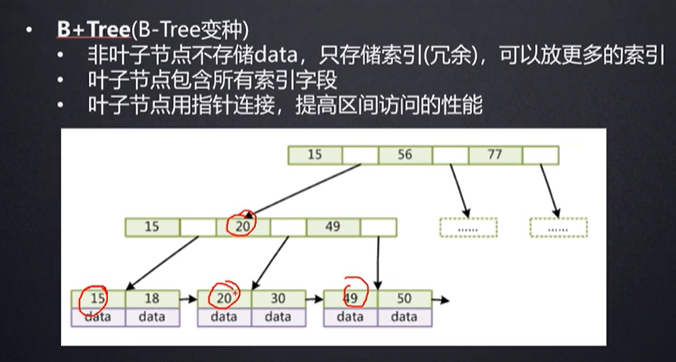

## 1. 参考


## 2. 存储引擎


### 2.1 查看MySQL提供的所有存储引擎

```sql
mysql> show engines;
```


从上图我们可以查看出 MySQL 当前默认的存储引擎是`InnoDB`,并且在5.7版本所有的存储引擎中只有 `InnoDB` 是事务性存储引擎，也就是说只有 InnoDB ⽀持事务。


### 2.2 查看MySQL当前默认的存储引擎

我们也可以通过下⾯的命令查看默认的存储引擎。

```sql
mysql> show variables like '%storage_engine%';
```


查看表的存储引擎

```sql
show table status like "table_name" ;
```


### 2.3 InnoDB四大特性

参考

> - https://www.cnblogs.com/zhs0/p/10528520.html


- 插入缓冲( insert buffer)
- 二次写( double write)
- 自适应哈希索引（hash）
- 预读( read ahead  ）


### 2.4 MyISAM和InnoDB区别


1. **是否⽀持⾏级锁** : MyISAM 只有表级锁(table-level locking)，⽽InnoDB ⽀持⾏级锁(rowlevel locking)和表级锁,默认为⾏级锁。
2. **是否⽀持事务和崩溃后的安全恢复**： MyISAM 强调的是性能，每次查询具有原⼦性,其执⾏速度 ⽐InnoDB类型更快，但是不提供事务⽀持。但是InnoDB 提供事务⽀持事务，外部键等⾼级数据 库功能。 具有`事务(commit)`、`回滚(rollback)`和`崩溃修复能⼒(crash recovery capabilities)` 的`事务安全(transaction-safe (ACID compliant))`型表。
3. **是否⽀持外键**： MyISAM不⽀持，⽽InnoDB⽀持。
4. **索引区别**：`InnoDB是聚集索引`，使用B+Tree作为索引结构，`数据文件是和（主键）索引绑在一起的`（表数据文件本身就是按B+Tree组织的一个索引结构），**必须要有主键**，通过主键索引效率很高。但是辅助索引需要两次查询，先查询到主键，然后再通过主键查询到数据。因此，主键不应该过大，因为主键太大，其他索引也都会很大。`MyISAM是非聚集索引`，也是使用B+Tree作为索引结构，`索引和数据文件是分离的`，索引保存的是数据文件的指针。主键索引和辅助索引是独立的。
5. **表行数计算**：InnoDB不保存表的具体行数，执行select count(\*) from table时需要全表扫描。而MyISAM用一个变量保存了整个表的行数，执行上述语句时只需要读出该变量即可，速度很快（注意不能加有任何WHERE条件）；
6. **是否⽀持MVCC** ：仅 InnoDB ⽀持。应对⾼并发事务, MVCC⽐单纯的加锁更⾼效;MVCC只在 `READ COMMITTED` 和 `REPEATABLE READ` 两个隔离级别下⼯作;MVCC可以使⽤ `乐观 (optimistic)锁` 和 `悲观(pessimistic)锁`来实现;各数据库中MVCC实现并不统⼀


### 2.5 如何选择


1. 是否要支持事务，如果要请选择innodb，如果不需要可以考虑MyISAM；

2. 如果表中绝大多数都只是读查询，可以考虑MyISAM，如果既有读也有写，请使用InnoDB。

3. 系统奔溃后，MyISAM恢复起来更困难，能否接受；


## 3. 索引

MySQL索引的建立对于MySQL的高效运行是很重要的，索引可以大大提高MySQL的检索速度。

打个比方，如果合理的设计且使用索引的MySQL是一辆兰博基尼的话，那么没有设计和使用索引的MySQL就是一个人力三轮车。

拿汉语字典的目录页（索引）打比方，我们可以按拼音、笔画、偏旁部首等排序的目录（索引）快速查找到需要的字。

索引分单列索引和组合索引。单列索引，即一个索引只包含单个列，一个表可以有多个单列索引，但这不是组合索引。组合索引，即一个索引包含多个列。

创建索引时，你需要确保该索引是应用在 SQL 查询语句的条件(一般作为 WHERE 子句的条件)。

实际上，索引也是一张表，该表保存了主键与索引字段，并指向实体表的记录。

上面都在说使用索引的好处，但过多的使用索引将会造成滥用。因此索引也会有它的缺点：虽然索引大大提高了查询速度，同时却会降低更新表的速度，如对表进行INSERT、UPDATE和DELETE。因为更新表时，MySQL不仅要保存数据，还要保存一下索引文件。

建立索引会占用磁盘空间的索引文件。


### 3.1 缺点

- **时间方面**：创建索引和维护索引要耗费时间,具体地,当对表中的数据进行增加、删除和修改的时候,索引也要动态的维护,会降低增/改/删的执行效率
- **空间方面**：索引需要占物理空间


### 3.2 种类

| 名称       | 描述                                                         |
| ---------- | ------------------------------------------------------------ |
| 唯一索引   | 不允许有俩行具有相同的值，允许空值                           |
| 主键索引   | 为了保持数据库表与表之间的关系，不允许空值                   |
| 聚集索引   | 索引文件和数据文件是`绑定`的，表中行的物理顺序与键值的逻辑(索引)顺序相同 |
| 非聚集索引 | 索引文件和数据文件是`分离`的，聚集索引和非聚集索引的根本区别是**表记录的排列顺序和与索引的排列顺序是否一致** |
| 复合索引   | 在创建索引时,并不是只能对一列进行创建索引,可以与主键样,讲多个组合为索引 |
| 全文索引   | 全文索引为在字符串数据中进行复杂的词搜索提供有效支持         |


### 3.3 主键索引与唯一索引区别


回归到主键本身的特点

1. 主键是一种约束,唯一索引是一种索引,两者在本质上是不同的
2. 主键创建后一定包含一个唯一性索引,唯一性索引并不一定就是主键。
3. 唯一性索引列允许空值,而主键列不允许为空值。  
4. 主键列在创建时,已经默认为空值++唯一索引了。
5. 一个表最多只能创建一个主键,但可以创建多个唯一索引。
6. 主键更适合那些不容易更改的唯一标识,如自动递增列、身份证号等。
7. 主键可以被其他表引用为外键,而唯一索引不能


### 3.4 使用场景


1. 当数据多且字段值有相同的值得时候用普通索引
2. 当字段多且字段值没有重复的时候用唯一索引
3. 当有多个字段名都经常被查询的话用复合索引
4. 普通索引不支持空值,唯一索引支持空值。
5. 但是,若是这张表增删改多而查询较少的话,就不要创建索引了,因为如果你绐一列创建了索引,那么对该列进行增删改的时候,都会先访问这一列的索引,
7. 若是增,则在这一列的索引内以新填入的这个字段名的值为名创建索引的子
8. 若是改,则会把原来的删掉,再添入一个以这个字段名的新值为名创建索引的子集
9. 若是删,则会把索引中以这个字段为名的索引的子集删掉
10. 所以,会对增删改的执行减缓速度
11. 所以,若是这张表增删改多而查询较少的话,就不要创建索引了。
12. 更新太频繁地字段不适合创建索引
13. 不会出现在 where条件中的字段不该建立索引  


### 3.5 哈希索引

MySQL索引使⽤的数据结构主要有`BTree索引` 和 `哈希索引` 。对于哈希索引来说，底层的数据结构就是 哈希表，因此在绝⼤多数需求为单条记录查询的时候，可以选择哈希索引，查询性能最快；其余⼤部分 场景，建议选择BTree索引。


### 3.6 B-树

参考

> - https://blog.csdn.net/biggoodloong/article/details/90203301


一个节点大小限制在`16k`


### 3.7 B+树




#### B+树特征

> 1. 有k个子树的中间节点包含有k个元素（B树中是k-1个元素），每个元素不保存数据，只用来索引，所有数据都保存在叶子节点。
>
> 2. 所有的叶子结点中包含了全部元素的信息，及指向含这些元素记录的指针，且叶子结点本身依关键字的大小自小而大顺序链接，方便区间查找。
>
> 3. 所有的中间节点元素都同时存在于子节点，在子节点元素中是最大（或最小）元素。


#### B+树优势


> 1. 单一节点存储更多的元素，使得查询的IO次数更少。
>
> 2. 所有查询都要查找到叶子节点，查询性能稳定。
>
> 3. 所有叶子节点形成有序链表，便于区间范围查询。
>


MySQL的BTree索引使⽤的是B树中的B+Tree，但对于主要的两种存储引擎的实现⽅式是不同的。


### 3.8 MyISAM实现方式：非聚簇索引

B+Tree叶节点的data域存放的是`数据记录的地址`。在索引检索的时候，⾸先按照B+Tree 搜索算法搜索索引，如果指定的Key存在，则取出其 data 域的值，然后以 data 域的值为地址 读取相应的数据记录。这被称为“`⾮聚簇索引`”。


MyISAM的索引文件仅仅保存`数据记录的地址`。在MyISAM中，`主键索引`和`辅助索引`在结构上没有任何区别，只是主索引要求key是唯一的，而辅助索引的key可以重复。


这里设表一共有三列，假设我们以Col1为主键，图myisam1是一个MyISAM表的主索引（Primary key）示意。可以看出MyISAM的索引文件仅仅保存`数据记录的地址`。


#### 辅助索引：

在MyISAM中，主索引和辅助索引在结构上没有任何区别，只是主索引要求key是唯一的，而辅助索引的key可以重复。 如果我们在Col2上建立一个辅助索引，则此索引的结构如下图所示：


### 3.9 InnoDB实现方式：聚簇索引

`其数据⽂件本身就是索引⽂件`。相⽐MyISAM的索引⽂件和数据⽂件是分离的，其`表数据⽂件本身就是按B+Tree组织的⼀个索引结构`，树的叶节点data域保存了完整的数据记录。这个索 引的key是数据表的主键，因此InnoDB表数据⽂件本身就是主索引。这被称为“聚簇索引（或聚集 索引）”。⽽其余的索引都作为辅助索引，辅助索引的data域存储相应记录`主键的值⽽不是地址`，这也是和MyISAM不同的地⽅。在根据主索引搜索时，直接找到key所在的节点即可取出数 据；在根据辅助索引查找时，则需要先取出主键索引的值，再⾛⼀遍主索引。 因此，在设计表的时 候，`不建议使⽤过⻓的字段作为主键，也不建议使⽤⾮单调的字段作为主键`，这样会造成`主索引频繁分裂`。 PS：整理⾃《Java⼯程师修炼之道》


以上是InnoDB主索引（同时也是数据文件）的示意图，可以看到叶节点包含了完整的数据记录。这种索引叫做**聚集索引**。因为InnoDB的数据文件本身要按主键聚集，所以InnoDB要求表必须有主键（MyISAM可以没有），如果没有显式指定，则MySQL系统会自动选择一个可以唯一标识数据记录的列作为主键，如果不存在这种列，则MySQL自动为InnoDB表生成一个隐含字段作为主键，这个字段长度为6个字节，类型为长整形。


#### 辅助索引：

InnoDB的所有辅助索引都引用主键作为data域，在使用时会先找到主键索引，然后再根据主键索引再来找到叶子节点数据。例如，下图为定义在Col3上的一个辅助索引


**InnoDB 表是基于聚簇索引建立的**。因此InnoDB 的索引能提供一种非常快速的主键查找性能。不过，它的辅助索引（Secondary Index， 也就是非主键索引）也会包含主键列， **所以，如果主键定义的比较大，其他索引也将很大。如果想在表上定义很多索引，则争取尽量把主键定义得小一些。** InnoDB 不会压缩索引。


### 3.10 索引使用注意点

| 注意点                       | 描述                                                         |
| ---------------------------- | ------------------------------------------------------------ |
| 不建议使用过长的字段作为主键 | 因为所有辅助索引都引用主索引，过长的主索引会令辅助索引变得过大 |
| 不建议使用单调字段作为主键   | 因为InnoDB数据文件本身是一颗B+Tree，非单调的主键会造成在插入新记录时数据文件为了维持B+Tree的特性而频繁的分裂调整，十分低效，而使用自增字段作为主键则是一个很好的选择 |


### 3.11 **InnoDB索引**和**MyISAM索引**的区别


主索引的区别，InnoDB的数据文件本身就是索引文件(`聚簇索引`)。而MyISAM的索引和数据是分开的(`非聚簇索引`)。

辅助索引的区别：InnoDB的辅助索引data域存储相应记录主键的值而不是地址。而MyISAM的辅助索引和主索引没有多大区别


## 4. 事务

事务是逻辑上的⼀组操作，要么都执⾏，要么都不执⾏。 事务最经典也经常被拿出来说例⼦就是转账了。假如⼩明要给⼩红转账1000元，这个转账会涉及到两个 关键操作就是：将⼩明的余额减少1000元，将⼩红的余额增加1000元。万⼀在这两个操作之间突然出现 错误⽐如银⾏系统崩溃，导致⼩明余额减少⽽⼩红的余额没有增加，这样就不对了。事务就是保证这两 个关键操作要么都成功，要么都要失败。


### 4.1 什么时候要用到事务

参考

> - [什么时候要用到事务](https://blog.csdn.net/sfq_bluesky/article/details/103183535?utm_medium=distribute.pc_relevant.none-task-blog-BlogCommendFromMachineLearnPai2-1.channel_param&depth_1-utm_source=distribute.pc_relevant.none-task-blog-BlogCommendFromMachineLearnPai2-1.channel_param)


当数据库需要处理操作量大、复杂度高的数据的时候需要用到事务。用事务是为了保证数据库的完整性，保证成批的 SQL 语句要么全部执行，要么全部不执行。

一个数据库事务通常包含了一个序列的对数据库的读/写操作。它的存在包含有以下两个目的：

> - 为数据库操作序列提供了一个从失败中恢复到正常状态的方法，同时提供了数据库即使在异常状态下仍能保持一致性的方法。
> - 当多个应用程序在并发访问数据库时，可以在这些应用程序之间提供一个隔离方法，以防止彼此的操作互相干扰。


当事务被提交给了数据库管理系统，则数据库管理系统需要确保该事务中的所有操作都成功完成且其结果被永久保存在数据库中，如果事务中有的操作没有成功完成，则事务中的所有操作都需要被回滚，回到事务执行前的状态;同时，该事务对数据库或者其他事务的执行无影响，所有的事务都好像在独立的运行。例如金融


### 4.2 回滚注解@Transactional

参考

> - https://blog.csdn.net/jiangyu1013/article/details/84397366
> - https://www.cnblogs.com/xd502djj/p/10940627.html


### 4.3 四大特性


> - **原⼦性（Atomicity）**： 事务是最⼩的执⾏单位，不允许分割。事务的原⼦性确保动作要么全部 完成，要么完全不起作⽤； 
> - **⼀致性（Consistency）**： 执⾏事务前后，数据保持⼀致，多个事务对同⼀个数据读取的结果是 相同的； 
> - **隔离性（Isolation）**： 并发访问数据库时，⼀个⽤户的事务不被其他事务所⼲扰，各并发事务之间数据库是独⽴的； 
> - **持久性（Durability）**： ⼀个事务被提交之后。它对数据库中数据的改变是持久的，即使数据库发⽣故障也不应该对其有任何影响。
>


### 4.4 并发事务带来的问题


- **脏读（Dirty read）**: 当⼀个事务正在访问数据并且对数据进⾏了修改，⽽这种修改还没有提交 到数据库中，这时另外⼀个事务也访问了这个数据，然后使⽤了这个数据。因为这个数据是还没 有提交的数据，那么另外⼀个事务读到的这个数据是“脏数据”，依据“脏数据”所做的操作可能是 不正确的。 
- **丢失修改（Lost to modify）**: 指在⼀个事务读取⼀个数据时，另外⼀个事务也访问了该数据， 那么在第⼀个事务中修改了这个数据后，第⼆个事务也修改了这个数据。这样第⼀个事务内的修 改结果就被丢失，因此称为丢失修改。 例如：事务1读取某表中的数据A=20，事务2也读取 A=20，事务1修改A=A-1，事务2也修改A=A-1，最终结果A=19，事务1的修改被丢失。 
- **不可重复读（Unrepeatableread**）: 指在⼀个事务内多次读同⼀数据。在这个事务还没有结束 时，另⼀个事务也访问该数据。那么，在第⼀个事务中的两次读数据之间，由于第⼆个事务的修改导致第⼀个事务两次读取的数据可能不太⼀样。这就发⽣了在⼀个事务内两次读到的数据是不 ⼀样的情况，因此称为不可重复读。 
- **幻读（Phantom read）**: 幻读与不可重复读类似。它发⽣在⼀个事务（T1）读取了⼏⾏数据，接 着另⼀个并发事务（T2）插⼊了⼀些数据时。在随后的查询中，第⼀个事务（T1）就会发现多了 ⼀些原本不存在的记录，就好像发⽣了幻觉⼀样，所以称为幻读。


不可重复读和幻读区别： 

> 不可重复读的重点是修改⽐如多次读取⼀条记录发现其中某些列的值被修改，幻读的重点在于新增或者 删除⽐如多次读取⼀条记录发现记录增多或减少了。


### 4.5 事务隔离级别

SQL 标准定义了四个隔离级别：

- **READ-UNCOMMITTED(读取未提交)**： 最低的隔离级别，允许读取尚未提交的数据变更，可能会导 致脏读、幻读或不可重复读。 
- **READ-COMMITTED(读取已提交)**： 允许读取并发事务已经提交的数据，可以阻⽌脏读，但是幻读 或不可重复读仍有可能发⽣。 
- **REPEATABLE-READ(可重复读)**： 对同⼀字段的多次读取结果都是⼀致的，除⾮数据是被本身事务 ⾃⼰所修改，可以阻⽌脏读和不可重复读，但幻读仍有可能发⽣。 
- **SERIALIZABLE(可串⾏化)**： 最⾼的隔离级别，完全服从ACID的隔离级别。所有的事务依次逐个 执⾏，这样事务之间就完全不可能产⽣⼲扰，也就是说，该级别可以防⽌脏读、不可重复读以及 幻读。


| 隔离级别             | 脏读 | 不可重复读 | 幻读 |
| -------------------- | ---- | ---------- | ---- |
| **READ-UNCOMMITTED** | √    | √          | √    |
| **READ-COMMITTED**   | ×    | √          | √    |
| **REPEATABLE-READ**  | ×    | ×          | √    |
| **SERIALIZABLE**     | ×    | ×          | ×    |


MySQL InnoDB 存储引擎的默认⽀持的隔离级别是 `REPEATABLE-READ（可重读）`。

```sql
SELECT @@tx_isolation
```


这⾥需要注意的是：与 SQL 标准不同的地⽅在于 InnoDB 存储引擎在 `REPEATABLE-READ（可重读）` 事 务隔离级别下使⽤的是`Next-Key Lock` 锁算法，`因此可以避免幻读的产⽣`，这与其他数据库系统(如 SQL Server) 是不同的。所以说InnoDB 存储引擎的默认⽀持的隔离级别是 REPEATABLE-READ（可重 读） 已经可以完全保证事务的隔离性要求，即达到了 SQL标准的 SERIALIZABLE(可串⾏化) 隔离级 别。因为`隔离级别越低，事务请求的锁越少`，所以⼤部分数据库系统的隔离级别都是 `READCOMMITTED(读取提交内容)` ，但是你要知道的是InnoDB 存储引擎默认使⽤ REPEATABLE-READ（可重 读） 并不会有任何性能损失。 InnoDB 存储引擎在 `分布式事务` 的情况下⼀般会⽤到 `SERIALIZABLE(可串⾏化)` 隔离级别。


## 5. 三大范式

参考

> - https://www.cnblogs.com/linjiqin/archive/2012/04/01/2428695.html


| 名称         | 描述                                                    |
| ------------ | ------------------------------------------------------- |
| **第一范式** | 据库表中的所有字段值都是不可分解的原子值                |
| **第二范式** | 满足第一范式且确保表中的每列都和主键相关                |
| **第三范式** | 满足第二范式且确保每列都和主键列直接相关,而不是间接相关 |


### 5.1 第一范式

第一范式的合理遵循需要根据系统的实际需求来定。比如某些数据库系统中需要用到“地址”这个属性，本来直接将“地址”属性设计成一个数据库表的字段就行。但是如果系统经常会访问“地址”属性中的“城市”部分，那么就非要将“地址”这个属性重新拆分为省份、城市、详细地址等多个部分进行存储，这样在对地址中某一部分操作的时候将非常方便。这样设计才算满足了数据库的第一范式，如下表所示。


### 5.2 第二范式

第二范式在第一范式的基础之上更进一层。第二范式需要确保数据库表中的每一列都和主键相关，而不能只与主键的某一部分相关（主要针对联合主键而言）。也就是说在一个数据库表中，一个表中只能保存一种数据，不可以把多种数据保存在同一张数据库表中。所以有时候需要`中间映射表`

比如要设计一个订单信息表，因为订单中可能会有多种商品，所以要将订单编号和商品编号作为数据库表的联合主键，如下表所示。


这样就产生一个问题：这个表中是以订单编号和商品编号作为联合主键。**这样在该表中商品名称、单位、商品价格等信息不与该表的主键相关，而仅仅是与商品编号相关**。所以在这里违反了第二范式的设计原则。

而如果把这个订单信息表进行拆分，把商品信息分离到另一个表中，把订单项目表也分离到另一个表中，就非常完美了。如下所示。


### 5.3 第三范式

第三范式需要确保数据表中的每一列数据都和主键直接相关，而不能间接相关。

比如在设计一个订单数据表的时候，可以将客户编号作为一个外键和订单表建立相应的关系。而不可以在订单表中添加关于客户其它信息（比如姓名、所属公司等）的字段。如下面这两个表所示的设计就是一个满足第三范式的数据库表。


再例如，学生选课表，不能把课程的具体信息列放在此表中，应该多开一个表为课程信息表，然后两个表通过课程id映射。


## 6. 锁


## 7. Mysql的树


### 7.1 字典树(前缀树)

参考

> - https://www.jianshu.com/p/e431bd41d676
> - https://www.jianshu.com/p/bbfe4874f66f


#### 性质

字典树，一般称为trie树，trie树常用于搜索提示。如当输入一个网址，可以自动搜索出可能的选择。当没有完全匹配的搜索结果，可以返回前缀最相似的可能。

一个保存了8个键的trie结构，"A", "to", "tea", "ted", "ten", "i", "in", and "inn".


> - 根节点不包含字符，除根节点外每个节点都只包含一个字符
> - 从根节点到某一节点，路径上经过的字符连接起来，为该节点对应的字符串
> - 每个节点的所有子节点包含的字符都不相同


#### 应用场景


典型应用是用于统计和排序大量的字符串（但不仅限于字符串），所以经常被搜索引擎系统用于文本词频统计。它的优点是：最大限度地减少无谓的字符串比较，查询效率比哈希表高。


#### 优缺点


> - 优点：Trie的核心思想是**空间换时间**。利用字符串的**公共前缀**来降低查询时间的开销以达到提高效率的目的。
> - 缺点：Trie树也有它的缺点,Trie树的内存消耗非常大.当然,或许用左儿子右兄弟的方法建树的话,可能会好点.


#### 插入操作

Trie.insert(W)：第一个操作是插入操作，就是将一个字符串W加入到集合中。

参考

> - https://blog.csdn.net/weixin_39778570/article/details/81990417


#### 查找操作

Trie.search(S)：第二个操作是查询操作，就是查询一个字符串S是不是在集合中。


### 7.2 二叉排序树


## 8. Mysql优化


参考

> - https://blog.csdn.net/qq_35642036/article/details/82820129
> - [一条SQL语句在MySQL中如何执行的](https://mp.weixin.qq.com/s?__biz=Mzg2OTA0Njk0OA==&mid=2247485097&idx=1&sn=84c89da477b1338bdf3e9fcd65514ac1&chksm=cea24962f9d5c074d8d3ff1ab04ee8f0d6486e3d015cfd783503685986485c11738ccb542ba7&token=79317275&lang=zh_CN%23rd)
> - [MySQL高性能优化规范建议](https://mp.weixin.qq.com/s?__biz=Mzg2OTA0Njk0OA==&mid=2247485117&idx=1&sn=92361755b7c3de488b415ec4c5f46d73&chksm=cea24976f9d5c060babe50c3747616cce63df5d50947903a262704988143c2eeb4069ae45420&token=79317275&lang=zh_CN%23rd)
> - [一条SQL语句执行得很慢的原因有哪些？](https://mp.weixin.qq.com/s?__biz=Mzg2OTA0Njk0OA==&mid=2247485185&idx=1&sn=66ef08b4ab6af5757792223a83fc0d45&chksm=cea248caf9d5c1dc72ec8a281ec16aa3ec3e8066dbb252e27362438a26c33fbe842b0e0adf47&token=79317275&lang=zh_CN%23rd)
> - [实践中如何优化MySQL（精）](https://blog.csdn.net/qq_35642036/article/details/82820129)
> - [Mysql大表优化](https://segmentfault.com/a/1190000006158186)


可以用`explain`放在语句前面查看这个语句的执行条件，包括是全表扫描还是走索引


### 索引/使数据库放弃索引的情况

需要优化的是有些查询会使索引失效


