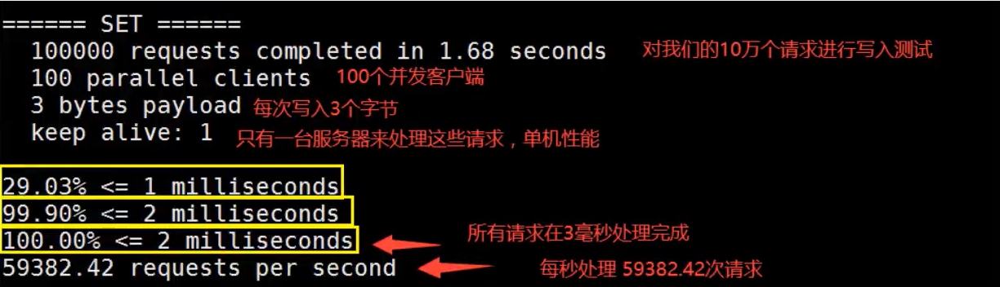

## 参考

> - [菜鸟笔记Redis](https://www.runoob.com/redis/redis-tutorial.html)
> - [Redis 命令参考 — Redis 命令参考 (redisfans.com)](http://doc.redisfans.com/)


## 1. Redis安装


### 使用Docker在Linux下安装

参考

> - https://www.runoob.com/docker/docker-install-redis.html


::: warning

`redis.conf`中是否在后台开启的属性`daemonize`只能是`NO`，如果为`YES` 会的导致 redis 无法启动，因为后台会导致docker无任务可做而退出。

```sh
daemonize no
```

:::


### 以配置文件方式启动

参考

> - https://blog.csdn.net/weixin_42456466/article/details/87270959


已配置文件方式启动redis容器

```sh
docker run -p 6379:6379 --name redis-6379 -v /usr/local/docker/redis/redis-6379.conf:/etc/redis/redis-6379.conf -v /usr/local/docker/redis/data:/data -d redis redis-server /etc/redis/redis-6379.conf
```


说明

> - -p 6378:6379 ：`docker端口:本机端口`，意思为将容器内6379端口映射到本机器的6379端口
> - --name redis01：容器 名字 为 redis01
> - -v 映射指向，将本机/data/中`/data/docker_data/redis/conf/redis.conf`映射到容器中`/usr/local/etc/redis/redis.conf`文件，修改本机该文件即可同步如容器中的指定文件，这里避免了每次进入容器修改文件的繁琐操作
> -  -d 后台启动
> - redis：镜像名称


进入容器

```sh
docker exec -it redis-6379 /bin/bash
```


运行redis

```sh
redis-cli -p 6379
```


### 修改密码

参考

> - https://www.cnblogs.com/x-ll123/p/9717351.html


### 使用RedisDesktopManager连接

下载RedisDesktopManager后直接连接即可


连接后


## 2. Redis性能测试redis-benchmark

参考

> - https://www.runoob.com/redis/redis-benchmarks.html


`Docker`中的`redis-benchmark`测试命令

参考

> - https://blog.csdn.net/jianjun_fei/article/details/95108694


```bash
docker exec -it containerName/containerid redis-benchmark -h 127.0.0.1 -p 6379 -c 100 -n 100000
```





## 3. Redis基本命令使用

参考

> - [官方命令文档](https://redis.io/commands)
> - [redis中文文档](http://redisdoc.com/)
> - [Redis 命令参考 — Redis 命令参考 (redisfans.com)](http://doc.redisfans.com/)
> - [菜鸟](https://www.runoob.com/redis/redis-commands.html)


### 查看redis系统状态


::: tip 参考

- https://www.cnblogs.com/wshenjin/p/11431378.html

:::


```sh
#部分Redis系统状态统计信息。
info
#全部Redis系统状态统计信息。
info all
#某一块的系统状态统计信息，其中section可以忽略大小写。
info section
```


### 3.1 数据库


切换数据库

```bash
select 0
select 1
```


数据库大小(key数量)

```bash
dbsize
```


清空当前数据库

```bash
flushdb

#清空所有
flushall
```


### 3.2 键Key

参考

> - https://www.runoob.com/redis/redis-keys.html


#### 查看所有key

```bash
keys *
```


#### 设置过期时间

```bash
expire [key] [second]
```


#### 查看剩余时间

```bash
ttl [key]
```

两种情况

> - -1：未设置过期时间
> - -2：已过期或不存在key


#### 查看key对应的value类型

```bash
type key
```


#### 给某个key的value拼接

```bash
append [key] [value]
```


#### 获取key对应value的长度

```bash
strlen [key]
```


#### 根据range截取

```bash
#截取字符串[0,3]
getrange [key] 0 3
```


#### 替换

```bash
#从0开始替换为value
setrange [key] 0 [value]
```


#### 对于value为integer类型的操作


##### 自增长++

```bash
incr [key]
```


##### 自减小--

```bash
decr [key]
```


##### 指定增加大小

```bash
incrby [key] [number]
```


##### 指定减小大小

```bash
decrby [key] [number]
```


### 3.3 List

参考

> - [Redis 列表(List) | 菜鸟教程 (runoob.com)](https://www.runoob.com/redis/redis-lists.html)


### 3.4 Set

参考

> - [Redis 集合(Set) | 菜鸟教程 (runoob.com)](https://www.runoob.com/redis/redis-sets.html)


### 3.5 Hash

参考

> - [Redis 哈希(Hash) | 菜鸟教程 (runoob.com)](https://www.runoob.com/redis/redis-hashes.html)


### 3.6 ZSet

参考

> - [Redis 有序集合(sorted set) | 菜鸟教程 (runoob.com)](https://www.runoob.com/redis/redis-sorted-sets.html)


### 3.7 Geospatial

地图经纬度，底层是用ZSet，可以使用ZSet的命令


### 3.8 Hyperloglog

基数


### 3.9 Bitmap

参考

::: tips 参考

- [一看就懂系列之 详解redis的bitmap在亿级项目中的应用](https://blog.csdn.net/u011957758/article/details/74783347)
- https://www.cnblogs.com/wuhaidong/articles/10389484.html

:::


二进制，可用于打卡等状态变化


## 4. Redis事务


Redis 事务可以一次执行多个命令， 并且带有以下三个重要的保证：

> - 批量操作在发送 EXEC 命令前被放入队列缓存。
> - 收到 EXEC 命令后进入事务执行，事务中任意命令执行失败，其余的命令依然被执行。
> - 在事务执行过程，其他客户端提交的命令请求不会插入到事务执行命令序列中。

一个事务从开始到执行会经历以下三个阶段：

> - 开始事务。
> - 命令入队。
> - 执行事务。


以下是一个事务的例子， 它先以 **MULTI** 开始一个事务， 然后将多个命令入队到事务中， 最后由 **EXEC** 命令触发事务， 一并执行事务中的所有命令：

```bash
redis 127.0.0.1:6379> MULTI
OK

redis 127.0.0.1:6379> SET book-name "Mastering C++ in 21 days"
QUEUED

redis 127.0.0.1:6379> GET book-name
QUEUED

redis 127.0.0.1:6379> SADD tag "C++" "Programming" "Mastering Series"
QUEUED

redis 127.0.0.1:6379> SMEMBERS tag
QUEUED

redis 127.0.0.1:6379> EXEC
1) OK
2) "Mastering C++ in 21 days"
3) (integer) 3
4) 1) "Mastering Series"
   2) "C++"
   3) "Programming"
```


单个 Redis 命令的执行是原子性的，但 Redis 没有在事务上增加任何维持原子性的机制，所以 Redis 事务的执行并不是原子性的。

事务可以理解为一个打包的批量执行脚本，但批量指令并非原子化的操作，中间某条指令的失败不会导致前面已做指令的回滚，也不会造成后续的指令不做。

```bash
redis 127.0.0.1:7000> multi
OK
redis 127.0.0.1:7000> set a aaa
QUEUED
redis 127.0.0.1:7000> set b bbb
QUEUED
redis 127.0.0.1:7000> set c ccc
QUEUED
redis 127.0.0.1:7000> exec
1) OK
2) OK
3) OK
```

如果在 `set b bbb` 处失败，`set a` 已成功不会回滚，`set c` 还会继续执行。


取消事务

```bash
discard
```


## 5. Redis用监视器实现锁


开启一个线程，开启监视器监视key`money`

```bash
127.0.0.1:6379> get money
"1080"
127.0.0.1:6379> watch money
OK
127.0.0.1:6379> multi
OK
127.0.0.1:6379> incrby money 100
QUEUED


```


在执行事务前修改前，用另一个线程修改`money`的值

```bash
127.0.0.1:6379> get money
"1080"
127.0.0.1:6379> set money 2000
OK

```


此时再执行第一个线程的事务，redis发现监视的值`money`被更改，不会执行关于`money`的操作

```bash
127.0.0.1:6379> exec
(nil)
127.0.0.1:6379> 
```


### 原理

watch相当于实现了`乐观锁`


## 6. Jedis操作Redis

导入包

```xml
        <!-- https://mvnrepository.com/artifact/redis.clients/jedis -->
        <dependency>
            <groupId>redis.clients</groupId>
            <artifactId>jedis</artifactId>
            <version>3.3.0</version>
        </dependency>

        <dependency>
            <groupId>com.alibaba</groupId>
            <artifactId>fastjson</artifactId>
            <version>1.2.70</version>
        </dependency>
```


### 6.1 测试连接

```java
public class pingTest {
    
    public static void main(String[] args) {
        Jedis jedis = new Jedis("127.0.0.1", 6379);
        //密码验证
        jedis.auth("123456");
        System.out.println(jedis.ping());
    }
}
```


### 6.2 HashTest

```java
public class TestHash {
    public static void main(String[] args) {
        Jedis jedis = new Jedis("47.100.59.153", 6379);
        jedis.auth("0.00.0");
        jedis.flushDB();
        Map<String,String> map = new HashMap<String,String>();
        map.put("key1","value1");
        map.put("key2","value2");
        map.put("key3","value3");
        map.put("key4","value4");
        //添加名称为hash（key）的hash元素
        jedis.hmset("hash",map);
        //向名称为hash的hash中添加key为key5，value为value5元素
        jedis.hset("hash", "key5", "value5");
        System.out.println("散列hash的所有键值对为："+jedis.hgetAll("hash"));//return Map<String,String>
        System.out.println("散列hash的所有键为："+jedis.hkeys("hash"));//return Set<String>
        System.out.println("散列hash的所有值为："+jedis.hvals("hash"));//return List<String>
        System.out.println("将key6保存的值加上一个整数，如果key6不存在则添加key6："+jedis.hincrBy("hash", "key6", 6));
        System.out.println("散列hash的所有键值对为："+jedis.hgetAll("hash"));
        System.out.println("将key6保存的值加上一个整数，如果key6不存在则添加key6："+jedis.hincrBy("hash", "key6", 3));
        System.out.println("散列hash的所有键值对为："+jedis.hgetAll("hash"));
        System.out.println("删除一个或者多个键值对："+jedis.hdel("hash", "key2"));
        System.out.println("散列hash的所有键值对为："+jedis.hgetAll("hash"));
        System.out.println("散列hash中键值对的个数："+jedis.hlen("hash"));
        System.out.println("判断hash中是否存在key2："+jedis.hexists("hash","key2"));
        System.out.println("判断hash中是否存在key3："+jedis.hexists("hash","key3"));
        System.out.println("获取hash中的值："+jedis.hmget("hash","key3"));
        System.out.println("获取hash中的值："+jedis.hmget("hash","key3","key4"));
    }
}
```


## 7. SpringBoot整合Redis

原先底层使用的是`jedis`，在Spring2.x后改为`lettuce`

> - jedis：采用的直连,多个线程操作的话,是不安全的,如果想要避免不安全的,使用 `jedis pool`连接池!更像`BIO模式`
> - lettuce：采用`netty`，实例可以再多个线程中进行共享,不存在线程不安全的情况!可以减少线程数据了,更像`NIO模式`


### 7.1 导入依赖

`pom.xml`

```java
<dependency>
  <groupId>org.springframework.boot</groupId>
  <artifactId>spring-boot-starter-data-redis</artifactId>
</dependency>
```


### 7.2 `application.yml`配置

```yaml
  #reids相关配置
  redis:
    #redis服务器地址
    host: 47.100.59.153
    #redis服务器端口
    port: 6379
    database: 0
    #密码
    password: 0.00.0
    lettuce:
      pool:
        #连接池最大连接数（使用负值表示没有限制）
        max-active: 1024
        #连接池最大阻塞等待时间（使用负值表示没有限制）
        max-wait: 10000ms
        #连接池中最大空闲连接
        max-idle: 200
        #连接池中最小空闲连接
        min-idle: 5
    # 连接超时时间(毫秒)
    timeout: 10000ms
```


### 7.3 简单使用示例

`SpringbootDemoApplicationTests.java`

```java
    @Autowired
    private RedisTemplate<String, String> redisTemplate;


    @Test
    void redisTest() {
        redisTemplate.opsForValue().set("myKey","你好");
        System.out.println(redisTemplate.opsForValue().get("myKey"));

        /*获得数据库对象*/
        RedisConnection conn = redisTemplate.getConnectionFactory().getConnection();
        conn.flushDb();
    }
```


### 7.4 序列化配置

`RedisAutoConfiguration.java`

```java
@Configuration(
  proxyBeanMethods = false
)
@ConditionalOnClass({RedisOperations.class})
@EnableConfigurationProperties({RedisProperties.class})
@Import({LettuceConnectionConfiguration.class, JedisConnectionConfiguration.class})
public class RedisAutoConfiguration {
  public RedisAutoConfiguration() {
  }

  @Bean
  @ConditionalOnMissingBean(
    name = {"redisTemplate"}
  ) //注解意思为当没有自定义redisTemplate使使用此bean，可以自定义来替换这个默认的
  public RedisTemplate<Object, Object> redisTemplate(RedisConnectionFactory redisConnectionFactory) throws UnknownHostException {
    // 默认的RedisTemplate没有过多地设置，redis对象都是需要序列化
    // 两个泛型都是object object 的类型，我们后使用需要强制转换<String, Object>
    RedisTemplate<Object, Object> template = new RedisTemplate();
    template.setConnectionFactory(redisConnectionFactory);
    return template;
  }

  @Bean
  @ConditionalOnMissingBean //由于string是最常使用的bean，所以这里单独定义一个string的redisTemplate
  public StringRedisTemplate stringRedisTemplate(RedisConnectionFactory redisConnectionFactory) throws UnknownHostException {
    StringRedisTemplate template = new StringRedisTemplate();
    template.setConnectionFactory(redisConnectionFactory);
    return template;
  }
}

```


`RedisTemplate.java`

```java
@Nullable
private RedisSerializer<?> defaultSerializer;
@Nullable
private ClassLoader classLoader;
@Nullable
private RedisSerializer keySerializer = null;
@Nullable
private RedisSerializer valueSerializer = null;
@Nullable
private RedisSerializer hashKeySerializer = null;
@Nullable
private RedisSerializer hashValueSerializer = null;


//这里默认使用的是JDK的序列化，可以自定义一个配置类使用JSON序列化
if (this.defaultSerializer == null) {
  this.defaultSerializer = new JdkSerializationRedisSerializer(this.classLoader != null ? this.classLoader : this.getClass().getClassLoader());
}
```


当没有序列化对象直接传对象作为`value`时会报错误`SerializationException`

```java
@Autowired
private RedisTemplate redisTemplate;

@Test
void redisTest_2() throws JsonProcessingException {
  User user = User.builder().uid(1).realName("realName").build();
  // 当没有序列化对象时
  // String jsonUser = new ObjectMapper().writeValueAsString(user);
  redisTemplate.opsForValue().set("user1",user);
  System.out.println(redisTemplate.opsForValue().get("user1"));

}
```


### 7.5 配置redisConfig类

`redisConfig.java`

用于替换在`RedisAutoConfiguration`默认的`RedisTemplate`

```java
@Configuration
public class RedisConfig {

    /*自定义RedisTemplate*/
    @Bean
    public RedisTemplate redisTemplate(RedisConnectionFactory factory) {
        RedisTemplate<String, Object> redisTemplate = new RedisTemplate<String, Object>();
        redisTemplate.setConnectionFactory(factory);

        // 使用Jackson2JsonRedisSerialize 替换默认序列化
        Jackson2JsonRedisSerializer jackson2JsonRedisSerializer = new Jackson2JsonRedisSerializer(Object.class);
        ObjectMapper objectMapper = new ObjectMapper();
        objectMapper.setVisibility(PropertyAccessor.ALL, JsonAutoDetect.Visibility.ANY);
        objectMapper.enableDefaultTyping(ObjectMapper.DefaultTyping.NON_FINAL);
        jackson2JsonRedisSerializer.setObjectMapper(objectMapper);

        // 设置value的序列化规则和 key的序列化规则
        StringRedisSerializer stringRedisSerializer = new StringRedisSerializer();
        // key采用String的序列化方式
        redisTemplate.setKeySerializer(stringRedisSerializer);
        // hash的key也采用String的序列化方式
        redisTemplate.setHashKeySerializer(stringRedisSerializer);
        // value序列化方式采用jackson
        redisTemplate.setValueSerializer(jackson2JsonRedisSerializer);
        // hash的value也采用jackson
        redisTemplate.setHashValueSerializer(jackson2JsonRedisSerializer);

        redisTemplate.afterPropertiesSet();
        return redisTemplate;
    }
}
```


存储一个对象

```java
@Test
void redisTest_2() throws JsonProcessingException {
  User user = User.builder().uid(5).realName("realName").build();
  redisTemplate.opsForValue().set("user5",user);
  System.out.println(redisTemplate.opsForValue().get("user5"));
}
```


存储在redis中的是已经序列化的字符串


取出来后会经过反序列化


### 7.6 封装常用API到`RedisUtil`


::: details RedisUtil.java

```java
package com.lifeisgg.springboot_demo.util;

import org.springframework.beans.factory.annotation.Autowired;
import org.springframework.data.redis.core.RedisTemplate;
import org.springframework.stereotype.Component;
import org.springframework.util.CollectionUtils;

import java.util.List;
import java.util.Map;
import java.util.Set;
import java.util.concurrent.TimeUnit;

/**
 * @Project: springboot_demo
 * @Package: com.lifeisgg.springboot_demo.util
 * @ClassName: RedisUtil
 * @Author: Chen Long
 * @Description:
 * @Datetime: 2020/12/1  20:32
 */
@Component
public final class RedisUtil {

    @Autowired
    private RedisTemplate<String, Object> redisTemplate;

    // =============================common============================
    /**
     * 指定缓存失效时间
     * @param key  键
     * @param time 时间(秒)
     */
    public boolean expire(String key, long time) {
        try {
            if (time > 0) {
                redisTemplate.expire(key, time, TimeUnit.SECONDS);
            }
            return true;
        } catch (Exception e) {
            e.printStackTrace();
            return false;
        }
    }

    /**
     * 根据key 获取过期时间
     * @param key 键 不能为null
     * @return 时间(秒) 返回0代表为永久有效
     */
    public long getExpire(String key) {
        return redisTemplate.getExpire(key, TimeUnit.SECONDS);
    }


    /**
     * 判断key是否存在
     * @param key 键
     * @return true 存在 false不存在
     */
    public boolean hasKey(String key) {
        try {
            return redisTemplate.hasKey(key);
        } catch (Exception e) {
            e.printStackTrace();
            return false;
        }
    }


    /**
     * 删除缓存
     * @param key 可以传一个值 或多个
     */
    @SuppressWarnings("unchecked")
    public void del(String... key) {
        if (key != null && key.length > 0) {
            if (key.length == 1) {
                redisTemplate.delete(key[0]);
            } else {
                redisTemplate.delete(CollectionUtils.arrayToList(key));
            }
        }
    }


    // ============================String=============================

    /**
     * 普通缓存获取
     * @param key 键
     * @return 值
     */
    public Object get(String key) {
        return key == null ? null : redisTemplate.opsForValue().get(key);
    }

    /**
     * 普通缓存放入
     * @param key   键
     * @param value 值
     * @return true成功 false失败
     */

    public boolean set(String key, Object value) {
        try {
            redisTemplate.opsForValue().set(key, value);
            return true;
        } catch (Exception e) {
            e.printStackTrace();
            return false;
        }
    }


    /**
     * 普通缓存放入并设置时间
     * @param key   键
     * @param value 值
     * @param time  时间(秒) time要大于0 如果time小于等于0 将设置无限期
     * @return true成功 false 失败
     */

    public boolean set(String key, Object value, long time) {
        try {
            if (time > 0) {
                redisTemplate.opsForValue().set(key, value, time, TimeUnit.SECONDS);
            } else {
                set(key, value);
            }
            return true;
        } catch (Exception e) {
            e.printStackTrace();
            return false;
        }
    }


    /**
     * 递增
     * @param key   键
     * @param delta 要增加几(大于0)
     */
    public long incr(String key, long delta) {
        if (delta < 0) {
            throw new RuntimeException("递增因子必须大于0");
        }
        return redisTemplate.opsForValue().increment(key, delta);
    }


    /**
     * 递减
     * @param key   键
     * @param delta 要减少几(小于0)
     */
    public long decr(String key, long delta) {
        if (delta < 0) {
            throw new RuntimeException("递减因子必须大于0");
        }
        return redisTemplate.opsForValue().increment(key, -delta);
    }


    // ================================Map=================================

    /**
     * HashGet
     * @param key  键 不能为null
     * @param item 项 不能为null
     */
    public Object hget(String key, String item) {
        return redisTemplate.opsForHash().get(key, item);
    }

    /**
     * 获取hashKey对应的所有键值
     * @param key 键
     * @return 对应的多个键值
     */
    public Map<Object, Object> hmget(String key) {
        return redisTemplate.opsForHash().entries(key);
    }

    /**
     * HashSet
     * @param key 键
     * @param map 对应多个键值
     */
    public boolean hmset(String key, Map<String, Object> map) {
        try {
            redisTemplate.opsForHash().putAll(key, map);
            return true;
        } catch (Exception e) {
            e.printStackTrace();
            return false;
        }
    }


    /**
     * HashSet 并设置时间
     * @param key  键
     * @param map  对应多个键值
     * @param time 时间(秒)
     * @return true成功 false失败
     */
    public boolean hmset(String key, Map<String, Object> map, long time) {
        try {
            redisTemplate.opsForHash().putAll(key, map);
            if (time > 0) {
                expire(key, time);
            }
            return true;
        } catch (Exception e) {
            e.printStackTrace();
            return false;
        }
    }


    /**
     * 向一张hash表中放入数据,如果不存在将创建
     *
     * @param key   键
     * @param item  项
     * @param value 值
     * @return true 成功 false失败
     */
    public boolean hset(String key, String item, Object value) {
        try {
            redisTemplate.opsForHash().put(key, item, value);
            return true;
        } catch (Exception e) {
            e.printStackTrace();
            return false;
        }
    }

    /**
     * 向一张hash表中放入数据,如果不存在将创建
     *
     * @param key   键
     * @param item  项
     * @param value 值
     * @param time  时间(秒) 注意:如果已存在的hash表有时间,这里将会替换原有的时间
     * @return true 成功 false失败
     */
    public boolean hset(String key, String item, Object value, long time) {
        try {
            redisTemplate.opsForHash().put(key, item, value);
            if (time > 0) {
                expire(key, time);
            }
            return true;
        } catch (Exception e) {
            e.printStackTrace();
            return false;
        }
    }


    /**
     * 删除hash表中的值
     *
     * @param key  键 不能为null
     * @param item 项 可以使多个 不能为null
     */
    public void hdel(String key, Object... item) {
        redisTemplate.opsForHash().delete(key, item);
    }


    /**
     * 判断hash表中是否有该项的值
     *
     * @param key  键 不能为null
     * @param item 项 不能为null
     * @return true 存在 false不存在
     */
    public boolean hHasKey(String key, String item) {
        return redisTemplate.opsForHash().hasKey(key, item);
    }


    /**
     * hash递增 如果不存在,就会创建一个 并把新增后的值返回
     *
     * @param key  键
     * @param item 项
     * @param by   要增加几(大于0)
     */
    public double hincr(String key, String item, double by) {
        return redisTemplate.opsForHash().increment(key, item, by);
    }


    /**
     * hash递减
     *
     * @param key  键
     * @param item 项
     * @param by   要减少记(小于0)
     */
    public double hdecr(String key, String item, double by) {
        return redisTemplate.opsForHash().increment(key, item, -by);
    }


    // ============================set=============================

    /**
     * 根据key获取Set中的所有值
     * @param key 键
     */
    public Set<Object> sGet(String key) {
        try {
            return redisTemplate.opsForSet().members(key);
        } catch (Exception e) {
            e.printStackTrace();
            return null;
        }
    }


    /**
     * 根据value从一个set中查询,是否存在
     *
     * @param key   键
     * @param value 值
     * @return true 存在 false不存在
     */
    public boolean sHasKey(String key, Object value) {
        try {
            return redisTemplate.opsForSet().isMember(key, value);
        } catch (Exception e) {
            e.printStackTrace();
            return false;
        }
    }


    /**
     * 将数据放入set缓存
     *
     * @param key    键
     * @param values 值 可以是多个
     * @return 成功个数
     */
    public long sSet(String key, Object... values) {
        try {
            return redisTemplate.opsForSet().add(key, values);
        } catch (Exception e) {
            e.printStackTrace();
            return 0;
        }
    }


    /**
     * 将set数据放入缓存
     *
     * @param key    键
     * @param time   时间(秒)
     * @param values 值 可以是多个
     * @return 成功个数
     */
    public long sSetAndTime(String key, long time, Object... values) {
        try {
            Long count = redisTemplate.opsForSet().add(key, values);
            if (time > 0)
                expire(key, time);
            return count;
        } catch (Exception e) {
            e.printStackTrace();
            return 0;
        }
    }


    /**
     * 获取set缓存的长度
     *
     * @param key 键
     */
    public long sGetSetSize(String key) {
        try {
            return redisTemplate.opsForSet().size(key);
        } catch (Exception e) {
            e.printStackTrace();
            return 0;
        }
    }


    /**
     * 移除值为value的
     *
     * @param key    键
     * @param values 值 可以是多个
     * @return 移除的个数
     */

    public long setRemove(String key, Object... values) {
        try {
            Long count = redisTemplate.opsForSet().remove(key, values);
            return count;
        } catch (Exception e) {
            e.printStackTrace();
            return 0;
        }
    }

    // ===============================list=================================

    /**
     * 获取list缓存的内容
     *
     * @param key   键
     * @param start 开始
     * @param end   结束 0 到 -1代表所有值
     */
    public List<Object> lGet(String key, long start, long end) {
        try {
            return redisTemplate.opsForList().range(key, start, end);
        } catch (Exception e) {
            e.printStackTrace();
            return null;
        }
    }


    /**
     * 获取list缓存的长度
     *
     * @param key 键
     */
    public long lGetListSize(String key) {
        try {
            return redisTemplate.opsForList().size(key);
        } catch (Exception e) {
            e.printStackTrace();
            return 0;
        }
    }


    /**
     * 通过索引 获取list中的值
     *
     * @param key   键
     * @param index 索引 index>=0时， 0 表头，1 第二个元素，依次类推；index<0时，-1，表尾，-2倒数第二个元素，依次类推
     */
    public Object lGetIndex(String key, long index) {
        try {
            return redisTemplate.opsForList().index(key, index);
        } catch (Exception e) {
            e.printStackTrace();
            return null;
        }
    }


    /**
     * 将list放入缓存
     *
     * @param key   键
     * @param value 值
     */
    public boolean lSet(String key, Object value) {
        try {
            redisTemplate.opsForList().rightPush(key, value);
            return true;
        } catch (Exception e) {
            e.printStackTrace();
            return false;
        }
    }


    /**
     * 将list放入缓存
     * @param key   键
     * @param value 值
     * @param time  时间(秒)
     */
    public boolean lSet(String key, Object value, long time) {
        try {
            redisTemplate.opsForList().rightPush(key, value);
            if (time > 0)
                expire(key, time);
            return true;
        } catch (Exception e) {
            e.printStackTrace();
            return false;
        }

    }


    /**
     * 将list放入缓存
     *
     * @param key   键
     * @param value 值
     * @return
     */
    public boolean lSet(String key, List<Object> value) {
        try {
            redisTemplate.opsForList().rightPushAll(key, value);
            return true;
        } catch (Exception e) {
            e.printStackTrace();
            return false;
        }

    }


    /**
     * 将list放入缓存
     *
     * @param key   键
     * @param value 值
     * @param time  时间(秒)
     * @return
     */
    public boolean lSet(String key, List<Object> value, long time) {
        try {
            redisTemplate.opsForList().rightPushAll(key, value);
            if (time > 0)
                expire(key, time);
            return true;
        } catch (Exception e) {
            e.printStackTrace();
            return false;
        }
    }


    /**
     * 根据索引修改list中的某条数据
     *
     * @param key   键
     * @param index 索引
     * @param value 值
     * @return
     */

    public boolean lUpdateIndex(String key, long index, Object value) {
        try {
            redisTemplate.opsForList().set(key, index, value);
            return true;
        } catch (Exception e) {
            e.printStackTrace();
            return false;
        }
    }


    /**
     * 移除N个值为value
     *
     * @param key   键
     * @param count 移除多少个
     * @param value 值
     * @return 移除的个数
     */

    public long lRemove(String key, long count, Object value) {
        try {
            Long remove = redisTemplate.opsForList().remove(key, count, value);
            return remove;
        } catch (Exception e) {
            e.printStackTrace();
            return 0;
        }

    }

}

```

:::


## 8. `redis.conf`详解


`redis.conf`官方下载地址

> - http://download.redis.io/redis-stable/redis.conf


### 8.1 存储单位说明

::: demo 存储单位说明

```bash
# Redis configuration file example.
#
# Note that in order to read the configuration file, Redis must be
# started with the file path as first argument:
#
# ./redis-server /path/to/redis.conf

# Note on units: when memory size is needed, it is possible to specify
# it in the usual form of 1k 5GB 4M and so forth:
#
# 1k => 1000 bytes
# 1kb => 1024 bytes
# 1m => 1000000 bytes
# 1mb => 1024*1024 bytes
# 1g => 1000000000 bytes
# 1gb => 1024*1024*1024 bytes
#
# units are case insensitive so 1GB 1Gb 1gB are all the same.
```


:::


### 8.2 网络配置


::: demo 网络配置

```bash
################################## NETWORK #####################################

# 绑定的IP
bind 127.0.0.1

# 保护模式是否开启，默认开启
protected-mode yes

# 端口号
port 6379

# TCP listen() backlog.
#
# In high requests-per-second environments you need a high backlog in order
# to avoid slow clients connection issues. Note that the Linux kernel
# will silently truncate it to the value of /proc/sys/net/core/somaxconn so
# make sure to raise both the value of somaxconn and tcp_max_syn_backlog
# in order to get the desired effect.
tcp-backlog 511

# Unix socket.
#
# Specify the path for the Unix socket that will be used to listen for
# incoming connections. There is no default, so Redis will not listen
# on a unix socket when not specified.
#
# unixsocket /tmp/redis.sock
# unixsocketperm 700

# Close the connection after a client is idle for N seconds (0 to disable)
timeout 0

# TCP keepalive.
#
# If non-zero, use SO_KEEPALIVE to send TCP ACKs to clients in absence
# of communication. This is useful for two reasons:
#
# 1) Detect dead peers.
# 2) Force network equipment in the middle to consider the connection to be
#    alive.
#
# On Linux, the specified value (in seconds) is the period used to send ACKs.
# Note that to close the connection the double of the time is needed.
# On other kernels the period depends on the kernel configuration.
#
# A reasonable value for this option is 300 seconds, which is the new
# Redis default starting with Redis 3.2.1.
tcp-keepalive 300
```


:::


### 8.3 基本配置


::: demo 基本配置

```bash
################################# GENERAL #####################################

# 是否以守护进程的方式运行即后台运行，默认为no，需要改为yes
daemonize no

# 后台运行指定的pid文件
pidfile /var/run/redis_6379.pid

# 日志级别
# Specify the server verbosity level.
# This can be one of:
# debug (a lot of information, useful for development/testing)
# verbose (many rarely useful info, but not a mess like the debug level)
# notice (moderately verbose, what you want in production probably)
# warning (only very important / critical messages are logged)
loglevel notice

# 输入的日志位置文件名
# Specify the log file name. Also the empty string can be used to force
# Redis to log on the standard output. Note that if you use standard
# output for logging but daemonize, logs will be sent to /dev/null
logfile ""

# 数据库数量
databases 16

# 运行时显示redislogo
always-show-logo yes
```


:::


### 8.4 快照配置


::: demo 快照配置

```bash
################################ SNAPSHOTTING  ################################
#
# Save the DB on disk:
#
#   save <seconds> <changes>
#
#   Will save the DB if both the given number of seconds and the given
#   number of write operations against the DB occurred.
#
#   In the example below the behavior will be to save:
#   after 900 sec (15 min) if at least 1 key changed
#   after 300 sec (5 min) if at least 10 keys changed
#   after 60 sec if at least 10000 keys changed
#
#   Note: you can disable saving completely by commenting out all "save" lines.
#
#   It is also possible to remove all the previously configured save
#   points by adding a save directive with a single empty string argument
#   like in the following example:
#
#   save ""

# 如果900s内,如果至少有一个1个key进行了修改,我们就进行持久化操作
save 900 1
# 如果.00s内,如果至少有一个10个key进行了修改,我们就进行持久化操作
save 300 10
# 如果60s内,如果至少有一个10000个key进行了修改,我们就进行持久化操作
save 60 10000

# By default Redis will stop accepting writes if RDB snapshots are enabled
# (at least one save point) and the latest background save failed.
# This will make the user aware (in a hard way) that data is not persisting
# on disk properly, otherwise chances are that no one will notice and some
# disaster will happen.
#
# If the background saving process will start working again Redis will
# automatically allow writes again.
#
# However if you have setup your proper monitoring of the Redis server
# and persistence, you may want to disable this feature so that Redis will
# continue to work as usual even if there are problems with disk,
# permissions, and so forth.
# 持久化操作失败是否还继续
stop-writes-on-bgsave-error yes

# Compress string objects using LZF when dump .rdb databases?
# By default compression is enabled as it's almost always a win.
# If you want to save some CPU in the saving child set it to 'no' but
# the dataset will likely be bigger if you have compressible values or keys.
# 是否压缩rdb文件，是的话会消耗一定CPU资源
rdbcompression yes

# Since version 5 of RDB a CRC64 checksum is placed at the end of the file.
# This makes the format more resistant to corruption but there is a performance
# hit to pay (around 10%) when saving and loading RDB files, so you can disable it
# for maximum performances.
#
# RDB files created with checksum disabled have a checksum of zero that will
# tell the loading code to skip the check.
# 保存rdb文件的时候是否校验rdb文件
rdbchecksum yes

# The filename where to dump the DB
dbfilename dump.rdb

# Remove RDB files used by replication in instances without persistence
# enabled. By default this option is disabled, however there are environments
# where for regulations or other security concerns, RDB files persisted on
# disk by masters in order to feed replicas, or stored on disk by replicas
# in order to load them for the initial synchronization, should be deleted
# ASAP. Note that this option ONLY WORKS in instances that have both AOF
# and RDB persistence disabled, otherwise is completely ignored.
#
# An alternative (and sometimes better) way to obtain the same effect is
# to use diskless replication on both master and replicas instances. However
# in the case of replicas, diskless is not always an option.
rdb-del-sync-files no

# The working directory.
#
# The DB will be written inside this directory, with the filename specified
# above using the 'dbfilename' configuration directive.
#
# The Append Only File will also be created inside this directory.
#
# Note that you must specify a directory here, not a file name.
# rdb文件保存的目录
dir ./
```


:::


### 8.5 主从复制相关


::: demo 主从复制相关

```bash
################################# REPLICATION #################################

# Master-Replica replication. Use replicaof to make a Redis instance a copy of
# another Redis server. A few things to understand ASAP about Redis replication.
#
#   +------------------+      +---------------+
#   |      Master      | ---> |    Replica    |
#   | (receive writes) |      |  (exact copy) |
#   +------------------+      +---------------+
#
# 1) Redis replication is asynchronous, but you can configure a master to
#    stop accepting writes if it appears to be not connected with at least
#    a given number of replicas.
# 2) Redis replicas are able to perform a partial resynchronization with the
#    master if the replication link is lost for a relatively small amount of
#    time. You may want to configure the replication backlog size (see the next
#    sections of this file) with a sensible value depending on your needs.
# 3) Replication is automatic and does not need user intervention. After a
#    network partition replicas automatically try to reconnect to masters
#    and resynchronize with them.
#
# replicaof <masterip> <masterport>

# If the master is password protected (using the "requirepass" configuration
# directive below) it is possible to tell the replica to authenticate before
# starting the replication synchronization process, otherwise the master will
# refuse the replica request.
#
# masterauth <master-password>
#
# However this is not enough if you are using Redis ACLs (for Redis version
# 6 or greater), and the default user is not capable of running the PSYNC
# command and/or other commands needed for replication. In this case it's
# better to configure a special user to use with replication, and specify the
# masteruser configuration as such:
#
# masteruser <username>
#
# When masteruser is specified, the replica will authenticate against its
# master using the new AUTH form: AUTH <username> <password>.

# When a replica loses its connection with the master, or when the replication
# is still in progress, the replica can act in two different ways:
#
# 1) if replica-serve-stale-data is set to 'yes' (the default) the replica will
#    still reply to client requests, possibly with out of date data, or the
#    data set may just be empty if this is the first synchronization.
#
# 2) If replica-serve-stale-data is set to 'no' the replica will reply with
#    an error "SYNC with master in progress" to all commands except:
#    INFO, REPLICAOF, AUTH, PING, SHUTDOWN, REPLCONF, ROLE, CONFIG, SUBSCRIBE,
#    UNSUBSCRIBE, PSUBSCRIBE, PUNSUBSCRIBE, PUBLISH, PUBSUB, COMMAND, POST,
#    HOST and LATENCY.
#
replica-serve-stale-data yes

# You can configure a replica instance to accept writes or not. Writing against
# a replica instance may be useful to store some ephemeral data (because data
# written on a replica will be easily deleted after resync with the master) but
# may also cause problems if clients are writing to it because of a
# misconfiguration.
#
# Since Redis 2.6 by default replicas are read-only.
#
# Note: read only replicas are not designed to be exposed to untrusted clients
# on the internet. It's just a protection layer against misuse of the instance.
# Still a read only replica exports by default all the administrative commands
# such as CONFIG, DEBUG, and so forth. To a limited extent you can improve
# security of read only replicas using 'rename-command' to shadow all the
# administrative / dangerous commands.
replica-read-only yes

# Replication SYNC strategy: disk or socket.
#
# New replicas and reconnecting replicas that are not able to continue the
# replication process just receiving differences, need to do what is called a
# "full synchronization". An RDB file is transmitted from the master to the
# replicas.
#
# The transmission can happen in two different ways:
#
# 1) Disk-backed: The Redis master creates a new process that writes the RDB
#                 file on disk. Later the file is transferred by the parent
#                 process to the replicas incrementally.
# 2) Diskless: The Redis master creates a new process that directly writes the
#              RDB file to replica sockets, without touching the disk at all.
#
# With disk-backed replication, while the RDB file is generated, more replicas
# can be queued and served with the RDB file as soon as the current child
# producing the RDB file finishes its work. With diskless replication instead
# once the transfer starts, new replicas arriving will be queued and a new
# transfer will start when the current one terminates.
#
# When diskless replication is used, the master waits a configurable amount of
# time (in seconds) before starting the transfer in the hope that multiple
# replicas will arrive and the transfer can be parallelized.
#
# With slow disks and fast (large bandwidth) networks, diskless replication
# works better.
repl-diskless-sync no

# When diskless replication is enabled, it is possible to configure the delay
# the server waits in order to spawn the child that transfers the RDB via socket
# to the replicas.
#
# This is important since once the transfer starts, it is not possible to serve
# new replicas arriving, that will be queued for the next RDB transfer, so the
# server waits a delay in order to let more replicas arrive.
#
# The delay is specified in seconds, and by default is 5 seconds. To disable
# it entirely just set it to 0 seconds and the transfer will start ASAP.
repl-diskless-sync-delay 5

# -----------------------------------------------------------------------------
# WARNING: RDB diskless load is experimental. Since in this setup the replica
# does not immediately store an RDB on disk, it may cause data loss during
# failovers. RDB diskless load + Redis modules not handling I/O reads may also
# cause Redis to abort in case of I/O errors during the initial synchronization
# stage with the master. Use only if your do what you are doing.
# -----------------------------------------------------------------------------
#
# Replica can load the RDB it reads from the replication link directly from the
# socket, or store the RDB to a file and read that file after it was completely
# received from the master.
#
# In many cases the disk is slower than the network, and storing and loading
# the RDB file may increase replication time (and even increase the master's
# Copy on Write memory and salve buffers).
# However, parsing the RDB file directly from the socket may mean that we have
# to flush the contents of the current database before the full rdb was
# received. For this reason we have the following options:
#
# "disabled"    - Don't use diskless load (store the rdb file to the disk first)
# "on-empty-db" - Use diskless load only when it is completely safe.
# "swapdb"      - Keep a copy of the current db contents in RAM while parsing
#                 the data directly from the socket. note that this requires
#                 sufficient memory, if you don't have it, you risk an OOM kill.
repl-diskless-load disabled

# Replicas send PINGs to server in a predefined interval. It's possible to
# change this interval with the repl_ping_replica_period option. The default
# value is 10 seconds.
#
# repl-ping-replica-period 10

# The following option sets the replication timeout for:
#
# 1) Bulk transfer I/O during SYNC, from the point of view of replica.
# 2) Master timeout from the point of view of replicas (data, pings).
# 3) Replica timeout from the point of view of masters (REPLCONF ACK pings).
#
# It is important to make sure that this value is greater than the value
# specified for repl-ping-replica-period otherwise a timeout will be detected
# every time there is low traffic between the master and the replica. The default
# value is 60 seconds.
#
# repl-timeout 60

# Disable TCP_NODELAY on the replica socket after SYNC?
#
# If you select "yes" Redis will use a smaller number of TCP packets and
# less bandwidth to send data to replicas. But this can add a delay for
# the data to appear on the replica side, up to 40 milliseconds with
# Linux kernels using a default configuration.
#
# If you select "no" the delay for data to appear on the replica side will
# be reduced but more bandwidth will be used for replication.
#
# By default we optimize for low latency, but in very high traffic conditions
# or when the master and replicas are many hops away, turning this to "yes" may
# be a good idea.
repl-disable-tcp-nodelay no

# Set the replication backlog size. The backlog is a buffer that accumulates
# replica data when replicas are disconnected for some time, so that when a
# replica wants to reconnect again, often a full resync is not needed, but a
# partial resync is enough, just passing the portion of data the replica
# missed while disconnected.
#
# The bigger the replication backlog, the longer the replica can endure the
# disconnect and later be able to perform a partial resynchronization.
#
# The backlog is only allocated if there is at least one replica connected.
#
# repl-backlog-size 1mb

# After a master has no connected replicas for some time, the backlog will be
# freed. The following option configures the amount of seconds that need to
# elapse, starting from the time the last replica disconnected, for the backlog
# buffer to be freed.
#
# Note that replicas never free the backlog for timeout, since they may be
# promoted to masters later, and should be able to correctly "partially
# resynchronize" with other replicas: hence they should always accumulate backlog.
#
# A value of 0 means to never release the backlog.
#
# repl-backlog-ttl 3600

# The replica priority is an integer number published by Redis in the INFO
# output. It is used by Redis Sentinel in order to select a replica to promote
# into a master if the master is no longer working correctly.
#
# A replica with a low priority number is considered better for promotion, so
# for instance if there are three replicas with priority 10, 100, 25 Sentinel
# will pick the one with priority 10, that is the lowest.
#
# However a special priority of 0 marks the replica as not able to perform the
# role of master, so a replica with priority of 0 will never be selected by
# Redis Sentinel for promotion.
#
# By default the priority is 100.
replica-priority 100

# It is possible for a master to stop accepting writes if there are less than
# N replicas connected, having a lag less or equal than M seconds.
#
# The N replicas need to be in "online" state.
#
# The lag in seconds, that must be <= the specified value, is calculated from
# the last ping received from the replica, that is usually sent every second.
#
# This option does not GUARANTEE that N replicas will accept the write, but
# will limit the window of exposure for lost writes in case not enough replicas
# are available, to the specified number of seconds.
#
# For example to require at least 3 replicas with a lag <= 10 seconds use:
#
# min-replicas-to-write 3
# min-replicas-max-lag 10
#
# Setting one or the other to 0 disables the feature.
#
# By default min-replicas-to-write is set to 0 (feature disabled) and
# min-replicas-max-lag is set to 10.

# A Redis master is able to list the address and port of the attached
# replicas in different ways. For example the "INFO replication" section
# offers this information, which is used, among other tools, by
# Redis Sentinel in order to discover replica instances.
# Another place where this info is available is in the output of the
# "ROLE" command of a master.
#
# The listed IP address and port normally reported by a replica is
# obtained in the following way:
#
#   IP: The address is auto detected by checking the peer address
#   of the socket used by the replica to connect with the master.
#
#   Port: The port is communicated by the replica during the replication
#   handshake, and is normally the port that the replica is using to
#   listen for connections.
#
# However when port forwarding or Network Address Translation (NAT) is
# used, the replica may actually be reachable via different IP and port
# pairs. The following two options can be used by a replica in order to
# report to its master a specific set of IP and port, so that both INFO
# and ROLE will report those values.
#
# There is no need to use both the options if you need to override just
# the port or the IP address.
#
# replica-announce-ip 5.5.5.5
# replica-announce-port 1234
```


:::


### 8.6 安全配置


::: demo 安全配置


查看密码

```bash
//密码为空时获取密码
config get requirepass

//结果
"requirepass"
""
```


设置密码

```bash
config set requirepass "123456"
```


密码登录

```bash
auth 123456
```


`redis.conf`设置密码

```bash
################################## SECURITY ###################################


# IMPORTANT NOTE: starting with Redis 6 "requirepass" is just a compatibility
# layer on top of the new ACL system. The option effect will be just setting
# the password for the default user. Clients will still authenticate using
# AUTH <password> as usually, or more explicitly with AUTH default <password>
# if they follow the new protocol: both will work.
#
# requirepass foobared
# 设置密码
requirepass 123456

```


:::


### 8.7 客户端限制


::: demo 客户端限制

```bash
################################### CLIENTS ####################################

# Set the max number of connected clients at the same time. By default
# this limit is set to 10000 clients, however if the Redis server is not
# able to configure the process file limit to allow for the specified limit
# the max number of allowed clients is set to the current file limit
# minus 32 (as Redis reserves a few file descriptors for internal uses).
#
# Once the limit is reached Redis will close all the new connections sending
# an error 'max number of clients reached'.
#
# IMPORTANT: When Redis Cluster is used, the max number of connections is also
# shared with the cluster bus: every node in the cluster will use two
# connections, one incoming and another outgoing. It is important to size the
# limit accordingly in case of very large clusters.
# 设置能连接的最大客户端数
maxclients 10000
```


:::


### 8.8 内存容量配置

参考

> - [redis 设置过期Key 的 maxmemory-policy 六种方式 | 511遇见 (511yj.com)](http://www.511yj.com/centos-redis-key.html)


六种方式

> - volatile-lru：只对设置了过期时间的key进行LRU（默认值） 
> - allkeys-lru ： 删除lru算法的key  
> - volatile-random：随机删除即将过期key  
> - allkeys-random：随机删除  
> - volatile-ttl ： 删除即将过期的  
> - noeviction ： 永不过期，返回错误


::: demo 内存容量配置

```bash
############################## MEMORY MANAGEMENT ################################


#最大内存容量
maxmemory <bytes>

# MAXMEMORY POLICY: how Redis will select what to remove when maxmemory
# is reached. You can select one from the following behaviors:
#
# volatile-lru -> Evict using approximated LRU, only keys with an expire set.
# allkeys-lru -> Evict any key using approximated LRU.
# volatile-lfu -> Evict using approximated LFU, only keys with an expire set.
# allkeys-lfu -> Evict any key using approximated LFU.
# volatile-random -> Remove a random key having an expire set.
# allkeys-random -> Remove a random key, any key.
# volatile-ttl -> Remove the key with the nearest expire time (minor TTL)
# noeviction -> Don't evict anything, just return an error on write operations.
#
# LRU means Least Recently Used
# LFU means Least Frequently Used
#
# Both LRU, LFU and volatile-ttl are implemented using approximated
# randomized algorithms.
#
# Note: with any of the above policies, Redis will return an error on write
#       operations, when there are no suitable keys for eviction.
#
#       At the date of writing these commands are: set setnx setex append
#       incr decr rpush lpush rpushx lpushx linsert lset rpoplpush sadd
#       sinter sinterstore sunion sunionstore sdiff sdiffstore zadd zincrby
#       zunionstore zinterstore hset hsetnx hmset hincrby incrby decrby
#       getset mset msetnx exec sort
#
# The default is:
# 内存达到上限的处理策略
maxmemory-policy noeviction

# LRU, LFU and minimal TTL algorithms are not precise algorithms but approximated
# algorithms (in order to save memory), so you can tune it for speed or
# accuracy. By default Redis will check five keys and pick the one that was
# used least recently, you can change the sample size using the following
# configuration directive.
#
# The default of 5 produces good enough results. 10 Approximates very closely
# true LRU but costs more CPU. 3 is faster but not very accurate.
#
# maxmemory-samples 5

# Starting from Redis 5, by default a replica will ignore its maxmemory setting
# (unless it is promoted to master after a failover or manually). It means
# that the eviction of keys will be just handled by the master, sending the
# DEL commands to the replica as keys evict in the master side.
#
# This behavior ensures that masters and replicas stay consistent, and is usually
# what you want, however if your replica is writable, or you want the replica
# to have a different memory setting, and you are sure all the writes performed
# to the replica are idempotent, then you may change this default (but be sure
# to understand what you are doing).
#
# Note that since the replica by default does not evict, it may end using more
# memory than the one set via maxmemory (there are certain buffers that may
# be larger on the replica, or data structures may sometimes take more memory
# and so forth). So make sure you monitor your replicas and make sure they
# have enough memory to never hit a real out-of-memory condition before the
# master hits the configured maxmemory setting.
#
# replica-ignore-maxmemory yes

# Redis reclaims expired keys in two ways: upon access when those keys are
# found to be expired, and also in background, in what is called the
# "active expire key". The key space is slowly and interactively scanned
# looking for expired keys to reclaim, so that it is possible to free memory
# of keys that are expired and will never be accessed again in a short time.
#
# The default effort of the expire cycle will try to avoid having more than
# ten percent of expired keys still in memory, and will try to avoid consuming
# more than 25% of total memory and to add latency to the system. However
# it is possible to increase the expire "effort" that is normally set to
# "1", to a greater value, up to the value "10". At its maximum value the
# system will use more CPU, longer cycles (and technically may introduce
# more latency), and will tolerate less already expired keys still present
# in the system. It's a tradeoff between memory, CPU and latency.
#
# active-expire-effort 1
```


:::


### 8.9 AOF配置

```conf
# 是否用AOF，默认为no
appendonly no：

# 持久化文件的名字
appendfilename "appendonly.aof"

# 以什么策略执行一次保存
# appendfsync always , 在每次修改后都会sync，消耗性能
# appendfsync everysec , 每秒sync一次，可能会丢失1s的数据
appendfsync everysec
# appendfsync no ， 不执行sync，速度最快
```


::: demo AOF配置


```bash
############################## APPEND ONLY MODE ###############################

# By default Redis asynchronously dumps the dataset on disk. This mode is
# good enough in many applications, but an issue with the Redis process or
# a power outage may result into a few minutes of writes lost (depending on
# the configured save points).
#
# The Append Only File is an alternative persistence mode that provides
# much better durability. For instance using the default data fsync policy
# (see later in the config file) Redis can lose just one second of writes in a
# dramatic event like a server power outage, or a single write if something
# wrong with the Redis process itself happens, but the operating system is
# still running correctly.
#
# AOF and RDB persistence can be enabled at the same time without problems.
# If the AOF is enabled on startup Redis will load the AOF, that is the file
# with the better durability guarantees.
#
# Please check http://redis.io/topics/persistence for more information.

# 是否用AOF默认为no
appendonly no

# The name of the append only file (default: "appendonly.aof")

# 持久化文件的名字
appendfilename "appendonly.aof"

# The fsync() call tells the Operating System to actually write data on disk
# instead of waiting for more data in the output buffer. Some OS will really flush
# data on disk, some other OS will just try to do it ASAP.
#
# Redis supports three different modes:
#
# no: don't fsync, just let the OS flush the data when it wants. Faster.
# always: fsync after every write to the append only log. Slow, Safest.
# everysec: fsync only one time every second. Compromise.
#
# The default is "everysec", as that's usually the right compromise between
# speed and data safety. It's up to you to understand if you can relax this to
# "no" that will let the operating system flush the output buffer when
# it wants, for better performances (but if you can live with the idea of
# some data loss consider the default persistence mode that's snapshotting),
# or on the contrary, use "always" that's very slow but a bit safer than
# everysec.
#
# More details please check the following article:
# http://antirez.com/post/redis-persistence-demystified.html
#
# If unsure, use "everysec".

# appendfsync always
appendfsync everysec
# appendfsync no

# When the AOF fsync policy is set to always or everysec, and a background
# saving process (a background save or AOF log background rewriting) is
# performing a lot of I/O against the disk, in some Linux configurations
# Redis may block too long on the fsync() call. Note that there is no fix for
# this currently, as even performing fsync in a different thread will block
# our synchronous write(2) call.
#
# In order to mitigate this problem it's possible to use the following option
# that will prevent fsync() from being called in the main process while a
# BGSAVE or BGREWRITEAOF is in progress.
#
# This means that while another child is saving, the durability of Redis is
# the same as "appendfsync none". In practical terms, this means that it is
# possible to lose up to 30 seconds of log in the worst scenario (with the
# default Linux settings).
#
# If you have latency problems turn this to "yes". Otherwise leave it as
# "no" that is the safest pick from the point of view of durability.

no-appendfsync-on-rewrite no

# Automatic rewrite of the append only file.
# Redis is able to automatically rewrite the log file implicitly calling
# BGREWRITEAOF when the AOF log size grows by the specified percentage.
#
# This is how it works: Redis remembers the size of the AOF file after the
# latest rewrite (if no rewrite has happened since the restart, the size of
# the AOF at startup is used).
#
# This base size is compared to the current size. If the current size is
# bigger than the specified percentage, the rewrite is triggered. Also
# you need to specify a minimal size for the AOF file to be rewritten, this
# is useful to avoid rewriting the AOF file even if the percentage increase
# is reached but it is still pretty small.
#
# Specify a percentage of zero in order to disable the automatic AOF
# rewrite feature.

auto-aof-rewrite-percentage 100
auto-aof-rewrite-min-size 64mb

# An AOF file may be found to be truncated at the end during the Redis
# startup process, when the AOF data gets loaded back into memory.
# This may happen when the system where Redis is running
# crashes, especially when an ext4 filesystem is mounted without the
# data=ordered option (however this can't happen when Redis itself
# crashes or aborts but the operating system still works correctly).
#
# Redis can either exit with an error when this happens, or load as much
# data as possible (the default now) and start if the AOF file is found
# to be truncated at the end. The following option controls this behavior.
#
# If aof-load-truncated is set to yes, a truncated AOF file is loaded and
# the Redis server starts emitting a log to inform the user of the event.
# Otherwise if the option is set to no, the server aborts with an error
# and refuses to start. When the option is set to no, the user requires
# to fix the AOF file using the "redis-check-aof" utility before to restart
# the server.
#
# Note that if the AOF file will be found to be corrupted in the middle
# the server will still exit with an error. This option only applies when
# Redis will try to read more data from the AOF file but not enough bytes
# will be found.
aof-load-truncated yes

# When rewriting the AOF file, Redis is able to use an RDB preamble in the
# AOF file for faster rewrites and recoveries. When this option is turned
# on the rewritten AOF file is composed of two different stanzas:
#
#   [RDB file][AOF tail]
#
# When loading, Redis recognizes that the AOF file starts with the "REDIS"
# string and loads the prefixed RDB file, then continues loading the AOF
# tail.
aof-use-rdb-preamble yes
```

:::


## 9. Redis持久化配置

理论参考

> - [Redis-RDB理论学习笔记 | LifeAlsoIsGG's Blog (lifeisgg.online)](https://myblog.lifeisgg.online/static-blog/database/redis/Redis_theory_note/#_8-redis持久化机制)


两种方式

> - RDB(REDIS DATABASE)
> - AOF(APPEND ONLY FILE)


### RDB(Redis Database)


`RDB`是`Redis`默认的持久化方案


手动触发执行命令`save`或`bgsave`即可，设置自动触发则在`redis.conf`中的快照配置中配置`save`触发机制


`save`和`bgsave`的区别


设置自动触发的`redis.conf`在快照配置里面


```bash
################################ SNAPSHOTTING  ################################
# 如果900s内,如果至少有一个1个key进行了修改,我们就进行持久化操作
save 900 1
# 如果.00s内,如果至少有一个10个key进行了修改,我们就进行持久化操作
save 300 10
# 如果60s内,如果至少有一个10000个key进行了修改,我们就进行持久化操作
save 60 10000


# 持久化操作失败是否还继续
stop-writes-on-bgsave-error yes


# 是否压缩rdb文件，是的话会消耗一定CPU资源
rdbcompression yes


# 保存rdb文件的时候是否校验rdb文件
rdbchecksum yes

# 存储的文件名
dbfilename dump.rdb

# Remove RDB files used by replication in instances without persistence
# enabled. By default this option is disabled, however there are environments
# where for regulations or other security concerns, RDB files persisted on
# disk by masters in order to feed replicas, or stored on disk by replicas
# in order to load them for the initial synchronization, should be deleted
# ASAP. Note that this option ONLY WORKS in instances that have both AOF
# and RDB persistence disabled, otherwise is completely ignored.
#
# An alternative (and sometimes better) way to obtain the same effect is
# to use diskless replication on both master and replicas instances. However
# in the case of replicas, diskless is not always an option.
rdb-del-sync-files no

# The working directory.
#
# The DB will be written inside this directory, with the filename specified
# above using the 'dbfilename' configuration directive.
#
# The Append Only File will also be created inside this directory.
#
# Note that you must specify a directory here, not a file name.
# rdb文件保存的目录
dir ./
```


## 10. Redis发布订阅

参考

> - [Redis 发布订阅 | 菜鸟教程 (runoob.com)](https://www.runoob.com/redis/redis-pub-sub.html)
> - [订阅与发布 — Redis 设计与实现 (redisbook.readthedocs.io)](https://redisbook.readthedocs.io/en/latest/feature/pubsub.html)


Redis 发布订阅 (pub/sub) 是一种消息通信模式：发送者 (pub) 发送消息，订阅者 (sub) 接收消息。

Redis 客户端可以订阅任意数量的频道。

下图展示了频道 channel1 ， 以及订阅这个频道的三个客户端 —— client2 、 client5 和 client1 之间的关系：


当有新消息通过 PUBLISH 命令发送给频道 channel1 时， 这个消息就会被发送给订阅它的三个客户端：


| 序号 | 命令及描述                                                   |
| :--- | :----------------------------------------------------------- |
| 1    | [PSUBSCRIBE pattern [pattern ...\]](https://www.runoob.com/redis/pub-sub-psubscribe.html) 订阅一个或多个符合给定模式的频道。 |
| 2    | [PUBSUB subcommand [argument [argument ...\]]](https://www.runoob.com/redis/pub-sub-pubsub.html) 查看订阅与发布系统状态。 |
| 3    | [PUBLISH channel message](https://www.runoob.com/redis/pub-sub-publish.html) 将信息发送到指定的频道。 |
| 4    | [PUNSUBSCRIBE [pattern [pattern ...\]]](https://www.runoob.com/redis/pub-sub-punsubscribe.html) 退订所有给定模式的频道。 |
| 5    | [SUBSCRIBE channel [channel ...\]](https://www.runoob.com/redis/pub-sub-subscribe.html) 订阅给定的一个或多个频道的信息。 |
| 6    | [UNSUBSCRIBE [channel [channel ...\]]](https://www.runoob.com/redis/pub-sub-unsubscribe.html) 指退订给定的频道。 |


### 订阅端

```sh
#订阅一个频道
127.0.0.1:6379> subscribe channelDemo
Reading messages... (press Ctrl-C to quit)
1) "subscribe"
2) "channelDemo"

#等待读取信息
3) (integer) 1
1) "message"
2) "channelDemo"
3) "message1"
```


### 发送端

```sh
127.0.0.1:6379> publish channelDemo message1
(integer) 1
```


更多请参考

> - [订阅与发布 — Redis 设计与实现 (redisbook.readthedocs.io)](https://redisbook.readthedocs.io/en/latest/feature/pubsub.html)


## 11. Redis集群配置-主从复制配置


### 11.1 查看当前库信息

```sh
127.0.0.1:6379> info replication
# Replication

# 角色
role:master

# 从机数量
connected_slaves:0

master_replid:a8d691a368c6b581987c7502f0ec91b89edf812f
master_replid2:0000000000000000000000000000000000000000
master_repl_offset:0
second_repl_offset:-1
repl_backlog_active:0
repl_backlog_size:1048576
repl_backlog_first_byte_offset:0
repl_backlog_histlen:0
127.0.0.1:6379> 

```


### 11.2 `redis.conf`配置

这里以docker创建不同的容器来运行不同的`redis.conf`为例，`redis.conf`文件名称不能一样，主要修改以下几项（这里默认不开启`appendonly`，所以不需要修改生成的`appendonly`文件名）

```sh
#端口号
port 6380

#pid文件不能相同
pidfile /var/run/redis_6380.pid

#日志文件不能相同
logfile "/var/log/redis-6380.log"

#RDB文件名
dbfilename dumb-6380.rdb

#存放RDB和AOF的文件夹尽量也修改
dir ./data/redis-6380

#当master设密码时，slave需要设置连接master的密码
masterauth 123456

#说明它是哪个master的slave，salveof 主IP（必须是真实IP，而不是本地127.0.0.1） 主服务端口
replicaof 127.0.0.1 6379
```


也可以通过`salveof`命令让当前redis实例成为某个redis实例的slave

```sh
slaveof 127.0.0.1 6379
```


从服务器比主服务器多一个`slaveof`的配置和`masterauth`密码


### 11.3 启动容器

启动`master`

```sh
docker run -p 6379:6379 --name redis-6379 -v /usr/local/docker/redis/redis-6379.conf:/etc/redis/redis-6379.conf -v /usr/local/docker/redis/data/redis-6379:/data/redis-6379 -d redis redis-server /etc/redis/redis-6379.conf
```


启动`slave-1`

```sh
docker run -p 6380:6380 --name redis-6380 -v /usr/local/docker/redis/redis-6380.conf:/etc/redis/redis-6380.conf -v /usr/local/docker/redis/data/redis-6380:/data/redis-6380 -d redis redis-server /etc/redis/redis-6380.conf
```


启动`slave-2`

```sh
docker run -p 6381:6381 --name redis-6381 -v /usr/local/docker/redis/redis-6381.conf:/etc/redis/redis-6381.conf -v /usr/local/docker/redis/data/redis-6381:/data/redis-6381 -d redis redis-server /etc/redis/redis-6381.conf
```


启动后在`master`中再次调用`info replication`如下

```sh
127.0.0.1:6379> info replication
# Replication
role:master
connected_slaves:2
slave0:ip=127.0.0.1,port=6380,state=online,offset=3374,lag=0
slave1:ip=127.0.0.1,port=6381,state=online,offset=3374,lag=1
master_replid:2f92baa3754bfd24b42113cfabd498396bfa736b
master_replid2:0000000000000000000000000000000000000000
master_repl_offset:3374
second_repl_offset:-1
repl_backlog_active:1
repl_backlog_size:1048576
repl_backlog_first_byte_offset:1
repl_backlog_histlen:3374
```


在`slave-1`中如下

```sh
127.0.0.1:6380> info replication
# Replication
role:slave
master_host:47.100.59.153
master_port:6379
master_link_status:up
master_last_io_seconds_ago:7
master_sync_in_progress:0
slave_repl_offset:5008
slave_priority:100
slave_read_only:1
connected_slaves:0
master_replid:2f92baa3754bfd24b42113cfabd498396bfa736b
master_replid2:0000000000000000000000000000000000000000
master_repl_offset:5008
second_repl_offset:-1
repl_backlog_active:1
repl_backlog_size:1048576
repl_backlog_first_byte_offset:1
repl_backlog_histlen:5008
```


在`slave-2`中如下

```sh
127.0.0.1:6381> info replication
# Replication
role:slave
master_host:47.100.59.153
master_port:6379
master_link_status:up
master_last_io_seconds_ago:9
master_sync_in_progress:0
slave_repl_offset:5078
slave_priority:100
slave_read_only:1
connected_slaves:0
master_replid:2f92baa3754bfd24b42113cfabd498396bfa736b
master_replid2:0000000000000000000000000000000000000000
master_repl_offset:5078
second_repl_offset:-1
repl_backlog_active:1
repl_backlog_size:1048576
repl_backlog_first_byte_offset:771
repl_backlog_histlen:4308
```


### 11.4 验证主写从读/主从宕机

`master`写入数据时，其它`slave`通过`增量复制`会同步`master`中的数据

当`slave`写的时候提示只能读

```sh
127.0.0.1:6380> set k1 v1
(error) READONLY You can't write against a read only replica.
127.0.0.1:6380> 
```


主从宕机

> - 如果此时`master`宕机或断开连接，`slave`还能继续读；当`master`上线回来后，`slave`能继续同步`master`读的内容
>
> - 如果是`slave`宕机，那么此时`master`在期间写，当`slave`上线回来后会`全量复制` `master`的数据
>
>   > 当`slave`启动后，主动向`master`发送`SYNC`命令。`master`接收到`SYNC`命令后在后台保存快照（`RDB持久化`）和缓存保存快照这段时间的命令，然后将保存的快照文件和缓存的命令发送给`slave`。`slave`接收到快照文件和命令后加载快照文件和缓存的执行命令。
>   >
>   > 复制初始化后，`master`每次接收到的写命令都会同步发送给`slave`，保证`主从数据一致性`。


### 11.5 其他注意

当把`slave`从入到另一个`slave`时，被从入的`slave`依然不能写

如果`master`宕机想要重新推举出新的master，或者说想让`slave`脱离`master`，可以通过以下命令

```sh
slaveof no one
```


如果需要自动选举，还需要`哨兵模式`


## 12. Redis集群配置-Sentinel（哨兵）模式


::: tip 参考

- https://www.cnblogs.com/kingyifan/p/11721422.html
- https://www.cnblogs.com/kevingrace/p/9004460.html

:::


### 12.1 创建`sentinel.conf`


`sentinel.conf`

```sh
# 哨兵提供对外的端口号
port 26379
daemonize no
logfile "sentinel-26379.log"
dir "./data/sentinel-26379"
sentinel monitor mymaster 127.0.0.1 7000 2
sentinel down-after-milliseconds mymaster 30000
sentinel parallel-syncs mymaster 1
sentinel failover-timeout mymaster 15000
sentinel auth-pass mymaster 123
```


配置详解

```sh
# 告诉sentinel去监听地址为ip:port的一个master，这里的master-name可以自定义，quorum是一个数字，
# 指明当有多少个sentinel认为一个master失效时，master才算真正失效，即客观下线
sentinel monitor <master-name> <ip> <redis-port> <quorum>

# 设置连接master和slave时的密码，注意的是sentinel不能分别为master和slave设置不同的密码，因此master和slave的密码应该设置相同。
sentinel auth-pass <master-name> <password>

# 这个配置项指定了需要多少失效时间，一个master才会被这个sentinel主观地认为是不可用的。 单位是毫秒，默认为30秒
sentinel down-after-milliseconds <master-name> <milliseconds> 

# 这个配置项指定了在发生failover主备切换时最多可以有多少个slave同时对新的master进行 同步，这个数字越小，完成failover所需的时间就越长，
# 但是如果这个数字越大，就意味着越 多的slave因为replication而不可用。可以通过将这个值设为 1 来保证每次只有一个slave 处于不能处理命令请求的状态。
sentinel parallel-syncs <master-name> <numslaves> 

# failover-timeout 可以用在以下这些方面：
# 同一个sentinel对同一个master两次failover之间的间隔时间。   
# 当一个slave从一个错误的master那里同步数据开始计算时间。直到slave被纠正为向正确的master那里同步数据时。    
# 当想要取消一个正在进行的failover所需要的时间。    
# 当进行failover时，配置所有slaves指向新的master所需的最大时间。不过，即使过了这个超时，slaves依然会被正确配置为指向master，但是就不按parallel-syncs所配置的规则了。
sentinel failover-timeout <master-name> <milliseconds>
```


### 12.2 使用Docker启动哨兵


## 13. Redis集群配置-集群cluster模式

> 通过docker并自定义网络搭建

::: tips 参考

- https://www.cnblogs.com/catelina/p/13630036.html
- [Redis-Cluster集群](https://www.jianshu.com/p/813a79ddf932)

:::


一般是三主三从


### 13.1 创建集群网络

```shell
docker network create redis-net --subnet 172.38.0.0/16
```

> `--subnet`为子网范围


### 13.2 创建生成redis配置文件脚本

用于生成自定义的redis配置`redis.conf`

```shell
# 循环6次
for port in $(seq 1 6);
do
  mkdir -p /usr/local/docker/redis-cluster/node-${port}/conf
  touch /usr/local/docker/redis-cluster/node-${port}/conf/redis.conf
  # 输出内容到/usr/local/docker/redis-cluster/node-${port}/conf/redis.conf
  cat > /usr/local/docker/redis-cluster/node-${port}/conf/redis.conf << EOF
port 6379
bind 0.0.0.0
cluster-enabled yes
# 注意每个集群的cluster-config-file名称不能一样，官网说实例 ID在集群中保持一个独一无二（unique）的名字。
cluster-config-file nodes-${port}.conf
cluster-node-timeout 5000
cluster-announce-ip 172.38.0.1${port}
cluster-announce-port 6379
appendonly yes
# 注意该脚本，结束的EOF前面不能有空格，输出的内容前面也不能留空格
EOF
done
```


之后会生成6个配置文件


### 13.3 创建脚本通过docker运行

```shell
for port in $(seq 1 6);
do
  docker run -p 638${port}:6379 -p 1638${port}:16379 --name redis-${port} \
  -v /usr/local/docker/redis-cluster/node-${port}/data:/data \
  -v /usr/local/docker/redis-cluster/node-${port}/conf/redis.conf:/etc/redis/redis.conf \
  -d --net redis-net --ip 172.38.0.1${port} redis redis-server /etc/redis/redis.conf
done
```


查看生成的六个容器

```shell
[root@izuf6f489inattnq5zpfcxz redis-cluster]# docker ps
CONTAINER ID        IMAGE                 COMMAND                  CREATED              STATUS              PORTS                                              NAMES
a6b9f914ece0        redis                 "docker-entrypoint.s…"   About a minute ago   Up About a minute   0.0.0.0:6386->6379/tcp, 0.0.0.0:26386->26379/tcp   redis-6
e8fd78ecb460        redis                 "docker-entrypoint.s…"   About a minute ago   Up About a minute   0.0.0.0:6385->6379/tcp, 0.0.0.0:26385->26379/tcp   redis-5
aa236068a616        redis                 "docker-entrypoint.s…"   About a minute ago   Up About a minute   0.0.0.0:6384->6379/tcp, 0.0.0.0:26384->26379/tcp   redis-4
d07e6c6a0e59        redis                 "docker-entrypoint.s…"   About a minute ago   Up About a minute   0.0.0.0:6383->6379/tcp, 0.0.0.0:26383->26379/tcp   redis-3
7404f91d3ec5        redis                 "docker-entrypoint.s…"   About a minute ago   Up About a minute   0.0.0.0:6382->6379/tcp, 0.0.0.0:26382->26379/tcp   redis-2
9b59cc207416        redis                 "docker-entrypoint.s…"   About a minute ago   Up About a minute   0.0.0.0:6381->6379/tcp, 0.0.0.0:26381->26379/tcp   redis-1

```


### 13.4 启动集群

进入某个redis

```shell
docker exec -it redis-1 /bin/bash
```


启动集群

> 创建redis集群命令 `redis-cli --cluster create` 参数 `--cluster-replicas 1` 表示副本是1

```shell
# 创建redis集群命令 redis-cli --cluster create 参数 --cluster-replicas 1 表示副本是1
redis-cli --cluster create 172.38.0.11:6379 172.38.0.12:6379 172.38.0.13:6379 172.38.0.14:6379 172.38.0.15:6379 172.38.0.16:6379 --cluster-replicas 1 
```


创建成功

```shell
Waiting for the cluster to join
.
>>> Performing Cluster Check (using node 172.38.0.11:6379)
M: 2dd15c79a6850e19be1cf503731b21b75c618242 172.38.0.11:6379
   slots:[0-5460] (5461 slots) master
   1 additional replica(s)
S: 54169c6085325e041c01812d88c0c4718d427989 172.38.0.15:6379
   slots: (0 slots) slave
   replicates 2dd15c79a6850e19be1cf503731b21b75c618242
M: 722e27ee6ac3b34416387b56ebae3d69cf54a4d1 172.38.0.13:6379
   slots:[10923-16383] (5461 slots) master
   1 additional replica(s)
M: 312454ec0845792a27650f1e237fc8be29d73f52 172.38.0.12:6379
   slots:[5461-10922] (5462 slots) master
   1 additional replica(s)
S: f2f92641a484bc2e84a72a7aaeef68d713b1defc 172.38.0.16:6379
   slots: (0 slots) slave
   replicates 312454ec0845792a27650f1e237fc8be29d73f52
S: dbe7035e84422f582ddd475cb822854c6ff57d00 172.38.0.14:6379
   slots: (0 slots) slave
   replicates 722e27ee6ac3b34416387b56ebae3d69cf54a4d1
[OK] All nodes agree about slots configuration.
>>> Check for open slots...
>>> Check slots coverage...
[OK] All 16384 slots covered.
```


### 13.5 进入集群

```shell
redis-cli -c
```


查看集群信息

```shell
127.0.0.1:6379> cluster info
cluster_state:ok
cluster_slots_assigned:16384
cluster_slots_ok:16384
cluster_slots_pfail:0
cluster_slots_fail:0
cluster_known_nodes:6
cluster_size:3
cluster_current_epoch:6
cluster_my_epoch:1
cluster_stats_messages_ping_sent:509
cluster_stats_messages_pong_sent:515
cluster_stats_messages_sent:1024
cluster_stats_messages_ping_received:510
cluster_stats_messages_pong_received:509
cluster_stats_messages_meet_received:5
cluster_stats_messages_received:1024
```


查看集群nodes

```shell
127.0.0.1:6379> cluster nodes
54169c6085325e041c01812d88c0c4718d427989 172.38.0.15:6379@16379 slave 2dd15c79a6850e19be1cf503731b21b75c618242 0 1613875900000 1 connected
722e27ee6ac3b34416387b56ebae3d69cf54a4d1 172.38.0.13:6379@16379 master - 0 1613875900000 3 connected 10923-16383
312454ec0845792a27650f1e237fc8be29d73f52 172.38.0.12:6379@16379 master - 0 1613875900000 2 connected 5461-10922
f2f92641a484bc2e84a72a7aaeef68d713b1defc 172.38.0.16:6379@16379 slave 312454ec0845792a27650f1e237fc8be29d73f52 0 1613875900847 2 connected
2dd15c79a6850e19be1cf503731b21b75c618242 172.38.0.11:6379@16379 myself,master - 0 1613875899000 1 connected 0-5460
dbe7035e84422f582ddd475cb822854c6ff57d00 172.38.0.14:6379@16379 slave 722e27ee6ac3b34416387b56ebae3d69cf54a4d1 0 1613875899000 3 connected
```


### 13.6 测试

set一个值

```shell
root@d0de8a779418:/data# redis-cli -c
127.0.0.1:6379> set k1 v1
-> Redirected to slot [12706] located at 172.38.0.13:6379
OK
172.38.0.13:6379> 
```

可以看到此值通过桶算法被set到另一个节点。当通过get等命令获取值时如果key在其他节点，也会切换到其他主节点

> 注意从节点不提供服务，只是作为备份和集群入口存在


### 13.7 测试集群高可用

模拟某个节点挂掉，此时他的从节点会顶替成为主节点，当挂掉的节点恢复时，会自动成为新的主节点的从节点


查看初始节点状态

```shell
127.0.0.1:6379> cluster nodes
54169c6085325e041c01812d88c0c4718d427989 172.38.0.15:6379@16379 slave 2dd15c79a6850e19be1cf503731b21b75c618242 0 1613875900000 1 connected
722e27ee6ac3b34416387b56ebae3d69cf54a4d1 172.38.0.13:6379@16379 master - 0 1613875900000 3 connected 10923-16383
312454ec0845792a27650f1e237fc8be29d73f52 172.38.0.12:6379@16379 master - 0 1613875900000 2 connected 5461-10922
f2f92641a484bc2e84a72a7aaeef68d713b1defc 172.38.0.16:6379@16379 slave 312454ec0845792a27650f1e237fc8be29d73f52 0 1613875900847 2 connected
2dd15c79a6850e19be1cf503731b21b75c618242 172.38.0.11:6379@16379 myself,master - 0 1613875899000 1 connected 0-5460
dbe7035e84422f582ddd475cb822854c6ff57d00 172.38.0.14:6379@16379 slave 722e27ee6ac3b34416387b56ebae3d69cf54a4d1 0 1613875899000 3 connected
```


挂掉`172.38.0.11:6379`的主节点后，从节点`172.38.0.15:6379`自动顶替成为新的主节点

```shell {5-5}
127.0.0.1:6379> cluster nodes
f2f92641a484bc2e84a72a7aaeef68d713b1defc 172.38.0.16:6379@16379 slave 312454ec0845792a27650f1e237fc8be29d73f52 0 1613879100375 2 connected
dbe7035e84422f582ddd475cb822854c6ff57d00 172.38.0.14:6379@16379 slave 722e27ee6ac3b34416387b56ebae3d69cf54a4d1 0 1613879099373 3 connected
722e27ee6ac3b34416387b56ebae3d69cf54a4d1 172.38.0.13:6379@16379 master - 0 1613879100579 3 connected 10923-16383
#挂掉的主节点
2dd15c79a6850e19be1cf503731b21b75c618242 172.38.0.11:6379@16379 master,fail - 1613879073779 1613879071274 1 connected
312454ec0845792a27650f1e237fc8be29d73f52 172.38.0.12:6379@16379 myself,master - 0 1613879099000 2 connected 5461-10922
#顶替上来的从节点
54169c6085325e041c01812d88c0c4718d427989 172.38.0.15:6379@16379 master - 0 1613879100000 7 connected 0-5460
```


此时再恢复挂掉的主节点后

```shell {5-5}
127.0.0.1:6379> cluster nodes
f2f92641a484bc2e84a72a7aaeef68d713b1defc 172.38.0.16:6379@16379 slave 312454ec0845792a27650f1e237fc8be29d73f52 0 1613879274000 2 connected
dbe7035e84422f582ddd475cb822854c6ff57d00 172.38.0.14:6379@16379 slave 722e27ee6ac3b34416387b56ebae3d69cf54a4d1 0 1613879273030 3 connected
722e27ee6ac3b34416387b56ebae3d69cf54a4d1 172.38.0.13:6379@16379 master - 0 1613879273000 3 connected 10923-16383
2dd15c79a6850e19be1cf503731b21b75c618242 172.38.0.11:6379@16379 slave 54169c6085325e041c01812d88c0c4718d427989 0 1613879275046 7 connected
312454ec0845792a27650f1e237fc8be29d73f52 172.38.0.12:6379@16379 myself,master - 0 1613879273000 2 connected 5461-10922
54169c6085325e041c01812d88c0c4718d427989 172.38.0.15:6379@16379 master - 0 1613879274042 7 connected 0-5460
```

> 可以看到此时的`172.38.0.11:6379`节点已经变为从节点


如果某个主节点和它的从节点一起挂掉，那么此时的redis集群不可用

我们此时挂掉主节点`172.38.0.15:6379`以及它的从节点`172.38.0.11:6379`，之后再从其他节点进入查看集群状态

```shell
127.0.0.1:6379> cluster info
#集群状态为fail不可用
cluster_state:fail
cluster_slots_assigned:16384
cluster_slots_ok:10923
cluster_slots_pfail:0
cluster_slots_fail:5461
cluster_known_nodes:6
cluster_size:3
cluster_current_epoch:7
cluster_my_epoch:2
cluster_stats_messages_ping_sent:9535
cluster_stats_messages_pong_sent:9628
cluster_stats_messages_meet_sent:1
cluster_stats_messages_fail_sent:5
cluster_stats_messages_auth-ack_sent:1
cluster_stats_messages_sent:19170
cluster_stats_messages_ping_received:9628
cluster_stats_messages_pong_received:9534
cluster_stats_messages_fail_received:3
cluster_stats_messages_auth-req_received:1
cluster_stats_messages_received:19166
```

可以看到`cluster_state:fail`，说明此时集群已经不可用(fail)


再尝试set值也报错误

```shell
127.0.0.1:6379> set k2 v2
(error) CLUSTERDOWN The cluster is down
127.0.0.1:6379> 
```


### 13.8 增加节点

由于集群已经初始化，我们后续增加节点只用增加就行

创建两个新的redis容器，配置和创建方式同上

> 新增两个redis容器`redis-7`和`redis-8`

```shell
[root@izuf6f489inattnq5zpfcxz ~]# docker ps
CONTAINER ID        IMAGE                 COMMAND                  CREATED             STATUS              PORTS                                              NAMES
56cc93bc0184        redis                 "docker-entrypoint.s…"   5 seconds ago       Up 3 seconds        0.0.0.0:6388->6379/tcp, 0.0.0.0:16388->16379/tcp   redis-8
8c27e66cbe48        redis                 "docker-entrypoint.s…"   5 seconds ago       Up 4 seconds        0.0.0.0:6387->6379/tcp, 0.0.0.0:16387->16379/tcp   redis-7
```


从某个节点进入集群并新增节点

新增了`172.38.0.17 6379`和`172.38.0.18 6379`

```shell
172.38.0.15:6379> cluster meet 172.38.0.17 6379
OK
172.38.0.15:6379> cluster meet 172.38.0.18 6379
OK
```


再次查看集群节点信息

```shell {4-4}
172.38.0.15:6379> cluster nodes
2dd15c79a6850e19be1cf503731b21b75c618242 172.38.0.11:6379@16379 slave 54169c6085325e041c01812d88c0c4718d427989 0 1613883611396 7 connected
722e27ee6ac3b34416387b56ebae3d69cf54a4d1 172.38.0.13:6379@16379 master - 0 1613883610594 3 connected 10923-16383
d1f011036255d7266095b6163b433939722c4acb 172.38.0.18:6379@16379 master - 0 1613883610393 9 connected
54169c6085325e041c01812d88c0c4718d427989 172.38.0.15:6379@16379 myself,master - 0 1613883609000 7 connected 0-5460
f2f92641a484bc2e84a72a7aaeef68d713b1defc 172.38.0.16:6379@16379 master - 0 1613883611000 8 connected 5461-10922
f288476630bd43910dff617591ac1521e06f9b72 172.38.0.17:6379@16379 master - 0 1613883610594 0 connected
312454ec0845792a27650f1e237fc8be29d73f52 172.38.0.12:6379@16379 slave f2f92641a484bc2e84a72a7aaeef68d713b1defc 0 1613883611596 8 connected
dbe7035e84422f582ddd475cb822854c6ff57d00 172.38.0.14:6379@16379 slave 722e27ee6ac3b34416387b56ebae3d69cf54a4d1 0 1613883610000 3 connected
```

发现新增的节点进来都是`master`身份即主节点


### 13.9 更换节点身份

将新增的`172.38.0.18 6379`节点身份改为`172.38.0.17 6379`的`slave`

```shell
redis-cli -c -h 172.38.0.18 -p 6379 cluster replicate f288476630bd43910dff617591ac1521e06f9b72(主节点node_id)
```


也可以进入集群后让当前节点变为某个节点的从节点

```shell
172.38.0.18:6379> CLUSTER REPLICATE f288476630bd43910dff617591ac1521e06f9b72
OK
172.38.0.18:6379> 
```


再次查看集群节点信息

```shell {5-5}
172.38.0.18:6379> cluster nodes
722e27ee6ac3b34416387b56ebae3d69cf54a4d1 172.38.0.13:6379@16379 master - 0 1613884572000 3 connected 10923-16383
dbe7035e84422f582ddd475cb822854c6ff57d00 172.38.0.14:6379@16379 slave 722e27ee6ac3b34416387b56ebae3d69cf54a4d1 0 1613884572009 3 connected
f2f92641a484bc2e84a72a7aaeef68d713b1defc 172.38.0.16:6379@16379 master - 0 1613884570605 8 connected 5461-10922
d1f011036255d7266095b6163b433939722c4acb 172.38.0.18:6379@16379 myself,slave f288476630bd43910dff617591ac1521e06f9b72 0 1613884572000 0 connected
54169c6085325e041c01812d88c0c4718d427989 172.38.0.15:6379@16379 master - 0 1613884572910 7 connected 0-5460
312454ec0845792a27650f1e237fc8be29d73f52 172.38.0.12:6379@16379 slave f2f92641a484bc2e84a72a7aaeef68d713b1defc 0 1613884571000 8 connected
f288476630bd43910dff617591ac1521e06f9b72 172.38.0.17:6379@16379 master - 0 1613884572409 0 connected
2dd15c79a6850e19be1cf503731b21b75c618242 172.38.0.11:6379@16379 slave 54169c6085325e041c01812d88c0c4718d427989 0 1613884572000 7 connected
```

发现已经更改


### 13.11 删除节点

```shell
192.168.30.130:7008> CLUSTER FORGET 1a1c7f02fce87530bd5abdfc98df1cffce4f1767
(error) ERR I tried hard but I can't forget myself...               #无法删除登录节点

192.168.30.130:7008> CLUSTER FORGET e51ab166bc0f33026887bcf8eba0dff3d5b0bf14
(error) ERR Can't forget my master!                 #不能删除自己的master节点

192.168.30.130:7008> CLUSTER FORGET 6788453ee9a8d7f72b1d45a9093838efd0e501f1
OK              #可以删除其它的master节点
```


### 13.10 其他集群操作

```shell
172.38.0.18:6379> cluster help
 1) CLUSTER <subcommand> arg arg ... arg. Subcommands are:
 2) ADDSLOTS <slot> [slot ...] -- Assign slots to current node.
 3) BUMPEPOCH -- Advance the cluster config epoch.
 4) COUNT-failure-reports <node-id> -- Return number of failure reports for <node-id>.
 5) COUNTKEYSINSLOT <slot> - Return the number of keys in <slot>.
 6) DELSLOTS <slot> [slot ...] -- Delete slots information from current node.
 7) FAILOVER [force|takeover] -- Promote current replica node to being a master.
 8) FORGET <node-id> -- Remove a node from the cluster.
 9) GETKEYSINSLOT <slot> <count> -- Return key names stored by current node in a slot.
10) FLUSHSLOTS -- Delete current node own slots information.
11) INFO - Return information about the cluster.
12) KEYSLOT <key> -- Return the hash slot for <key>.
13) MEET <ip> <port> [bus-port] -- Connect nodes into a working cluster.
14) MYID -- Return the node id.
15) NODES -- Return cluster configuration seen by node. Output format:
16)     <id> <ip:port> <flags> <master> <pings> <pongs> <epoch> <link> <slot> ... <slot>
17) REPLICATE <node-id> -- Configure current node as replica to <node-id>.
18) RESET [hard|soft] -- Reset current node (default: soft).
19) SET-config-epoch <epoch> - Set config epoch of current node.
20) SETSLOT <slot> (importing|migrating|stable|node <node-id>) -- Set slot state.
21) REPLICAS <node-id> -- Return <node-id> replicas.
22) SAVECONFIG - Force saving cluster configuration on disk.
23) SLOTS -- Return information about slots range mappings. Each range is made of:
24)     start, end, master and replicas IP addresses, ports and ids
```

